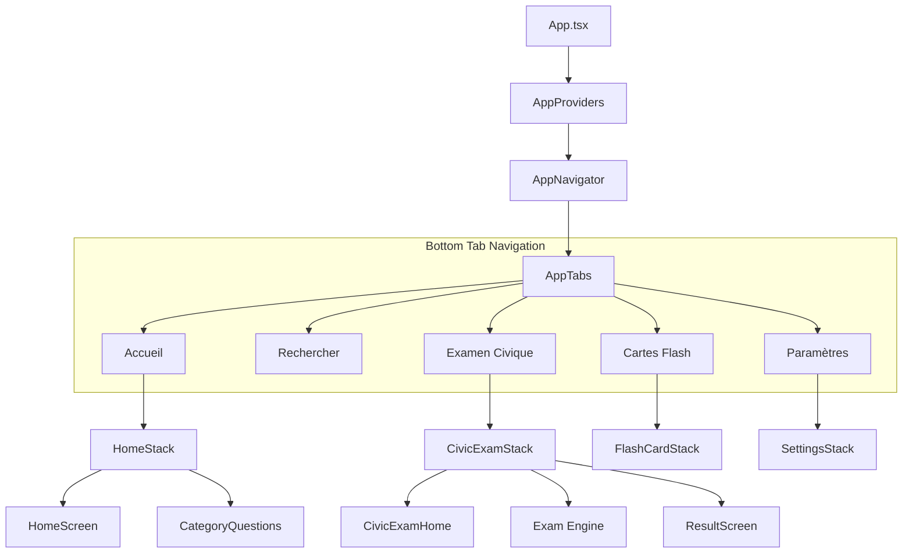
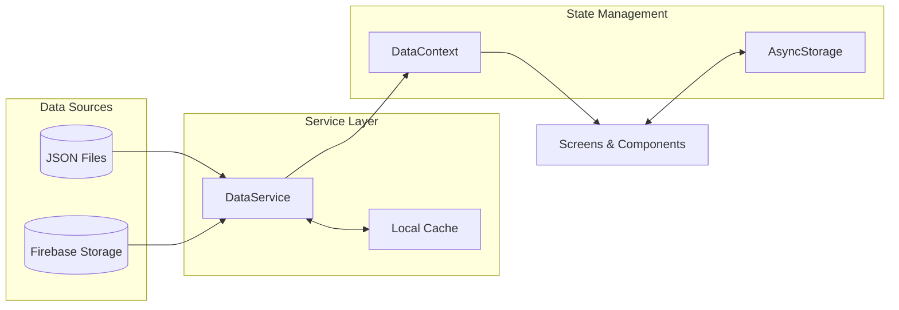

# 🏗️ Project Architecture

Welcome to the technical blueprint of the **Naturalisation Test Civique** application. This document outlines the system design, data flow, and component relationships that power our mobile experience.

---

## 🗺️ High-Level Navigation

The application uses a nested navigation strategy. The root is a **Bottom Tab Navigator** that hosts specialized **Stack Navigators** for each major feature area.

---

## 🧬 Core Structure & Organization

We follow a modular directory structure to keep the codebase maintainable and scalable.

| Directory        | Purpose                                                                   |
| :--------------- | :------------------------------------------------------------------------ |
| `src/config`     | Global settings for Firebase, Sentry, and the Icon system.                |
| `src/shared`     | The foundation: reusable UI, global contexts, hooks, and services.        |
| `src/test_civic` | The "brain" of the application—manages exam logic, scoring, and sessions. |
| `src/flashcard`  | Interactive learning module with specialized animations and state.        |
| `src/theme`      | Our design system, containing color palettes and typography rules.        |
| `src/data`       | Static JSON repositories and the civic knowledge base.                    |

---

## 💾 Data Architecture & State Management

Our state management is handled through a hierarchy of **React Context Providers**, ensuring data is available where needed without "prop drilling."

### Provider Hierarchy

1.  **DataProvider**: The source of truth for question data and knowledge base content.
2.  **IconProvider**: Manages 3D icon variants and theme-specific iconography.
3.  **ThemeProvider**: Handles color schemes (Light, Dark, and Custom themes).
4.  **CivicExamProvider**: Manages the complex state of an active exam session.

### Data Flow Pipeline

The app uses a multi-layered approach to data retrieval, prioritizing speed and reliability.

---

## 🎯 Key Features: Deep Dive

### 1. The Exam Engine (`src/test_civic`)

The most complex part of the app. It handles:

- **Generation**: Dynamically creating 40-question sets based on official weightings.
- **Session Persistence**: Allowing users to close the app and resume their exam later.
- **Scoring**: Instant calculation of pass/fail results based on official thresholds.

### 2. Search & Indexing (`src/search`)

Built for speed. It normalizes French accents and special characters to provide a "fuzzy" search experience across the entire question database.

### 3. Flash Card Engine (`src/flashcard`)

Uses `react-native-reanimated` for high-performance 60fps card flip animations, providing a tactile feel to study sessions.

---

## 🛠️ Development Principles

- **Type Safety**: 100% TypeScript coverage with strict checking.
- **Offline Reliability**: Every data request has a local fallback.
- **Performance**: Heavy use of `useMemo` and `useCallback` to prevent unnecessary re-renders in large question lists.
- **Consistency**: All UI elements derive their style from the centralized `src/theme` system.
