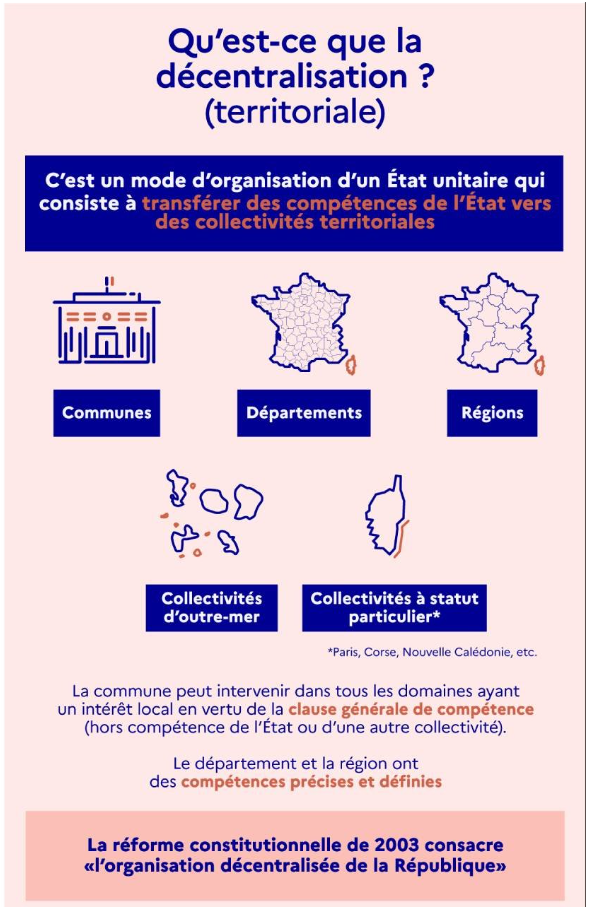
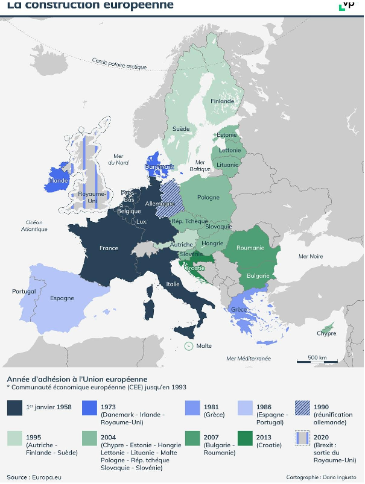
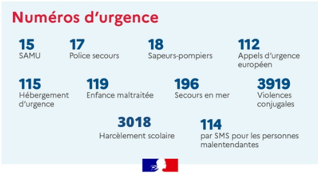
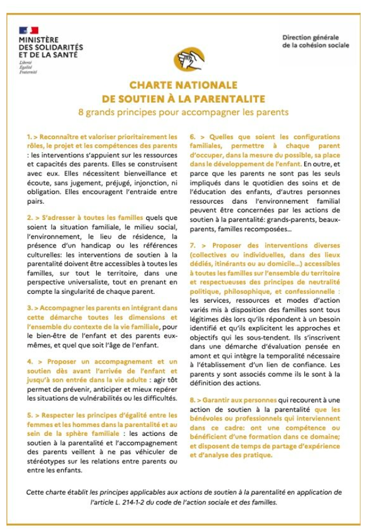

# Principes et valeurs de la République
Devise et symboles de la République, laïcité

## La devise de la République 
### La devise française 
- Objectifs de la fiche :
Connaître les symboles républicains mentionnés dans la Constitution.

Comprendre l’origine et le sens de la devise française.

**Qu’est-ce qu’une devise ?**\n
La devise de la République française est :
"Liberté, Égalité, Fraternité".

Elle est officielle depuis 1848 et fait partie de notre patrimoine national.
Elle exprime les valeurs auxquelles les Français sont attachés :

- la liberté pour chacun ;
- l’égalité entre tous ;
- la fraternité, c’est-à-dire la solidarité entre les citoyens.

**D’où vient cette devise ?**\n
La devise apparaît pendant la Révolution française, en 1789.
Les révolutionnaires veulent une société plus juste, fondée sur ces trois valeurs : liberté, égalité, fraternité.

- Elle est adoptée officiellement en 1848, sous la 2e République.
- Sous la 3e République, elle est visible un peu partout : mairies, monuments, écoles…
- Elle est toujours inscrite dans la Constitution d’aujourd’hui (1958).

C’est un symbole fort de la République française, elle nous rappelle que la République est fondée sur des valeurs partagées, unit les citoyens et guide la vie démocratique en France.

**Où voit-on la devise aujourd’hui ?**\n
Vous pouvez la lire :

- sur les bâtiments publics : mairies, écoles, tribunaux…
- sur certaines pièces de monnaie et timbres ;
- sur les documents officiels : carte d’identité, papiers administratifs…
- dans la Constitution française ;
- lors de fêtes nationales, comme le 14 juillet.

### La liberté 
- Objectifs de la fiche :
Comprendre ce qu’est la liberté, une des valeurs de la République française.

Connaître les différents types de liberté.

**La liberté : qu’est-ce que c’est ?**\n
En France, chaque personne peut penser, s’exprimer et vivre comme elle le souhaite. La seule limite est de ne pas empêcher une autre personne d’en faire autant.

Cette liberté est une valeur fondamentale qui est garantie par la Déclaration des droits de l’homme et du citoyen de 1789.

L’État français protège cette liberté et pose les limites pour que la liberté des uns n'empêche pas celle des autres.

**Les différents types de liberté**
Il existe deux types de libertés :

- les libertés de chaque personne : se déplacer dans le territoire grâce à son titre de séjour, avoir ou ne pas avoir une religion, exprimer une opinion, vivre avec la personne de son choix...
- les libertés qui concernent plusieurs personnes et qui garantissent à chacun sa place dans la société : se rassembler dans un lieu, participer à une manifestation, adhérer à un syndicat pour défendre des intérêts communs…

**La liberté, un droit pour tous**
La liberté est un droit pour tous, sans faire de différence entre les pays d’origine d’une personne, ses parents ou ses ancêtres, sa religion…

Une personne qui a bien compris ce qu’est le principe de liberté peut alors vivre, travailler, apprendre et s’exprimer en toute sécurité.

### L'égalité 
- Objectif de la fiche :
Comprendre ce qu’est l’égalité, une des valeurs de la République française.

**L’égalité : qu’est-ce que c’est ?**
L’égalité est un principe fondamental de la République française : elle est inscrite dans la Constitution de 1958. Elle est aussi présente dans la Déclaration des droits de l’homme et du citoyen.

En France, l'égalité s’applique de différentes manières :

- l'égalité devant la loi : la loi est la même pour toutes les personnes ;
- l'égalité des droits civiques : tous les citoyens français ont les mêmes droits civiques : voter, se présenter à une élection, participer à un conseil municipal…
- l'égalité des droits sociaux : ces droits sont accessibles à tous : éducation, santé, logement, emploi...

**L’égalité de tous devant les services publics**
Chaque personne peut - et doit - bénéficier des services publics dont elle a besoin : santé, éducation, sécurité… Par conséquent, chacun a le devoir de respecter les règles qui organisent le fonctionnement de ces services publics.

La loi interdit de limiter l’accès à ces services selon certains critères : homme ou femme, origine ethnique, handicap, orientation sexuelle...
Exemple : toute personne malade doit être soignée.

**Un traitement différent possible**
Le principe de l’égalité n’empêche pas de traiter différemment des personnes qui sont dans des situations différentes.
Exemple : les tarifs d’un service peuvent être différents pour les personnes sans emploi, les étudiants, les personnes âgées…

**Objectif de la fiche :(2/3)**
Comprendre comment s’applique l’égalité entre les femmes et les hommes en France.

**L’égalité femmes-hommes, qu’est-ce que cela signifie ?**

L’égalité entre les femmes et les hommes est inscrite dans le Préambule de la Constitution de 1946 : "la loi garantit à la femme, dans tous les domaines, des droits égaux à ceux de l’homme".

Cela signifie que les femmes et les hommes ont les mêmes droits et les mêmes devoirs dans tous les aspects de la vie : éducation, travail, santé, vie politique…

**Des inégalités existent entre les femmes et les hommes**
Malgré ce que dit la loi, il existe dans la vie de tous les jours des inégalités entre les femmes et les hommes. Ces inégalités sont moins fortes que dans le passé, mais elles sont encore présentes.

- En moyenne, les femmes ont un salaire inférieur à celui des hommes en exerçant le même métier et avec le même temps de travail.
- Les femmes sont moins nombreuses que les hommes dans les postes de direction.
- Les femmes réalisent une grande partie des activités de la vie quotidienne.
- Les femmes passent plus de temps que les hommes pour l’éducation des enfants.

**La parité dans la vie politique**
Des lois ont été votées pour permettre la parité, c’est-à-dire l’égalité entre les femmes et les hommes dans les responsabilités politiques.

Une de ces lois, qui date de 2000, oblige les partis politiques à présenter autant de femmes que d’hommes dans les listes de candidats. Un parti qui ne respecte pas cette obligation doit payer une amende.

Les femmes sont devenues plus nombreuses dans la vie politique, mais il n’y a pas de parité dans les postes à haute responsabilité. Par exemple, il n’y a encore jamais eu de Présidente de la République française.

**Objectifs de la fiche:(3/3)**
Comprendre ce qu’est la discrimination.

Identifier les discriminations qui sont interdites par la loi.

**La discrimination, qu’est-ce que c’est ?**
On parle de discrimination lorsqu’une personne est moins bien traitée qu’une autre en raison d’un des critères interdits par la loi, par exemple son handicap, sa religion, son orientation sexuelle...

La discrimination peut exister dans plusieurs domaines : emploi, logement, éducation, accès aux services publics.

Elle peut être directe (par exemple, refuser un emploi à une personne en raison de son origine) ou indirecte (par exemple, appliquer une règle qui semble ne pas faire de discrimination, mais qui, dans les faits, désavantage certaines personnes).

**Quels sont les critères ? Quelles sont les sanctions ?**
La loi française reconnaît plus de 26 critères de discrimination : origine, sexe, apparence physique, âge, handicap, grossesse, orientation sexuelle, opinions politiques, religion…

Les discriminations sont punies par des amendes et diverses sanctions. Des peines de prison sont possibles en cas de récidive.

**Les différentes formes de discriminations**
L’État lutte activement contre plusieurs formes de discrimination :

- le racisme : discrimination à cause de l'origine ethnique ou raciale ;
- l’antisémitisme : perception des Juifs pouvant s’exprimer par de la haine vis-à-vis d’eux ;
Exemples : refus d'embauche, insultes.
- la discrimination à cause de la religion ;
- le sexisme : comportement particulier, et souvent rabaissant, à cause du sexe de la personne ;
Exemples : salaire plus bas, moqueries, refus d’accès à certains métiers.
- la haine et la discrimination anti-LGBT+ : attitude hostile à l'égard des personnes en raison de leur orientation sexuelle.
Exemples : harcèlement, moqueries, refus de soin ou de logement.

### La fraternité

**Objectif de la fiche:(1/2)**
Comprendre ce qu’est la fraternité, une des valeurs de la République française.

**La fraternité : qu’est-ce que c’est ?**
La fraternité, c’est la solidarité entre les citoyens. C’est ce qui permet aux personnes de vivre ensemble avec harmonie et de former une société.

La fraternité est présente dans la Déclaration universelle des droits de l’homme de 1948 : il est écrit que les personnes doivent agir les unes envers les autres "dans un esprit de fraternité".

**L’histoire du concept de fraternité**
La fraternité a longtemps été considérée comme une simple valeur morale, contrairement aux principes de liberté et d’égalité. Elle n’est pas présente dans la Déclaration des droits de l’homme et du citoyen de 1789, alors que la liberté et l’égalité y sont inscrites.

Elle apparaît pour la première fois dans le Préambule de la Constitution de la Deuxième République en 1848. Enfin, elle est intégrée dans la Constitution de 1946 et 1958.

**Les différentes formes de solidarité**
- La solidarité collective, c’est une aide organisée surtout par des institutions publiques (État, département…), et souvent financée par l’impôt ou des cotisations (c’est-à-dire de l’argent prélevé sur les salaires).
Exemples : la Sécurité sociale, le RSA, l’aide au logement…
- La solidarité entre les générations, c’est l’entraide entre les personnes d’âges différents.
Exemple : les retraites sont financées par les cotisations des personnes plus jeunes, celles qui travaillent.
- L’engagement associatif, c’est un groupe de personnes qui agissent, dans des associations, pour aider des personnes en difficulté, pour préserver l’environnement…
Exemples : aide alimentaire, soutien scolaire, aide aux réfugiés…

**Objectif de la fiche:(2/2)**
Connaître et comprendre les différentes formes d’engagement dans la vie associative et locale.

**Les différentes formes de l’engagement**
En France, chaque personne - française ou étrangère - peut s’engager librement. Ce droit, que l’on appelle "liberté d’association", est inscrit dans une loi qui date de 1901.

Cet engagement peut prendre différentes formes :

- travailler dans une association (culture, sport, aide humanitaire…) ;
- mener une action pour les autres, sur son temps libre, sans être payé (bénévolat), par exemple pour une association ;
- adhérer à un syndicat (pour défendre les droits des travailleurs) ;
- adhérer à un parti politique, participer à une campagne électorale…

**Pourquoi s’engager dans une association ?**
S’engager dans une association permet de :

- rencontrer des personnes qui ont des situations de vie différentes ;
- défendre des idées, aider les autres ou encore participer à la société.
L’engagement est aussi une manière de participer à la vie collective, à la solidarité et à la démocratie.

**Comment créer une association ?**
La création d’une association est une démarche simple. Il faut :

- réunir au moins deux personnes ;
- choisir un objectif non lucratif, c’est-à-dire qui n’a pas pour but de gagner de l’argent ;
Exemple : aider des personnes, préserver l’environnement, partager une activité culturelle…
- rédiger les statuts, c'est-à-dire les règles de fonctionnement de l’association ;
- faire une déclaration à la préfecture ou sur internet.

Pour financer les activités de l’association, il est possible de recevoir des dons ou des subventions, à condition de respecter certaines obligations : transparence sur les finances, respect des lois, déclaration des changements (nouveaux dirigeants, achat de local…).

## Les symboles de la République

### Le drapeau français
**Objectifs de la fiche :**
Comprendre ce que représente le drapeau français.

Reconnaître les moments et les lieux où il est utilisé dans la vie de tous les jours.

**Les couleurs**
Le drapeau français est un symbole officiel de la République française.

- Le drapeau est composé de trois bandes verticales : bleu, blanc et rouge.
- Chaque couleur a une signification : le bleu et le rouge étaient les couleurs de la ville de Paris, tandis que le blanc était la couleur du roi.
- L'alliance des trois couleurs était donc le symbole de l'alliance du roi et du peuple et reste le symbole d'une France unie.

**L'histoire du drapeau français**
- En juillet 1789, pendant la Révolution française, les gardes nationaux parisiens portent une cocarde bleue et rouge, les couleurs de la ville de Paris.
- Le général Lafayette, pour symboliser l’unité entre le roi et le peuple, ajoute le blanc royal au centre : c’est la naissance des trois couleurs réunies.
- En 1790, le drapeau tricolore commence à être utilisé dans la marine.
- Il est devenu le drapeau officiel de la France en 1794.
- Il a perdu les couleurs bleue et rouge lors du retour de la monarchie qui ne garda que blanc royal.
- Le drapeau bleu blanc rouge est revenu définitivement en 1830.

**Où voit-on le drapeau aujourd'hui ?**
- Devant les bâtiments publics : mairies, écoles, préfectures...
- Lors des cérémonies officielles, des fêtes nationales (14 juillet).
- Dans les stades pendant les compétitions sportives.
- Sur certains documents officiels (carte d’identité, permis de conduire).
Il est interdit de faire outrage au drapeau français, c'est-à-dire de détruire ou d'utiliser de manière dégradante le drapeau en public.

### L'hymne français
**Objectifs de la fiche :**
- Comprendre la signification de l’hymne français.
- Identifier les principales occasions d’entendre l’hymne français.

**Le titre de l’hymne français**
L’hymne national de la France est un chant qui s’appelle La Marseillaise. Il évoque un grand moment de l’histoire de la France : la Révolution.

Ce chant a été composé en 1792 pour soutenir les soldats dans le cadre d’une guerre. La Marseillaise représente les valeurs de liberté, de résistance et d’unité du peuple français.

**L’histoire de l’hymne français**
- En avril 1792, quelques jours après le début de la guerre de la France contre l'Autriche, un officier français compose le "Chant de guerre pour l’armée du Rhin". Ce chant est repris par un bataillon d’habitants de Marseille lors d’une révolte à Paris en août 1792.
- Le chant se diffuse rapidement partout en France. Face à ce succès, il est déclaré chant national le 14 juillet 1795. Il s’appelle désormais La Marseillaise.
- Interdite pendant de longues années, la Marseillaise est à nouveau chantée lors de la Révolution de 1830. Berlioz, célèbre compositeur français, arrange le chant pour qu’il puisse être joué par un orchestre.
- La Marseillaise devient l’hymne national en 1879 durant la 3e République.

**Les principales occasions d’entendre l’hymne français**
- Cérémonies officielles de l’État : commémoration nationale, discours du président de la République, hommage rendu aux victimes d’attentats ou aux soldats morts pour la France, défilé militaire du 14 juillet.
- Événements sportifs internationaux : avant un match auquel participe une équipe française, cérémonie de remise d’une médaille à un athlète français.
- Manifestations exceptionnelles : rassemblement lors d’un évènement national marquant (par exemple les manifestations après les attentats de 2015).

### Marianne 
**Objectifs de la fiche :**
- Comprendre la signification de ce symbole officiel.
- Identifier les principales utilisations de Marianne.

**Que signifie le symbole Marianne ?**
La figure de Marianne apparaît pendant la Révolution française pour représenter la République.

Avec son prénom féminin populaire, elle symbolise le fait que la République est fondée sur la volonté du peuple et la démocratie.

Elle porte le bonnet phrygien, comme les esclaves de l’Antiquité qui avaient retrouvé leur liberté.

De plus en plus utilisée au fil du temps, elle finit par devenir un symbole officiel de la République.

**Un élément de la culture populaire**
En plus de son utilisation dans les institutions de la République française, Marianne est devenue un repère visuel pour représenter la France et son peuple. Elle apparaît sur des timbres, des pièces de monnaie, des affiches, dans des films, des caricatures…

À partir des années 1960, Marianne a souvent été représentée par des actrices françaises (Brigitte Bardot, Catherine Deneuve, Laetitia Casta). Cela a modernisé son image et renforcé sa place dans la culture populaire.

**Les principales utilisations du symbole Marianne**
- Institutions de la République : le buste de Marianne est présent dans toutes les mairies.
- Documents officiels : la figure de Marianne est présente sur la carte d’identité, sur les documents administratifs comme la déclaration d'impôts par exemple…
On la voit aussi sur des timbres et les pièces de monnaie.

### La fête nationale 
**Objectifs de la fiche :**
- Comprendre la signification de ce symbole officiel.
- Connaître les origines de la fête nationale.

**Quel est le jour de la fête nationale ?**
Le 14 juillet devient le jour de la fête nationale en 1880. Ce choix commémore deux événements fondateurs de la République française : le 14 juillet 1789 et le 14 juillet 1790.

**Les origines de la fête nationale**
- Que s’est-il passé le 14 juillet 1789 ?
Des Parisiens sont entrés dans la prison de la Bastille. Cet événement, que l’on appelle la prise de la Bastille, marque le début de la Révolution française, c’est-à-dire la révolte du peuple contre l’Ancien Régime. Il symbolise la lutte pour la liberté.

- Et le 14 juillet 1790 ?
C’est la première Fête de la Fédération, pour fêter l’anniversaire de la prise de la Bastille. Les représentants de toutes les provinces de France se réunissent à Paris, en présence du roi Louis XVI, pour affirmer leur attachement à la Constitution qui sera écrite l’année suivante.

**Quelle est la signification de cette journée ?**
Aujourd’hui, la journée du 14 juillet est un moment fort de la vie républicaine en France.

C’est un moment institutionnel qui rappelle les fondements de la République : un défilé militaire a lieu à Paris, sur les Champs-Élysées, en présence du président de la République.

C’est aussi une fête populaire dans tout le pays, pour célébrer l’identité nationale, avec des feux d’artifice, des concerts, des bals…

### Le Coq
**Objectifs de la fiche :**
- Comprendre la signification de ce symbole coutumier.
- Identifier les principales utilisations de ce symbole.

**Quelles sont les origines de ce symbole ?**
Pendant l’Antiquité, les Romains désignaient les Gaulois par le mot latin "Gallus", qui signifiait à la fois "Gaulois" et "coq". Ce jeu de mots s’est concrétisé par l’utilisation du coq pour représenter le Gaulois de manière symbolique. D’abord moqueur, le coq est peu à peu devenu un symbole de fierté et de courage.

À partir de la Renaissance, puis surtout pendant la Révolution française, le coq commence à apparaître sur des monnaies, des drapeaux… Il valorise alors les paysans qui travaillent dur et qui sont attachés à la terre.

**Un symbole non officiel**
Le coq n’est pas reconnu de manière officielle comme un symbole de la République française, contrairement au drapeau tricolore, à Marianne ou à la devise nationale.

Mais comme il est très utilisé, il est devenu un symbole national fort.

**Les principales utilisations du coq**
- Diplomatie économique et culturelle : logo de La French Tech, communication de Business France, pavillon de la France lors des expositions universelles…
- Institutions de la République : frontons de certaines mairies ou de monuments aux morts…
- Sport : maillots des équipes nationales.

## La laïcité
### La définition de la laïcité
**Objectifs de la fiche :(1/2)**
- Comprendre ce qu’est la laïcité.
- Comprendre ce qu’est la liberté de conscience.
- Identifier la place des religions par rapport à l’État.

**La laïcité : qu’est-ce que c’est ?**
La laïcité garantit la liberté de conscience pour tous, c’est-à-dire que chaque personne est libre d’avoir ou de ne pas avoir de religion, d’en changer ou de ne plus en avoir.

**La liberté de (ne pas) pratiquer une religion**
La liberté de conscience a pour conséquence la liberté de pratiquer une religion, sans troubler l’ordre public (c’est-à-dire en respectant les règles de la vie en société : pas de bruit pendant la nuit, pas d’attroupement dans la rue…).

À l’inverse, la laïcité garantit aussi la liberté de ne pas pratiquer une religion : personne ne peut être obligé de respecter les principes fondamentaux d’une religion ou des prescriptions liées à une religion.

**L’État est neutre vis-à-vis des religions**
Le principe de laïcité implique la séparation entre l’État et les organisations religieuses ainsi que l'égalité de tous devant la loi sans distinction de religion ou de convictions. L'ordre est fondé sur la seule souveraineté du peuple.

Par conséquent, l’État français :

- ne reconnaît aucune religion ;
- ne salarie ni ne subventionne aucun culte ;
- ne participe pas au fonctionnement interne des organisations religieuses.
En France, les religions n’influencent pas le pouvoir politique dans ses décisions.

Conséquence de cette séparation : l’État, mais aussi les collectivités territoriales et les services publics, sont neutres vis-à-vis des religions.

La laïcité n'est pas une opinion : c'est un principe constitutionnel. L'article 1 de la Constitution de 1958 précise que "La France est une République indivisible, laïque, démocratique et sociale".

**Objectifs de la fiche :(2/2)**
Connaître la diversité des religions en France.

Identifier la place et le rôle des religions par rapport à l’État.

**La diversité des religions en France**
Plusieurs religions sont pratiquées en France, ainsi que divers courants de pensée, spiritualités… Cette diversité peut se retrouver au sein d’une même famille.

Chaque personne a la liberté de pratiquer la religion de son choix, dans le respect des autres.

**Le droit de ne pas croire, de ne plus croire ou de changer de religion**
Ne pas avoir de religion ou choisir de ne plus avoir de religion est aussi un droit. En France, beaucoup de personnes déclarent ne pas avoir de religion.

**Les différentes religions en France**
La France est un pays de diversité religieuse :

- la religion la plus représentée en France est la religion catholique ;
- la communauté musulmane en France est la plus importante d’Europe ;
- la communauté juive en France est la plus importante d’Europe ;
- la communauté bouddhiste en France est la plus importante d’Europe.

### Histoire de la laïcité
**Objectif de la fiche :**
Comprendre l'évolution de l'application du principe de laïcité à travers le temps.

**La laïcité, une longue histoire**
En France, l’État et les Églises sont séparés en 1905, plus de 200 ans après l’apparition du principe fondateur de la laïcité dans la Déclaration des droits de l'homme et du citoyen de 1789.

**Les dates clés avant la loi de 1905**
Dans le passé, l’Église catholique a eu un rôle central dans la société : elle contrôlait notamment l’éducation, l'état civil (naissances, mariages, décès) et la morale publique.

- En 1789, la Déclaration des droits de l'homme et du citoyen crée le principe de la liberté de conscience et de religion. C’est le fondement de la laïcité.

- En 1801, un traité appelé le Concordat organise les relations entre l’État et l’Église catholique.

- En 1882, l’école primaire publique devient obligatoire, gratuite et indépendante de l’Église catholique. L’école devient un lieu neutre, sans enseignement religieux.

**Les dates clés depuis la loi de 1905**
En 1905, une loi sépare l’Église et l’État :

- l’État est indépendant des religions ;
- l’État ne finance aucune religion ;
- et les religions s’organisent de manière indépendante mais en respectant des règles fixées par l’État. Par exemple, il est interdit de commettre un délit au nom d’une religion.

En 2004, une loi interdit dans les écoles, collèges et lycées publics de porter, avec l’intention d’être vu, un signe ou un vêtement qui montre une appartenance à une religion.

En 2021, une loi renforce la laïcité et la neutralité dans les services publics et les associations.

### La laïcité dans l'espace public 

Objectif de la fiche :
Comprendre comment s'applique la laïcité dans l'espace public.

**Manifester sa religion, c’est possible…**
En France, toute personne a le droit de manifester sa religion dans l’espace public, c’est-à-dire dans les lieux ouverts à tous : rues, restaurants, marchés, magasins, transports...

Cela signifie qu’une personne peut :

- porter des signes religieux (voile, kippa, croix, turban...) ;
- participer à des célébrations ou rassemblements religieux ;
- exprimer ses convictions religieuses, dans le respect des lois de la République française.

**… dans certaines limites**
Les personnes qui travaillent dans les services publics ne peuvent pas exprimer leur religion dans le cadre de leur travail.

Les usagers des services publics, quant à eux, peuvent exprimer leur religion à condition de respecter les règles de fonctionnement du service. Exemple : pas de prosélytisme, respect des consignes de sécurité.

En cas de trouble de l’ordre public, une manifestation religieuse peut être interdite ou limitée pour garantir la sécurité et la tranquillité. Exemple : prières de rue. Ce n'est pas au nom de la laïcité, mais pour garantir la sécurité et la tranquillité publiques.

**La dissimulation du visage : un interdit**
Depuis le 11 octobre 2010, il est interdit de dissimuler son visage dans l’espace public (cagoule, masque, voile intégral...).

Cette loi n’est pas « contre la religion ». Elle vise notamment à protéger le vivre-ensemble, les valeurs républicaines. Elle est fondée sur le principe de fraternité et sert, notamment, à garantir le principe de l'égalité entre les femmes et les hommes.

Cette loi ne s’applique pas dans les lieux de culte ouverts au public (églises, mosquées, synagogues…).

### La laïcité dans les services publics
Objectif de la fiche :
Comprendre comment s'applique le principe de laïcité dans les services publics.

**La neutralité dans les services publics**
Les personnes qui travaillent dans les services publics ainsi que dans les entreprises ou associations qui ont une mission de service public ne peuvent pas exprimer ou montrer leurs convictions (religieuses, politiques ou philosophiques). Les opinions et croyances sont de l’ordre de la vie privée et ne doivent pas s’imposer aux autres. Cela permet de traiter les usagers de manière équitable.

Cette neutralité se concrétise aussi dans les bâtiments des services publics. Aucun signe ou emblème religieux, politique ou philosophique ne doit être exposé dans les bureaux, aux guichets ou encore dans les espaces communs.

Il n’est pas possible de demander une adaptation du service public au nom d’une religion.

**La neutralité ne concerne pas les usagers**
La neutralité ne s’impose pas aux personnes qui se rendent dans un service public en tant qu’usagers. Elles peuvent donc porter un signe d’appartenance religieuse.

Cette liberté est limitée dans certaines situations, de manière ponctuelle. Par exemple, une personne qui porte un voile doit l’enlever un moment pour la vérification de son identité à l’occasion de la remise d’un passeport. De même, les usagers ne peuvent pas demander une adaptation du service public au nom d'une religion.

**La charte de la laïcité dans les services publics**
Il existe un document qui rappelle les droits et les devoirs pour respecter la laïcité dans les services publics. Il s’adresse aux usagers et aux personnes qui travaillent dans ces services. C’est la Charte de la laïcité dans les services publics.

### Le prosélytisme
Objectifs de la fiche :
Comprendre ce qu’est le prosélytisme religieux.

Identifier les endroits où il est interdit.

**Le prosélytisme, qu’est-ce que c’est ?**
Une personne qui fait du prosélytisme religieux cherche à convaincre d’autres personnes de choisir sa religion. Cela peut se traduire par différentes actions : parler avec une personne, distribuer des documents, ou inviter une personne à une pratique religieuse (prière, culte…).

**Le prosélytisme, une attitude autorisée en France**
En France, le prosélytisme religieux est autorisé, car chaque personne a la liberté d’avoir une religion ou pas.

Mais il ne doit pas consister à forcer quelqu'un à croire en une religion.

Le harcèlement religieux est interdit : le prosélytisme ne doit pas utiliser la contrainte physique ou psychologique. Ne pas respecter cette règle peut entraîner une sanction.

**Les lieux où le prosélytisme est interdit**
Pour garantir la neutralité de l’État, le prosélytisme est interdit dans certains lieux publics :

- écoles publiques : les enseignants, tout comme les élèves, ne doivent pas faire de prosélytisme ;
- services publics : le personnel ne doit pas faire de prosélytisme ;
- hôpitaux publics : le personnel ne doit pas faire de prosélytisme.
Le prosélytisme est également interdit dans les entreprises privées.

### Le blasphème
Objectifs de la fiche :
Comprendre ce qu’est le blasphème.

Comprendre pourquoi il n’est pas interdit en France.

Connaître les limites fixées par la loi.

**Les bases : qu’est-ce que la liberté d’expression ?**
En France, la liberté d’expression est un droit fondamental. Elle est garantie par la Déclaration des droits de l'homme et du citoyen de 1789 :

- chacun a le droit d’avoir ses opinions, même religieuses, à condition que cela ne trouble pas l’ordre public ;
- chacun peut parler, écrire et publier librement.

**Le blasphème, c’est quoi ?**
Le blasphème, c’est quand on critique ou se moque d’une religion, d’un dieu ou de ce que certains considèrent comme sacré.
En France, pays laïque, le blasphème n’est pas interdit :

- on a le droit de critiquer une religion ;
- on ne peut pas être puni pour avoir dit quelque chose contre une religion.
La caricature est libre et ne peut être punie.

**Quelles sont les limites ?**
Au nom de la liberté d'expression, même si le blasphème n’est pas interdit, on ne peut pas dire tout et n’importe quoi. Certains propos sont punis par la loi, par exemple :

- les insultes ou propos haineux envers des personnes à cause de leur religion ;
- l'encouragement à commettre certains crimes ou délits contre une religion ;
- l’incitation à la haine raciale ou ethnique, à la violence ou à la discrimination religieuse ;
- la négation de la Shoah (génocide des Juifs pendant la Seconde Guerre mondiale).

### La laïcité au travail
Objectif de la fiche :
Identifier les différences d’application de la laïcité entre les services publics et les entreprises privées.

**La neutralité au travail**
La laïcité ne s’applique pas de la même manière aux personnes qui travaillent dans les services publics (les agents publics) et à celles qui travaillent dans les entreprises privées (les salariés).

**Comment s’applique la laïcité pour les agents publics ?**
Comme tout citoyen français, l’agent du service public est libre d’avoir une religion.

Mais dans le cadre de son travail, il n’a pas le droit de manifester ses opinions religieuses :

- il ne doit porter aucun signe montrant sa religion (voile, keshi, croix, kippa…) ;
- il ne doit pas faire de prosélytisme ;
- son comportement ne doit pas troubler le fonctionnement du service public.

**Comment s’applique la laïcité pour les salariés ?**
Le salarié a lui aussi la liberté d’avoir une religion, comme tout citoyen.

Contrairement à l’agent public, il peut exprimer ses opinions religieuses dans le cadre de son travail et il peut porter des signes montrant sa religion, sauf si cela perturbe le bon fonctionnement de l’entreprise.

L’employeur peut imposer des limites à cette liberté de manifester son opinion religieuse dans certains cas. Par exemple, pour des questions d’hygiène ou de sécurité.

Un salarié doit obtenir l'autorisation de son employeur pour s'absenter pour une fête religieuse. Le refus de l'employeur est possible, à condition qu'il ne soit pas discriminatoire.

### La laïcité à l'école
Objectifs de la fiche :(1/2)
Comprendre comment s’applique la laïcité à l’école.

Comprendre les enjeux de la laïcité à l'école.

**La neutralité de l’école publique**
Les écoles publiques sont neutres vis-à-vis des religions. Cette neutralité permet à chaque élève de penser librement et de construire lui-même ses opinions.

La laïcité garantit la liberté de conscience et protège la liberté de croire ou de ne pas croire en une religion. Elle permet la libre expression de ses convictions religieuses, dans le respect de celles des autres et dans les limites de l’ordre public.

Dans les écoles publiques, les règles de vie dans les différents espaces respectent le principe de laïcité. Elles sont précisées dans le règlement intérieur. Parmi ses règles, il est interdit de porter un signe ou un vêtement qui montre sa religion de manière ostensible, c’est-à-dire de manière à être vu.

**La place de la religion à l’école**
Dans les écoles publiques :

- les enseignants ne doivent pas manifester leurs convictions politiques ou religieuses ;
- les élèves peuvent parler de religion entre eux, dans le respect des autres ;
- le prosélytisme est interdit ;
- il n’y a pas de cours de religion, mais certains cours abordent l’existence de diverses religions et leur histoire.
Dans les écoles privées sous contrat avec l’État, l’enseignement est le même que dans les écoles publiques. Des cours de religion peuvent être proposés mais ils ne sont pas obligatoires.

**Le même programme de cours pour tous**
C’est l’État qui fixe le programme des cours et le fonctionnement des écoles publiques ou des écoles privées sous contrat avec l’État.

Il n’est pas possible de refuser de suivre un cours prévu dans le programme (sports, sortie scolaire...) pour des motifs religieux.

Objectif de la fiche :(2/2)
Identifier les enjeux de la laïcité à l'école.

**La charte de la laïcité à l’école**
À l’école, il n’est pas possible de refuser, en raison de sa religion, une règle de fonctionnement ou un cours du programme. C’est l’une des règles d’application de la laïcité dans les écoles.

L’ensemble des règles d’application de la laïcité dans les écoles est listé dans la charte de la laïcité à l’école. Ce document s’adresse aux professeurs, aux élèves ainsi qu’aux parents d’élèves.

**La laïcité, une garantie d’égalité**
La laïcité n’est pas une contrainte qui limite la liberté des personnes. Elle ne s’oppose pas à certaines personnes, à certaines religions.

Au contraire, la laïcité a un but positif : permettre à chaque personne d’être libre de toute contrainte dans sa façon de penser, de vivre, de croire ou de ne pas croire à une religion.

La laïcité garantit l’égalité de traitement de tous les élèves au sein des écoles.

**La laïcité, une condition de la fraternité**
La charte de la laïcité à l’école montre que l'école a un rôle important pour faire comprendre la laïcité, notamment auprès des élèves.

La laïcité est une condition indispensable pour que les élèves se respectent les uns envers les autres, dans un esprit de fraternité.

Elle permet également l’exercice de la citoyenneté et l’épanouissement de la personnalité de chacun, dans le respect de l’égalité des droits et autour des principes fondateurs de la République.

## La langue de la République
Objectifs de la fiche :
Comprendre la place de la langue française dans l’histoire de la France.

Connaître la diversité des langues pratiquées en France.

Identifier l’influence d’autres pays sur le français.

**Le français : l’unique langue officielle**
C’est en 1539 que la langue française a remplacé le latin dans les textes administratifs. À cette époque, la population utilise de nombreuses langues locales. C’est la première étape pour unifier la langue française.

Il faut attendre 1992, au moment de la création de l’Union européenne et de la disparition de la monnaie française, pour que la langue française soit inscrite dans la Constitution : "la langue de la République est le français".

Le français est donc la seule langue officielle en France. Elle est utilisée dans les écoles, l’administration, la justice, et plus largement dans la vie publique.

Cette unité de langue garantit l’égalité d’accès aux droits et à l’information, et renforce la cohésion nationale.

**Une langue qui évolue toujours**
Le français n’est pas une langue figée. Il se nourrit sans cesse de nouveaux mots venus d’autres pays.
Exemples : banque (mot issu de l’italien), week-end (mot issu de l’anglais), chiffre (mot issu de l’arabe)…

**Une diversité de langues régionales**
Plusieurs autres langues sont utilisées dans différents régions de la France : le breton, le corse, l’alsacien, le basque ou encore le créole. Elles peuvent être enseignées à l’école, dans le cadre de cours non obligatoires.

Ce ne sont pas des langues officielles de la France, mais elles font partie du patrimoine français.

## Le contrat d'engagement à respecter les principes de la République
Objectifs de la fiche :
Comprendre à quoi sert le contrat d’engagement républicain.

Identifier les conséquences en cas de la non-signature ou du non-respect du contrat.

**Le contrat d’engagement républicain, qu’est-ce que c’est ?**
"Le contrat d’engagement à respecter les principes de la République", c’est un document que doit obligatoirement signer toute personne étrangère au moment de la demande d’un titre de séjour.

En signant ce contrat, la personne s’engage à respecter les principes de la République française pour s’intégrer dans la société française.

Aucun titre de séjour ne peut être délivré sans ce contrat signé.

Si la personne ne respecte pas un principe républicain, le titre de séjour peut être retiré ou non renouvelé.

Il faut signer ce contrat à chaque étape de l’obtention (ou du renouvellement) d’un titre de séjour.

**Les principes du contrat d’engagement républicain**
- La liberté personnelle ;
- La liberté d'expression et de conscience ;
- L'égalité entre les femmes et les hommes ;
- La dignité de la personne humaine ;
- La devise française ;
- Les symboles de la République ;
- Les frontières nationales ;
- La laïcité.

**Les cas particuliers**
Les personnes qui bénéficient d’une protection internationale (réfugiés, apatrides, protection subsidiaire) doivent également signer le contrat d’engagement.

# Système institutionnel et politique
Démocratie et droit de vote ; Organisation de la République française

## État de droit et séparation des pouvoirs
### État de droit et séparation des pouvoirs : présentation de l'état de droit et principe de séparation des pouvoirs

Objectif de la fiche :
Connaître et comprendre les caractéristiques de notre démocratie.

**L’État de droit, c’est quoi ?**
Un État de droit est un système dans lequel la loi est la même pour tous, y compris pour l’État. Le droit est donc supérieur aux pouvoirs et aux autorités politiques. Ce système garantit le respect des droits fondamentaux et de la démocratie.

Exemple : le droit à la sûreté protège les individus contre les arrestations et les emprisonnements arbitraires des autorités publiques.

L’État de droit est donc une condition de la démocratie, et c'est le contraire de l’État arbitraire puisque les autorités publiques agissent toujours en respectant la loi.

Des juges indépendants contrôlent les autorités publiques.

**Les principes de l’État de droit, quels sont-ils ?**
On définit l’État de droit selon 6 principes :

- la primauté du droit : le droit s’impose à tous, y compris à l’État et à ses représentants ;
- l’égalité devant la loi (tout le monde est soumis aux mêmes lois et a les mêmes droits et devoirs, qu’il soit politicien ou pas) ;
- la séparation des pouvoirs.
On y ajoute :

- la légalité : les lois sont créées dans un processus transparent, responsable, démocratique et dans lequel chaque parti politique a pu s’exprimer ;
- la sécurité juridique : on peut avoir confiance en la loi, elle est claire et ne change pas tout le temps ;
- une protection juridictionnelle effective : la justice protège réellement.
L’État de droit doit toujours respecter la Constitution française et la Déclaration des droits de l'homme et du citoyen de 1789, citée dans l’introduction de la Constitution.

**Le principe de séparation des pouvoirs, c’est quoi ?**
En France, la séparation des 3 pouvoirs signifie que les pouvoirs législatif (le Parlement vote les lois), exécutif (le Gouvernement applique et fait respecter la loi) et judiciaire (l’autorité judiciaire contrôle l’application des lois) ne sont pas entre les mains des mêmes personnes.

Ce principe permet de garantir les droits fondamentaux et de conserver un équilibre : les pouvoirs se contrôlent mutuellement, ils sont neutres et ne peuvent s’exercer de façon arbitraire.
Exemple : un ministre qui ne respecte pas la loi peut être sanctionné comme tout citoyen.

Le principe de séparation des pouvoirs est inscrit dans la Constitution, qui cite la Déclaration des droits de l’homme et du citoyen de 1789.

### État de droit et séparation des pouvoirs : présentation des 3 pouvoirs

Objectifs de la fiche :(1/2)
Connaître et comprendre les caractéristiques de notre démocratie.

Identifier les trois pouvoirs.

**Le pouvoir législatif, c’est quoi ?**
Le pouvoir législatif est exercé par le Parlement, composé de 2 entités, qu’on appelle “chambres” :

- l’Assemblée nationale (où siègent les 577 députés, élus par les citoyens) ;
- le Sénat (où siègent les 348 sénateurs, élus par les grands électeurs).

Le Parlement vote la loi.

Les deux chambres doivent :

- proposer ;
- négocier ;
- voter la loi.
Elles vérifient aussi que le Gouvernement agit selon la loi et évaluent les politiques publiques.

**Le pouvoir exécutif, c’est quoi ?**
Le pouvoir exécutif est exercé par :

- le président de la République (le chef de l’État et des armées) qui réside au Palais de l’Élysée ;
- le Gouvernement (le Premier ministre et les ministres). Le Premier ministre, qui réside à l'hôtel de Matignon, est nommé par le président de la République.
Le président de la République et le Gouvernement appliquent et font respecter les lois (créées par le pouvoir législatif).

Le président de la République et le Gouvernement doivent aussi :

- diriger l’Administration ;
- conduire la politique nationale (intérieure et extérieure).

**L'autorité judiciaire, c’est quoi ?**
L'autorité judiciaire est exercée par les juges et les magistrats (recrutés par concours et non choisis par le pouvoir).

Les juges et les magistrats appliquent les lois. Ils jugent et rendent la justice.

La justice est indépendante, elle rend un jugement impartial et équitable. Une aide juridictionnelle financière existe pour que chacun (peu importe sa nationalité, son âge, ses revenus) soit défendu de manière juste.

Objectifs de la fiche :(2/2)
Connaître et comprendre les caractéristiques de notre démocratie.

Identifier les trois pouvoirs.

Quelle justice pour quel conflit ?****
La justice protège, décide et sanctionne impartialement. Selon les parties qui s’opposent, le pouvoir judiciaire s’exerce différemment, réparti entre deux ordres : la justice judiciaire et la justice administrative.

La justice judiciaire comprend :

- la justice civile, qui s’occupe des litiges entre citoyens (exemple : un conflit entre locataire et propriétaire) ;
- la justice pénale, qui punit les infractions des citoyens à la loi (exemple : un vol, un excès de vitesse en voiture).
- la justice administrative juge les litiges entre les citoyens (individus) et l’État (administrations et collectivités publiques) (exemple : une fausse déclaration à la CAF).

**Comment sont organisées ces institutions judiciaires ?**
Les tribunaux de chaque ordre sont organisés en pyramide :

- une juridiction de première instance (premier procès) ;
- une juridiction d'appel (quand un deuxième procès est demandé, il va en cours d’appel) ;
- une juridiction de cassation : la Cour de cassation (justice judiciaire) ou le Conseil d’État (justice administrative). C’est le dernier niveau de juridiction en France.

## Démocratie et droit de vote
### La démocratie et la République 
Objectifs de la fiche :(1/2)
Comprendre le modèle de la République.

Savoir décrire simplement le fonctionnement démocratique.

**La démocratie, c’est quoi ?**
Le mot démocratie vient du grec "Dêmos Krátos" qui signifie "Peuple Pouvoir". La démocratie est le régime politique dans lequel le pouvoir appartient au peuple sans distinction de sexe, de religion, de richesse ou d'origine sociale.

Elle repose sur le principe de la consultation régulière du peuple (le vote : élections de représentants et référendum), de la séparation des pouvoirs et de la pluralité des partis politiques.

La démocratie s’oppose à la dictature (pouvoir détenu par une personne ou un groupe restreint de personnes).

**La France est une démocratie**
La France est une démocratie dans le sens où le pouvoir vient du peuple : les citoyens votent pour choisir leurs représentants au suffrage universel.

Le droit de vote est accordé à tout citoyen :

- de nationalité française ;
- de plus de 18 ans (être majeur) ;
- qui a ses droits civils et politiques (n’est pas condamné) ;
- qui est inscrit sur les listes électorales.
La Constitution de 1958 indique que la démocratie c'est : "le gouvernement du peuple, par le peuple et pour le peuple".

**La République, c’est quoi ?**
La République vient du mot vient du latin "Res Publica" qui signifie "chose publique". La République appartient au peuple. L’ensemble des biens, des droits et des services (domaine public, services publics, fonction publique…) appartiennent à tous les citoyens.

La République est un système politique dans lequel le pouvoir est détenu par des représentants élus.

La République s’oppose par exemple à la monarchie (pouvoir héréditaire).

**La France est une République**
La France est une République où le pouvoir est exercé par un ensemble de représentants élus par le peuple. La France n’est plus une monarchie : le pouvoir n’appartient plus à une seule personne.

En résumé, la démocratie se concentre sur la participation du peuple au processus de prise de décision, tandis que la République se concentre sur la forme de gouvernement et la manière dont le pouvoir est exercé. Une démocratie peut être une République, mais une République n'est pas nécessairement une démocratie.

Objectifs de la fiche :(2/2)
Comprendre le modèle de la République.

Savoir décrire simplement le fonctionnement démocratique.

**Qui sont les acteurs politiques au niveau national ?**
- Le président de la République, élu pour 5 ans au suffrage universel directement par les citoyens français. Il nomme le Premier ministre selon la majorité ;
- le Gouvernement (les ministres sont proposés par le Premier ministre au président de la République) ;
- les 577 députés de l’Assemblée nationale (élus au suffrage direct par les Français, tous les 5 ans) et les 348 sénateurs du Sénat (élection au suffrage indirect, par les grands électeurs choisis par les français, tous les 6 ans). L’Assemblée nationale et le Sénat forment le Parlement.

**Qui sont les acteurs politiques au niveau local ?**
- Les élus municipaux (maire et conseillers municipaux, élus pour 6 ans lors des élections municipales au suffrage direct) : ils représentent les citoyens sur la commune ;
- les conseillers départementaux (élus pour 6 ans aux élections départementales au suffrage direct) : ils forment l’assemblée départementale qui prend des décisions concernant le département ;
- les conseillers régionaux (élus pour 6 ans au élections régionales au suffrage direct) : ils forment l’assemblée régionale qui prend des décisions concernant la région.

### Les conditions pour voter en France 

Objectif de la fiche :(1/2)
Connaître et comprendre le droit de vote.

**Le droit de vote, c’est quoi ?**
Le droit de vote est le droit d’exprimer sa volonté à une élection. Les citoyens élisent leurs représentants.

**Le suffrage universel, c’est quoi ?**
Le suffrage universel signifie que tous les citoyens

- qui ont la nationalité française ;
- majeurs (de plus de 18 ans) ;
- ayant leurs droits civiques et politiques (n’est pas condamné) ;
- inscrits sur les listes électorales (à leur demande, auprès de la mairie de son lieu de résidence depuis plus de 6 mois),
pouvant voter sans distinction de sexe, d'origine, de religion ou d'idéaux politiques.

Un ressortissant d’un pays membre de l’Union européenne, résidant en France, a le droit de vote aux élections européennes (inscription aux listes électorales requise) et aux élections municipales (s’il habite dans la même ville depuis plus de 6 mois et y est inscrit sur la liste électorale).

Le vote n'est pas obligatoire, c'est un droit et non un devoir.

Il est possible de voter pour une autre personne uniquement si elle a fait une procuration de vote.

**Les droits civiques et politiques, c’est quoi ?**
Le citoyen a plusieurs droits civiques et politiques liés au droit de vote :

- droit de se présenter à des élections et d’être élu (élections législatives, communales...) ;
- droit d’exercer une fonction juridictionnelle (être juge) ;
- droit de servir dans l’armée.
Un citoyen puni par la loi (condamné à une peine d’emprisonnement) peut être privé de ses droits civiques et politiques.

Objectif de la fiche :(2/2)
Connaître et comprendre les élections en France.

En France, le droit de vote est un droit fondamental. Il est inscrit dans la Déclaration des droits de l’homme et du citoyen, de 1789. L’article 3 de la Constitution de la Ve République de 1958 le précise.

En France, le vote est strictement :

- personnel ;
- libre ;
- secret.
Par le vote, le peuple exprime sa volonté, qui se traduit ensuite en lois, qui s’imposent à tous. Tous les votes sont comptabilisés, peu importe le sexe, l’âge, l’origine ou la religion.

**Quels sont les différents types d’élection ?**
Les citoyens français peuvent participer à plusieurs types d’élections au suffrage universel direct en France :

1. les élections présidentielles pour élire le président de la République (tous les 5 ans) ;
2. les élections législatives pour élire les députés à l’Assemblée nationale (tous les 5 ans sauf s’il y a une dissolution) ;
3. les élections municipales pour élire les conseillers municipaux (tous les 6 ans) ;
4. les élections départementales pour élire les conseillers départementaux (tous les 6 ans) ;
5. les élections régionales pour élire les conseillers régionaux (tous les 6 ans) ;
6. les élections européennes pour élire les députés au Parlement européen (tous les 5 ans). Les citoyens de l’Union européenne résidant en France peuvent également voter.
Par contre, les élections sénatoriales, qui permettent d'élire les sénateurs, sont au suffrage universel indirect (tous les 3 ans renouvellement par moitié). Seuls les grands électeurs (maires, conseillers municipaux, députés) votent.

### Le principe de pluralité des partis 

Objectif de la fiche :(1/2)
Connaître et comprendre le principe de la pluralité des partis.

**La pluralité des partis politiques, c’est quoi ?**
La pluralité des partis politiques (beaucoup de partis différents) est un principe fondamental de la démocratie française. Le Conseil constitutionnel a affirmé que “Le respect du pluralisme constitue le fondement de la démocratie”.

La pluralité des partis garantit la liberté d’expression des opinions politiques de tous les citoyens.

Chaque citoyen peut librement rejoindre un parti politique correspondant à ses convictions. Ce droit est garanti par l'article 4 de la Constitution française, qui dispose que “Les partis et groupements politiques concourent à l’expression du suffrage”.

**Les médias sont-ils équitables entre les partis ?**
D’après la loi du 30 septembre 1986 sur la liberté de communication, les médias ont l’obligation d’être équitables entre les partis politiques. Cette loi garantit le pluralisme politique.

Exemple : pendant les campagnes électorales, tous les partis ont autant de temps de parole.

**Beaucoup de partis politiques différents, à quoi ça sert ?**
Les partis politiques participent à la vie politique (ils peuvent être présents à l’Assemblée et au Sénat).

Il ont 2 fonctions :

1. Ils proposent des programmes politiques qu'ils souhaitent mettre en œuvre. Les partis politiques sont les intermédiaires entre les citoyens et le Gouvernement.
2. Ils sélectionnent les candidats pour les faire élire. Quand un membre d’un parti est élu à l’Assemblée ou au Sénat (pouvoir législatif) ou élu en tant que président de la République ou choisi en tant que Premier ministre (pouvoir exécutif), le parti politique dirige le pays (ils y participent).

### Comment voter une loi

Objectif de la fiche :(1/2)
Connaître et comprendre comment est votée une loi.

**Qui propose les lois ?**
L’initiative de la loi peut être faite par :

- Le Gouvernement (les ministres), qui peut présenter un projet de loi.
- Le Parlement (les députés ou les sénateurs), qui peut présenter une proposition de loi.

**Que se passe-t-il après ?**
La loi est déposée auprès d’une commission parlementaire (qui dépend du Sénat ou du Parlement) qui va examiner la loi et rendre un rapport sur le sujet.

Cette commission désigne quelqu’un, un rapporteur, pour modifier le texte (amendements).

**Comment la loi est-elle validée ?**
Quand le texte de loi a été validé par la commission parlementaire, il est transmis à l’Assemblée nationale ou au Sénat pour être discuté et amendé (modifications) en séances publiques.

Chaque article et chaque amendement sont votés un par un. Puis, l’ensemble du texte de loi est validé.

Les deux chambres parlementaires (le Sénat et l’Assemblée nationale) doivent valider un texte de loi identique pour qu’il soit appliqué.

La loi est l'expression de la volonté générale.

Objectif de la fiche :(2/2)
Connaître et comprendre comment est votée une loi.

**La navette parlementaire, c’est quoi ?**
Quand le texte de loi a été validé par une des chambres parlementaires (l’Assemblée nationale ou le Sénat), le texte de loi est envoyé à l’autre chambre.

Exemple : l’Assemblée nationale a amendé (modifié) le texte de loi et l’a validé. Le texte de loi est transmis au Sénat.

- Si les deux assemblées valident le même texte de loi (sans modification), alors le texte de loi est définitivement adopté.
- Si des amendements sont ajoutés (modifications) par la deuxième chambre parlementaire, alors le texte de loi est de nouveau transmis à la première assemblée : on parle de navette parlementaire.

**Et si les députés et les sénateurs ne sont pas d’accord ?**
Une commission paritaire mixte, composée de 7 députés et 7 sénateurs, est appelée pour se mettre d’accord sur un texte de loi.

S’ils n’arrivent pas à se mettre d’accord : l’Assemblée nationale décide (les députés peuvent choisir quels amendements/modifications faire, ou ne pas faire, à la loi).

**Que se passe-t-il après, quand la loi est adoptée par les deux chambres ?**
La loi est validée et signée par le président de la République dans un délai de 15 jours.

Pendant ce délai :

- le président peut demander un nouvel examen ;
le Conseil constitutionnel peut être saisi pour vérifier la conformité à la Constitution.- 
Une fois promulguée, la loi est publiée au Journal officiel et entre en vigueur.

## Organisation de la République française
### Le découpage administratif de la France

Objectifs de la fiche :(1/1)
Comprendre ce qu’est la décentralisation.

Identifier les différentes collectivités locales et leurs missions.

**La décentralisation, qu’est-ce que c’est ?**
La décentralisation, c’est l’État qui transfère des compétences et des moyens à d’autres autorités, appelées collectivités territoriales.

Il existe plusieurs niveaux de collectivités territoriales : les communes, les départements, les régions, les collectivités à statut particulier (c’est-à-dire qui ont leurs propres caractéristiques), et les collectivités d’outre-mer.

**À quoi servent les collectivités territoriales ?**
- La commune a de nombreuses compétences, surtout en urbanisme, logement et action sociale. Elle gère les écoles primaires et maternelles et les services de proximité. C’est la collectivité la plus répandue sur le territoire (il y a plus de 35 000 communes en France). Elle est dirigée par des personnes élues, dont le maire.
- Le département agit surtout dans l’action sociale (exemples : aide aux personnes handicapées, gestion du RSA). Il gère aussi les collèges, et a des compétences partagées avec les autres collectivités territoriales. Il y a 101 départements en France.
- La région contribue notamment à gérer les lycées, à développer l’activité économique et à aménager le territoire. Il y a 18 régions en France.

**Exemples de collectivités à statut particulier**
- Paris a à la fois les compétences de la commune et du département.
- La métropole de Lyon a, à la fois, les compétences du département et de la commune.
- La collectivité européenne d'Alsace a les compétences du département et des compétences spécifiques adaptées aux particularités de l’Alsace.
- Les collectivités d’outre-mer ne sont pas des collectivités à statut particulier, mais elles ont elles aussi des caractéristiques particulières. Par exemple, elles peuvent adapter les lois et les règlements en fonction de leurs contraintes locales et fixer des règles applicables sur leur territoire (sauf la Réunion).

Objectifs de la fiche :(2/2)
Comprendre le rôle du Préfet.

Connaître les missions de la préfecture.

Le rôle du Préfet
Le Préfet est le représentant de l’État dans le département.

Il dirige les services de l’État dans un département.

Il ne s’occupe ni de la justice ni de l’armée mais il veille à la continuité de l’État.

**Les principales missions de la préfecture et du Préfet**
- Organiser la sécurité des personnes et des biens avec la police, la gendarmerie et les secours.
- Délivrer les titres et autorisations administratives.
- Vérifier que les collectivités territoriales respectent les lois.
- Coordonner les aides pour les personnes en difficulté, notamment pour l’emploi, la santé et le logement selon les besoins du territoire.
- Soutenir le développement économique et social : elle aide à créer des entreprises par exemple.

Objectifs de la fiche :(3/3)
Comprendre ce que l’on appelle le découpage administratif.

Découvrir un exemple de répartition des compétences entre l'État et les collectivités territoriales.

**Le découpage administratif en France, qu’est-ce que c’est ?**
- Les ministères, qui mettent en œuvre les décisions du Gouvernement : l'administration centrale définit et encadre les politiques à l’échelle nationale ;
- Les collectivités territoriales :
    - les communes (34 875) ;
    - les départements (101 dont 5 en outre-mer) ;
    - les régions (18 dont 5 outre-mer).
Les ministères et les collectivités territoriales sont chargés, selon leurs compétences, de gérer le pays et chacun des territoires.

**Exemple de répartition des compétences entre l’État et les collectivités territoriales : l’école en France**
Le service public de l’Éducation est concerné par la décentralisation : l’État a transféré certaines compétences aux collectivités territoriales.

- L'État (l’administration centrale) :
    - définit les programmes scolaires ;
    - recrute, forme et gère les enseignants ;
    - valide les manuels scolaires ;
    - supervise les universités.
- Les régions gèrent les lycées ;
- Les départements gèrent les collèges ;
- Les communes gèrent les écoles maternelles et primaires.
Gérer un établissement scolaire réunit plusieurs compétences : construction et entretien des bâtiments, équipements et matériel, cantine.

## Institutions européennes

### Les étapes clés de la construction européenne
**Objectifs de la fiche :**
Connaître les grandes étapes de la construction européenne.
Identifier les pays membres de l’Union européenne.

**L’Union européenne, une construction progressive**
L’Union européenne n’a jamais cessé d’évoluer depuis sa création en 1952. Elle a évolué à deux niveaux :

1. ses domaines d’action ont été élargis à chaque nouveau traité ;
2. son territoire s’est étendu à de nouveaux pays.

**L’élargissement des domaines d’action**
- En 1951, le traité de Paris crée la CECA (communauté européenne du charbon et de l’acier).
- En 1957, le traité de Rome crée la CEE (communauté économique européenne), dont l’objectif est de créer un marché commun, et la CEEA (communauté européenne de l’énergie atomique).
- En 1992, le traité de Maastricht crée l’Union européenne (UE). Désormais, les marchandises, les personnes et les capitaux peuvent circuler librement au sein de l’UE. La libre circulation des personnes au sein de l'UE signifie notamment que tout citoyen peut se déplacer dans un autre pays de l'UE.
- En 2007, le traité de Lisbonne adapte les règles des anciens traités pour permettre une meilleure coordination des pays membres, modifie les institutions et assouplit la prise de décision. La lutte contre le changement climatique est ajoutée aux objectifs de l’UE.

**Les dates clés de l’extension géographique**
- En 1957, la CEE est créée avec 6 pays : Allemagne de l’Ouest, Belgique, France, Italie, Luxembourg et Pays-Bas.
- En 1973, 3 nouveaux pays entrent dans la CEE : Danemark, Irlande et Royaume-Uni.
- En 1981, la Grèce intègre l’Europe.
- En 1986, c’est au tour de l’Espagne et du Portugal.
- En 1995, l’Autriche, la Finlande et la Suède intègrent l’UE.
- En 2004, l’extension géographique concerne de nombreux pays : Chypre, Estonie, Hongrie, Lettonie, Lituanie, Malte, Pologne, République tchèque, Slovaquie et Slovénie.
- En 2007, la Bulgarie et la Roumanie intègrent l’UE.
- En 2013, c’est au tour de la Croatie.
- En 2020, pour la première fois, un pays quitte l’UE : le Royaume-Uni.

### Les symboles européens

Objectifs de la fiche :(1/2)
Connaître la signification du drapeau européen.

Connaître la signification de l’hymne européen.

**Quelle est la signification du drapeau européen ?**
Le drapeau européen est un des symboles de l’Union européenne.

Sur un fond bleu, douze étoiles jaunes forment un cercle. Ce cercle d’étoiles symbolise l’unité, la solidarité et l’harmonie entre les peuples d’Europe.

Ce drapeau est présent sur les façades des institutions européennes, sur les passeports et cartes d’identité de certains États européens…

**Les dates clés du drapeau européen**
- 1955 : le drapeau devient l’emblème officiel du Conseil de l’Europe.
- 1985 : le drapeau devient l’emblème officiel de la CEE.
- 1986 : le drapeau est hissé pour la première fois devant le bâtiment de la Commission européenne, à Bruxelles.

**L’hymne européen**
L’hymne européen est l' "Ode à la joie", une mélodie écrite par le compositeur allemand Ludwig von Beethoven.

Cet hymne est un des symboles de l'Union européenne. Il symbolise la liberté, la paix et la solidarité.

Cette mélodie est devenue l’hymne officiel du Conseil de l'Europe en 1972. En 1985, elle devient un symbole de l'Union européenne.

On peut l’entendre lors des évènements officiels, notamment la Journée de l’Europe (le 9 mai).

Objectifs de la fiche :(2/2)
Connaître la devise européenne et comprendre sa signification.

Connaître la Journée de l’Europe et comprendre son rôle.

**La devise européenne**
La devise de l'Union européenne est « Unie dans la diversité » depuis 2000.

Elle illustre la manière dont les Européens se sont rassemblés en créant l’Union européenne pour partager la paix et la prospérité, dans le respect de leurs diverses cultures, traditions et langues.

Elle est traduite dans toutes les langues officielles de l’Union européenne.

Elle est présente dans des discours officiels, des documents pédagogiques…

**La Journée de l’Europe**
Chaque année, le 9 mai, tous les pays membres de l’Union européenne fêtent la Journée de l’Europe en organisant des évènements.

Cette date marque l’anniversaire de la "déclaration Schuman" du 9 mai 1950, un texte fondateur de la construction européenne.

Cette journée a plusieurs objectifs :

- Rappeler les valeurs qui fondent l’Union européenne ;
- Faire découvrir l’Europe à travers des évènements culturels, éducatifs et citoyens ;
- Renforcer le sentiment d’appartenance à un espace commun.

### Le fonctionnement européen

Objectifs de la fiche :(1/2)
Connaître l’histoire des principales institutions européennes.

Identifier les principales institutions européennes.

**Les institutions européennes, le résultat de l’histoire**
Les institutions européennes qui existent aujourd'hui sont le résultat d’une évolution constante :

Les institutions fondatrices ont été réorganisées par les traités ;
De nouvelles institutions sont apparues de manière progressive.

**L’évolution des institutions fondatrices**
En 1951, la CECA est organisée avec quatre institutions :

- la Haute Autorité représente l’intérêt général de la CECA ;
- l’Assemblée commune représente les peuples des pays membres ;
- le Conseil spécial des ministres représente les États membres ;
- la Cour de justice assure le respect et l'application du traité de Paris.

En 1957, la Haute Autorité est remplacée par la Commission. Cette nouvelle institution propose les lois et contrôle leur exécution. Et l’Assemblée commune devient l’Assemblée européenne consultative.

En 1962, l’Assemblée européenne consultative devient le Parlement européen. Ses pouvoirs sont élargis.

**L’apparition des autres institutions**

La Cour des comptes européenne est créée en 1975.

La Banque centrale européenne est créée en 1998, au moment de la création de l’euro comme monnaie unique.

Le Conseil européen, apparu dans les années 1960 sous la forme de réunions irrégulières, devient une institution en 2009.

Objectifs de la fiche :(2/2)
Comprendre le fonctionnement européen.

Connaître les principales institutions de l’Union européenne.

Comprendre le rôle de chaque institution européenne.

**Le Conseil européen et le Conseil de l’Union européenne**
Ces deux institutions sont toutes les deux situées à Bruxelles. Elles ont des noms similaires mais elles n’ont pas les mêmes rôles, pas les mêmes membres.

Le Conseil européen donne les grandes orientations politiques et budgétaires de l’Union européenne (UE).

Il réunit les 27 chefs d’État ou de gouvernement des pays membres de l’UE.

Le Conseil de l'Union européenne coordonne les politiques communes, conclut des accords internationaux, vote le budget de l’UE, élabore la politique étrangère et de sécurité de l’UE, coordonne les politiques des États membres dans certains domaines.

Il n’a pas de membres permanents : il réunit les ministres des pays membres, choisis en fonction des domaines à traiter (agriculture, économie…).

**La Commission européenne et le Parlement européen**
La Commission européenne est située à Bruxelles et le Parlement européen à Strasbourg.

La Commission européenne représente les intérêts communs, propose le budget et propose les lois.

Elle réunit les 27 commissaires européens, un pour chaque pays membre. Chaque commissaire européen est chargé d’un domaine : agriculture, justice, égalité… La commission exécute les décisions du Conseil et du Parlement

Le Parlement européen vote le budget et vote les lois, avec le Conseil de l’Union européenne. Il contrôle la Commission européenne.

Il réunit 720 députés européens, répartis en groupes politiques (sociaux-démocrates, libéraux, libéraux, etc.).

**La Cour de justice**
La cour de Justice est située à Luxembourg.

Elle rend la justice à l’échelle européenne. Par exemple, elle traite les conflits juridiques entre des institutions et/ou des États membres de l’UE.

Elle vérifie également que les États appliquent correctement le droit européen.

### Les élections européennes

Objectifs de la fiche :
Comprendre à quoi servent les élections européennes.

Comprendre qui peut voter.

Comprendre qui peut être candidat.

**Qui élit-on lors des élections européennes ?**
Les élections européennes sont organisées tous les cinq ans. Les citoyens et les citoyennes de l’Union européenne votent pour désigner les membres du Parlement européen. On les appelle les députés européens, ou eurodéputés.

Le nombre d’eurodéputés par État dépend de la population du pays. Depuis les élections de 2024, la France compte 81 eurodéputés.

Les électeurs votent pour des listes de partis politiques, et non pour des candidats uniques.

**Qui peut voter ?**
Pour avoir le droit de voter en France lors des élections européennes, il faut :

- Avoir la nationalité d’un pays membre de l’Union européenne ;
- Habiter en France ;
- Avoir au moins 18 ans la veille du 1er tour de l’élection ;
- Être inscrit sur les listes électorales françaises.

**Qui peut être candidat ?**
Pour être candidat aux élections européennes organisées en France, il faut :

- Avoir la nationalité d’un pays membre de l’Union européenne ;
- Habiter en France ;
- Avoir au moins 18 ans la veille du 1er tour de l’élection ;
- Ne pas être privé de ses droits civils et politiques.

# Droits et devoirs
Droits fondamentaux ; Obligations et devoirs des personnes résidant en France

## Droits fondamentaux
### Introduction aux droits fondamentaux
Objectifs de la fiche :
Connaître les droits fondamentaux.

Comprendre l’application des droits fondamentaux.

**Les droits fondamentaux, c’est quoi ?**
Les droits fondamentaux (ou libertés fondamentales) sont les droits et les libertés élémentaires que tout le monde doit respecter pour assurer le bien-être de chacun.

Ces droits sont les mêmes pour tout le monde, peu importe le sexe, l'âge (avant ou après 18 ans), les croyances ou la façon de vivre.

Les droits fondamentaux garantissent à chacun :

- la dignité ;
- le respect ;
- l’égalité ;
- la justice.

**Quelles sont les différentes catégories de droits fondamentaux ?**
Ces droits fondamentaux peuvent être répartis en 3 catégories :

1. les droits liés à la personne humaine ;
2. les droits sociaux et économiques ;
3. les droits dits "de troisième génération" qui sont collectifs.
Ces droits fondamentaux sont la base de notre démocratie.

**Quels textes garantissent ces droits fondamentaux ?**
Ces droits fondamentaux sont garantis par l’État.

Les droits et libertés fondamentaux sont inscrits dans plusieurs textes français et européens, dont :

- la Déclaration des droits de l'homme et du citoyen de 1789 ;
- le Code Civil de 1804 ;
- la Constitution française de 1946 ;
- la Constitution française de 1958 ;
- la Convention européenne des droits de l’homme et des libertés fondamentales mise en place en 1959 ;
- la Charte des droits fondamentaux de l'Union européenne de 2000 ;
- la Charte de l’environnement de 2005.

### Les droits lies a la personne humaine
Objectifs de la fiche :
Connaître les droits fondamentaux.

Comprendre l’application des droits fondamentaux.

Les droits liés à la personne humaine (dits “les droits de” quelqu’un), c’est quoi ?
Les droits liés à la personne sont “les droits de” tous les êtres humains. Ce sont des droits naturels que chaque individu possède simplement parce qu’il est un être humain.

Ce sont des droits individuels, civiques et politiques. Chaque personne a droit à :

l’égalité devant la loi (tout être humain doit être traité de la même façon par la loi) ;
la liberté ;
la sûreté (la sécurité) ;
la résistance à l’oppression.
Ces droits fondamentaux sont des libertés fondamentales inaltérables (c'est-à-dire qu'elles ne sont pas modifiables).

**Quels sont les droits qui découlent des droits individuels ?**
L’application des droits fondamentaux liés à la personne humaine cités précédemment (égalité, liberté, sûreté et résistance à l'oppression) entraîne des droits fondamentaux dans une société.

Le principe d’égalité devant la loi se décline en plusieurs types d’égalité :

- le suffrage universel (le droit de vote pour chaque citoyen) ;
- l’égalité des sexes (les femmes et les hommes doivent recevoir un traitement égal et ne doivent pas être victimes de discriminations fondées sur leur appartenance à l'un ou l'autre sexe ou genre) ;
- l’égalité devant la loi, l’impôt, la justice, devant l’accès à l’emploi, l'accès à la culture…

Le principe de liberté confère à chacun :

- la liberté d’expression (liberté de penser et de dire ce que l’on pense) ;
- la liberté de culte ou de religion ;
- le droit de grève (droit pour une personne employée de cesser le travail pour exprimer un désaccord).

Le droit de propriété fonde la liberté de disposer de ses biens et d’entreprendre.

Le droit à la sûreté suppose le respect des droits de la défense comme :

- le droit à un procès équitable (être accompagné, dans la langue qu’il comprend) ;
- la présomption d’innocence (toute personne accusée est dite "innocente" tant que sa culpabilité n’a pas été prouvée) ;
- le droit à un avocat ;
- le droit au silence ;
- et la protection de la liberté individuelle.

### Les droits économiques et sociaux et les droits dits de troisième génération
Objectifs de la fiche :
Connaître les droits fondamentaux.

Comprendre l’application des droits fondamentaux.

**Les droits économiques et sociaux, c’est quoi ?**
Les droits économiques et sociaux visent à garantir à chaque individu des conditions de vie dignes en assurant l'accès à des ressources essentielles telles que l'éducation, la santé, le travail, le logement et la sécurité sociale.

Les droits économiques et sociaux sont notamment :

- le droit à l’emploi : "Chacun a le devoir de travailler et le droit d'obtenir un emploi. Nul ne peut être lésé, dans son travail ou son emploi, en raison de ses origines, de ses opinions ou de ses croyances." (article 5 du Préambule de la Constitution de 1946) ;
- le droit à la protection de la santé : "Elle garantit à tous, notamment à l'enfant, à la mère et aux vieux travailleurs, la protection de la santé, la sécurité matérielle, le repos et les loisirs." (article 11 du Préambule de la Constitution de 1946) ;
- le droit à la gratuité de l’enseignement public : "La Nation garantit l'égal accès de l'enfant et de l'adulte à l'instruction, à la formation professionnelle et à la culture. L'organisation de l'enseignement public gratuit et laïque à tous les degrés est un devoir de l'État." (article 13 du Préambule de la Constitution de 1946).

À la différence des droits liés à la personne qui existent dès la naissance d’un individu, les droits économiques et sociaux ont besoin de l’intervention de l’État pour être assurés et protégés.

**Les droits dits "de troisième génération", c’est quoi ?**
Les droits fondamentaux dits de "troisième génération" sont avant tout fondés sur la solidarité collective.

Ces droits concernent autant un citoyen français qu’un citoyen d’un autre pays. Ils prennent en compte des enjeux internationaux qui concernent toute la planète : la paix, l’environnement, le développement…

Ces droits ont pour but de garantir une vie décente aux futures générations.

On dit que ce sont des “droits pour” :

- la paix ;
- un environnement sain ("Chacun a le droit de vivre dans un environnement équilibré et respectueux de la santé." - article 1 de la Charte de l’environnement de 2004) ;
- des générations futures : nous devons préserver les droits, les ressources et l’environnement pour les futures générations ;
- l’assistance humanitaire : en cas de violation des droits de l’Homme, un État peut intervenir dans un autre État pour aider les Hommes qui s’y trouvent (apporter de la nourriture et des soins, ou tenter de limiter un conflit fait partie des actions possibles).

Ces droits sont apparus plus récemment et sont progressivement intégrés dans les textes de loi en France. Ils ne peuvent pas encore tous être utilisés devant un tribunal.

### La dignite humaine
Objectifs de la fiche :
Comprendre ce que signifie la dignité humaine.

Identifier les droits fondamentaux qui découlent de la dignité humaine.

**La dignité humaine, c’est quoi ?**
La dignité humaine, c’est le fait que chaque personne a de la valeur et mérite le respect, simplement parce qu’elle est un être humain. Elle mérite un respect inconditionnel (sans conditions), peu importe son âge, son sexe, son état de santé physique ou mentale, sa condition sociale, sa religion ou son origine ethnique.

Un être humain ne doit jamais être traité comme un objet ou un moyen.

**Dans quel texte de loi, la dignité humaine est-elle inscrite ?**
La dignité humaine est un principe fondamental qui constitue le socle de tous les droits fondamentaux.

Ce principe est inscrit dans le premier chapitre de la Charte des droits fondamentaux de l’Union européenne de 2000 parmi 5 droits essentiels liés au respect de la personne humaine.

Parmi ces droits, nous pouvons trouver :

- la dignité humaine (article 1) ;
- le droit à la vie (article 2) ;
- le droit à l’intégrité de la personne (article 3) ;
- l’interdiction de la torture et des traitements inhumains ou dégradants (article 4) ;
- l’interdiction de l’esclavage et du travail forcé (article 5).

**Le droit à l’intégrité de la personne, c’est quoi ?**
Toute personne a droit à son intégrité physique et mentale, peu importe son état de santé.

L’article 3 de la Charte des droits fondamentaux de l’Union européenne de 2000 dit que le consentement libre et éclairé doit être respecté, que le corps humain ne peut être une source de profit (le trafic d’organe est interdit), que les pratiques eugéniques (sélection du patrimoine génétique) et de clonage sont interdites.

### Un droit fondamental: le droit de disposer de son corps
Objectifs de la fiche :
Comprendre ses droits fondamentaux.

Identifier le droit de disposer de son corps.

**Le droit de disposer de son corps, c’est quoi ?**
Le droit de disposer de son corps est un principe fondamental des droits humains et des libertés individuelles.

C'est la liberté pour chaque personne de faire elle-même ses propres choix concernant son corps.

Le droit de disposer de son corps (pour les plus et moins de 18 ans) est garanti par plusieurs dispositifs législatifs et de santé publique, notamment pour ce qui concerne :

- la contraception ;
- l’IVG (Interruption Volontaire de Grossesse).

**La contraception, c’est quoi ?**
La contraception, c’est l’ensemble des moyens visant à éviter une grossesse.

Il existe différents moyens de contraception. Les plus connus sont la pilule contraceptive (qui s’adresse aux femmes) et le préservatif. Certains contraceptifs nécessitent la prescription d’un médecin ou d’une sage-femme et sont alors délivrés en pharmacie. Les consultations et prescriptions de contraception aux moins de 18 ans (mineurs) peuvent être anonymes et gratuites sur demande du "secret".

La contraception des femmes assurées sociales de moins de 26 ans est prise en charge par l’Assurance Maladie sans avance de frais. Les préservatifs pour les hommes de moins de 26 ans sont disponibles gratuitement dans les pharmacies, dans les centres de santé sexuelle et dans les centres gratuits d'information, de dépistage et de diagnostic (CeGGID).

La contraception d’urgence est délivrée sans ordonnance en pharmacie. Pour les mineurs (moins de 18 ans), elle peut être obtenue gratuitement et de façon anonyme en pharmacie, auprès de l’infirmière scolaire ou dans un centre de santé sexuelle.

**L’interruption volontaire de grossesse, c’est quoi ?**
L’interruption volontaire de grossesse (IVG), c’est la possibilité d’arrêter une grossesse pour toutes les femmes, sans condition d’âge (les mineures n’ont pas besoin d’une autorisation de leurs parents pour avorter mais elles doivent être accompagnées d’une personne majeure de leur choix).

L’IVG doit être pratiquée dans un cadre réglementé précis. Plusieurs méthodes sont possibles, selon le choix de la patiente et le moment de la grossesse :

- l’IVG instrumentale (chirurgie) ;
- l’IVG médicamenteuse (médicament).
Quand vous souhaitez recourir à un avortement, vous devez prendre rendez-vous avec un médecin ou une sage-femme.

L’avortement et les actes médicaux adjacents (consultations, échographies, prises de sang...) des femmes assurées sociales sont pris en charge à 100 % par l'Assurance Maladie sans avance de frais.

### Les libertés au sein du couple

Objectifs de la fiche :
Comprendre ses droits fondamentaux.

Comprendre et connaître ses libertés au sein du couple.

**Qu’est-ce qu’un couple ?**
Un couple est une union entre deux personnes de sexe différent ou de même sexe, qui ont une vie commune.

Qu’ils soient en concubinage, pacsés ou mariés, les deux partenaires du couple ont chacun des libertés individuelles fondamentales reconnues par la loi. Ces droits les protègent et garantissent le respect de l’autonomie de chacun d’eux.

Dessin en lignes épaisses bleues sans détails réaliste de deux figures humaines simplifiées non genrées dans une maison avec une cheminée.

**La liberté conjugale, c’est quoi ?**
En France, chacun est libre de choisir son conjoint (quel que soit son sexe).

Chacun est libre de se mettre en couple, de vivre en concubinage, de se pacser, de se marier ou de ne pas le faire. Le consentement libre est une condition essentielle de la validité du mariage (article 146 du Code civil).

La liberté conjugale permet aussi à chaque conjoint de mettre fin à l’union (concubinage, PACS ou mariage) dans laquelle elle est engagée :

- le divorce met fin au mariage, sans avoir besoin d’une faute ;
- le PACS peut être rompu par un simple passage à la mairie ;
- le concubinage peut s’arrêter à tout moment, sans formalité.

**La liberté d’avoir des enfants, c’est quoi ?**
Chaque personne du couple est individuellement libre de choisir d’avoir ou de ne pas avoir d’enfant. La contraception et l’IVG sont accessibles sans autorisation du partenaire.

Que vous soyez en couple (en concubinage, pacsé ou marié) ou seul, vous avez aussi le droit de devenir parent grâce :

- au droit à l’adoption, qui permet d’adopter un mineur ou un majeur, français ou étranger ;
- à la PMA (Procréation Médicalement Assistée), ouverte à toutes les femmes (en couple ou seules) depuis le 2 août 2021 grâce à la loi bioéthique.

### La citoyennete

Objectifs de la fiche :
Comprendre la citoyenneté comme un droit fondamental.

Comprendre la notion de déchéance de nationalité.

**Un citoyen, c’est quoi ?**
Le citoyen français a la nationalité française. Il bénéficie de la protection de l’État et doit respecter ses lois. On dit qu’il est “ressortissant” du pays.

Le citoyen a des droits civiques et politiques (comme le droit de vote entre autres) et des devoirs (respecter les lois, payer les impôts, remplir ses devoirs militaires…). 

La citoyenneté est un droit fondamental. Elle est associée à la liberté. Le citoyen est libre :

- d’exprimer ses opinions (liberté d’expression) ;
- de voter ;
- de s’engager ;
- de voyager…
Les personnes étrangères qui vivent dans le pays dont elles n'ont pas la nationalité n'ont pas tous ces droits et devoirs.

**Quel texte garantit ce droit fondamental ?**
La citoyenneté française est un droit fondamental inscrit dans la Déclaration des droits de l’homme et du citoyen de 1789.

Ce texte s'adresse autant au citoyen qu'à l'Homme.

**La déchéance de nationalité : la perte de la nationalité**
La déchéance de nationalité est une décision administrative de l’État qui retire à une personne sa nationalité française dans certaines conditions.

Cette mesure implique la perte des droits et libertés liés à la citoyenneté dont le droit de vote, le passeport français ou encore la protection diplomatique de l’État.

### Présentation des principaux textes : La Déclaration des droits de l'homme et du citoyen

Objectifs de la fiche :
Connaître les principaux textes garants des droits fondamentaux.

Comprendre les principes énoncés dans la Déclaration des droits de l'homme et du citoyen.

**La Déclaration des droits de l'homme et du citoyen, c’est quoi ?**
La Déclaration des droits de l'homme et du citoyen (DDHC) est un texte fondamental qui affirme les droits fondamentaux de l’être humain : des droits naturels, universels (pour tous les hommes, femmes, enfants…) et inaliénables (ils ne peuvent être donnés à quelqu’un d’autre, ils lui appartiennent) et du citoyen (des droits et devoirs civiques et politiques).

Adoptée le 26 août 1789, la Déclaration des droits de l'homme et du citoyen marque une rupture avec l'Ancien Régime et fixe les objectifs et le programme de la Révolution française : construire une démocratie fondée sur la justice, l’égalité et la liberté, où le pouvoir appartient au peuple

Cette Déclaration est reprise par la Constitution de 1791 et devient une référence juridique pour les démocraties modernes dans le monde entier.

**Comment ce texte est-il structuré ?**
La Déclaration des droits de l'homme et du citoyen est composée d’une introduction et de 17 articles. Elle affirme les droits universels de l’Homme et du citoyen. 

Voici quelques exemples : 

- l’égalité : "Les Hommes naissent et demeurent libres et égaux en droits." (article 1er) ;
- le droit de propriété, parmi les droits fondamentaux : "Le but de toute association politique est la conservation des droits naturels et imprescriptibles de l'homme. Ces droits sont la liberté, la propriété, la sûreté, et la résistance à l'oppression." (article 2) ;
- la liberté d’opinion, religieuse et d’expression : "Nul ne doit être inquiété pour ses opinions, même religieuses, pourvu que leur manifestation ne trouble pas l'ordre public établi par la loi." (article 10)
Et d’autres principes fondamentaux tels que : la présomption d’innocence, la souveraineté nationale, la séparation des pouvoirs (contrôlés par une même personne sous la monarchie absolue), l’obligation de contribuer à l’impôt selon ses moyens…

### Présentation des principaux textes : La Constitution de la Ve République 
Objectifs de la fiche :
Connaître les principaux textes garants des droits fondamentaux.

Comprendre les notions de Constitution et de bloc de constitutionnalité.

**Une Constitution, c’est quoi ?**
Une Constitution est un acte fondateur par lequel une société se constitue une identité et décide de/établit son organisation. Ses articles déterminent : 

- l'organisation de l’État (comment le pouvoir est réparti et exercé) ;
- les caractéristiques du régime politique ;
- les principaux droits et libertés fondamentaux ;
- la façon dont ces derniers vont être garantis pour tous les citoyens.

**La Constitution française du 4 octobre 1958**
La Constitution du 4 octobre 1958 est le texte fondateur de la Ve République. C'est la Constitution qui est appliquée actuellement.

Elle a été rédigée en moins de trois mois par le Gouvernement du Général de Gaulle, dans un contexte de crise politique liée à la guerre d’Algérie. Elle a été approuvée par référendum (les citoyens votent par “oui” ou par “non” à une question posée par le président de la République) à 82% des voix le 28 septembre 1958. Elle est adoptée le 4 octobre 1958.

La Constitution est un texte très difficile à modifier mais quelques modifications ont pu être apportées. En 1962 par exemple, un référendum constitutionnel a validé que le président de la République ne serait plus élu au suffrage indirect (élu par des grands électeurs), mais au suffrage direct (par les citoyens eux-mêmes).

**Le bloc de constitutionnalité**
La Constitution du 4 octobre 1958 est composée d’un Préambule et de 108 articles organisés en 17 parties.

Le Préambule de la Constitution de la Ve République fait référence à 3 textes fondateurs : 

1. La Déclaration des droits de l’homme et du citoyen de 1789 ;
2. Le Préambule de la Constitution de 1946 ;
3. La Charte de l’environnement de 2004.
Ces trois textes fondateurs et la Constitution française du 4 octobre 1958 forment, ensemble, le "bloc de constitutionnalité".

Le bloc de constitutionnalité est la référence juridique la plus haute : toutes les lois françaises doivent le respecter. Le Conseil constitutionnel est chargé de faire respecter la Constitution, la norme suprême en droit français.

### Présentation des principaux textes : La Charte de l'environnement
Objectifs de la fiche :
Connaître les principaux textes garants des droits fondamentaux.

Identifier les grands principes de la Charte de l’environnement.

**La Charte de l’environnement de 2004, qu’est-ce que c’est ?**
La Charte de l’Environnement de 2004 dit que la protection de l’environnement est vitale, pour la France et pour les générations à venir de l’humanité.

**Quelle est l’histoire de la Charte de l’Environnement de 2004 ?**
En 2000, on prend peu à peu conscience que nous devons protéger l’environnement de notre planète.

Au Sommet mondial sur le développement durable de 2002, le président de la République Jacques Chirac a dit : "Notre maison brûle et nous regardons ailleurs."

En 2004, après deux ans de discussion, la Charte de l’environnement est validée.

Elle est ajoutée à la Constitution de 1958 en 2005.

**Que contient la Charte de l’environnement de 2004 ?**
La Charte de l’environnement comporte un Préambule et 10 articles.

On peut notamment y lire que : 

- l’Homme dépend de la nature et la nature dépend de l’Homme ;
- chacun doit contribuer à limiter les dégâts de l’homme et de ses activités sur l’environnement.
On cite souvent cette dernière phrase du Préambule : "Afin d’assurer un développement durable, les choix destinés à répondre aux besoins du présent ne doivent pas compromettre la capacité des générations futures et des autres peuples à satisfaire leurs propres besoins".

### Les acteurs institutionnels

Objectif de la fiche :
Identifier les acteurs qui permettent de faire valoir ses droits fondamentaux.

**Vers qui se tourner en premier pour faire valoir ses droits fondamentaux ?**
Les policiers et gendarmes sont les forces de l’ordre. Ils interviennent pour résoudre un conflit, calmer un désaccord ou protéger physiquement une personne.

Vous pouvez vous rendre au commissariat de police ou à la brigade de gendarmerie la plus proche. Vous pouvez y déposer une plainte contre quelqu’un (ou contre X, si vous ne connaissez pas l’identité de la personne responsable).

Le Défenseur des droits est une autorité administrative indépendante chargée de veiller au respect des droits.

Elle a pour mission de défendre les personnes dont les droits ne sont pas respectés et de permettre l’égalité pour tous (lutte contre la discrimination). Elle intervient pour régler les conflits entre un service public et un usager. Elle vous accueille dans des structures publiques locales (mairie, CAF, France Travail, préfecture…).

Les maisons de justice et du droit orientent et conseillent les personnes dans leurs démarches juridiques.

Elles assurent des permanences gratuites grâce à des associations spécialisées, sous la Coordination des conseils Départementaux d’Accès au Droit (CDAD).

**Quels sont les autres acteurs qui peuvent vous accompagner ?**
Quand vous déposez une plainte, une procédure est ouverte. Différents acteurs peuvent vous accompagner dans cette procédure judiciaire : 

- Un conciliateur ou un médiateur : il contacte les deux parties et essaye de trouver un accord à l’amiable afin d’éviter un procès.
- Un avocat : il informe, conseille et défend devant la justice. Pour les personnes aux faibles ressources, une prise en charge des frais de justice est possible.

## Obligations et devoirs des personnes résidant en France

### La limite des libertés individuelles
Objectifs de la fiche :
Comprendre les limites des libertés individuelles.

Identifier des exemples concrets de restrictions de libertés individuelles en France.

**Que dit la Déclaration des droits de l'homme et du citoyen ?**
De nombreux droits et libertés nous sont accordés par la Déclaration des droits de l'homme et du citoyen et les autres textes fondamentaux. Il est écrit que nos droits sont imprescriptibles (article 2 de la DDHC), ce qui signifie qu’ils ne peuvent pas nous être retirés.

Cependant, ces droits et libertés ont une limite pour protéger la vie en société. Nos droits et libertés individuels sont limités par les droits des autres : "La liberté consiste à faire tout ce qui ne nuit pas à autrui" (article 4 de la DDHC).

**Quelles sont les limites de nos droits et libertés ?**
Nos droits et libertés individuels sont limités par :

- l’intérêt général ;
- les libertés des autres ;
- la défense de l’ordre public qui concerne non seulement la sécurité, mais également la tranquillité, la salubrité (c’est-à-dire qui ne présente pas de danger pour l’hygiène, la santé et l’environnement) ;
- le respect de la dignité humaine.

**Quelques exemples**
Dans le cadre de la lutte contre le terrorisme certaines libertés individuelles (liberté de circulation, par exemple) ont été restreintes.

La mise en place de l'état d'urgence sanitaire contre le Covid-19 en mars 2020 a limité la liberté d'aller et venir, la liberté d'entreprendre et la liberté de réunion.

En milieu carcéral, la liberté de correspondance peut être restreinte pour des raisons de sécurité ou de maintien de l’ordre.

De même, il est interdit de circuler dans l'espace public avec une tenue qui vise à cacher son visage.

### Se conformer aux lois: les infractions

Objectifs de la fiche :
Découvrir les différentes catégories d’infractions.

Identifier les principaux acteurs chargés de faire respecter la loi.

**Une infraction, qu’est-ce que c’est ?**
Tout le monde doit respecter les lois. Elles garantissent l’ordre public et la sécurité de tous.

Les infractions pénales désignent des actes ou des comportements interdits par la loi.

Le non-respect des lois peut entraîner des sanctions. Les sanctions sont prononcées par le juge selon la gravité.

**Quels sont les différents types d’infractions ?**
1. La contravention
- La contravention est l’infraction la moins grave. Exemple : un excès de vitesse ou du tapage nocturne.
- Elle est punie par une amende de maximum 3 000 € (pas de peine de prison possible).
- Elle est jugée par le tribunal de police.

2. Le délit
- Le délit est une infraction intermédiaire. Exemples : vol, fraude fiscale, harcèlement, agression sexuelle, homicide involontaire, ne pas scolariser son enfant…
- Il est puni par une amende supérieure ou égale à 3 750 € et une peine d’emprisonnement entre 2 mois et 10 ans.
- Il est jugé par le tribunal correctionnel.

3. Le crime
- Le crime est l'infraction la plus grave. Exemples : assassinat (prémédité), meurtre (non prémédité), viol, braquage, terrorisme…
- En raison de la gravité de cette infraction, la tentative de crime est toujours punissable.
- Il est sanctionné par une amende supérieure ou égale à 3 750 € et une peine d’emprisonnement de 15 ans à la perpétuité (prison à vie).
- La cour d’assises et la cour criminelle jugent les accusés de crime.

### Se conformer aux lois : les acteurs 
Objectifs de la fiche :
Découvrir les différentes catégories d’infractions.

Identifier les principaux acteurs chargés de faire respecter la loi.

**Qui est chargé de faire respecter la loi ?**
La police et la gendarmerie sont des forces de l’ordre. Ces deux institutions assurent le respect des lois en France.

Institutions distinctes, elles agissent sur des périmètres différents :

- la police assure le respect des lois en ville ;
- la gendarmerie agit en zone rurale et périurbaine (campagne) et sur les axes de circulation. Les gendarmes ont le statut de militaires.

**Quel est leur rôle ?**
La police et la gendarmerie exercent les mêmes missions mais dans des zones différentes.

Elles se chargent de :

- la prévention des infractions ;
- le maintien de l’ordre public ;
- la protection des personnes et des biens ;
- l’investigation ou enquête sur les infractions ;
- la protection du pays en cas de menace extérieure ou de terrorisme.

Les policiers et les gendarmes peuvent donner des amendes, recueillir le témoignage d’une infraction sous forme de procès-verbaux ou constater et signaler des faits à la justice.

Les 2 institutions travaillent parfois ensemble pour assurer la sécurité et l’ordre public.

### Les obligations en tant que résident français
Objectifs de la fiche :
Comprendre les obligations d’un résident français.

Comprendre comment elles participent au vivre-ensemble.

**Vivre en France : vivre ensemble selon des règles communes à tous**
Toute personne qui habite en France (peu importe sa nationalité, citoyen français ou non) doit respecter certaines obligations légales envers l’État et certaines règles qui relèvent du vivre-ensemble et du respect de la société.

Les obligations des résidents français garantissent :

- la cohésion sociale ;
- la sécurité ;
- le bon fonctionnement de la société.

**Quelles sont les obligations du résident français ?**
1. Payer des impôts
L’impôt permet à l’État de développer et de faire fonctionner son pays. La participation à l’effort commun, adaptée selon ses revenus, est nécessaire pour rendre les services publics gratuits (exemples : police, justice, éducation, hôpitaux, ramassage des ordures…).

L’obligation de payer des impôts est inscrite dans la Déclaration des droits de l'homme et du citoyen de 1789.

2.Être en situation régulière
Les personnes étrangères qui vivent en France doivent avoir un titre de séjour valide et renouveler leur titre à son expiration.

Elles doivent aussi respecter les conditions du regroupement et de la réunification familiale.

3. Assurer l’assistance à personne en danger
Assurer l’assistance à personne en danger, c’est porter secours à toute personne en danger.

Si une personne voit quelqu’un en danger ou qui est en danger, il doit l’aider.

Si elle n’aide pas, elle peut être condamnée pour “non-assistance à personne en danger”.

4. Défendre l’environnement
Au quotidien, chacun a l’obligation d’agir pour protéger l’environnement que ce soit au sujet de : l’alimentation, la consommation responsable, les économies d’eau et d’énergie, le choix des transports, la limitation des produits chimiques, le jardinage écologique, la réutilisation et le recyclage.

### Les obligations en tant que citoyen français

Objectifs de la fiche :
Comprendre les obligations d’un citoyen français.

Comprendre comment elles sont reliées au bon fonctionnement de la société française.

**Quelles sont les obligations que doit respecter le citoyen français ?**
En plus des règles précédemment énoncées, le citoyen français doit respecter la loi (française et européenne).

Il doit aussi tout mettre en œuvre pour essayer de la faire respecter par les autres.

Les citoyens, qui ont le droit de vote, sont indirectement auteurs des lois. En effet, ils ont élu des représentants qui ont voté les lois. Les citoyens doivent donc d’autant plus respecter ces règles qu’ils se sont indirectement fixés à eux-mêmes.

**Quelles sont les obligations du citoyen français ?**
Les citoyens ont des devoirs. Ils doivent par exemple participer :

1. À la vie politique
Par son vote, le citoyen assure le bon fonctionnement de la démocratie. En France, la carte d'électeur porte la mention “Voter est un droit, c’est aussi un devoir civique”.

2. À la défense du pays
Le service national, suspendu en 1997, a été remplacé par une Journée d’Appel et de Préparation à la Défense (JAPD), puis par la Journée Défense et Citoyenneté (JDC). La JDC sensibilise les jeunes citoyens à leurs responsabilités en matière de sécurité nationale et leur fait découvrir les missions des forces armées en temps de paix et en temps de guerre.

3. Au fonctionnement de la justice
Tout citoyen français âgé de plus de 23 ans, qui a tous ses droits civiques et qui est inscrit sur les listes électorales, peut être tiré au sort pour être juré lors d’un procès d’une cour d'assises. C’est un rôle clé qui garantit la participation directe des citoyens à l’administration de la justice.

### L'interdiction de toutes les formes de violences
Objectifs de la fiche :
Comprendre ses droits fondamentaux.

Comprendre l'interdiction de toutes les formes de violences.

Les violences, c’est quoi ?
Les violences sont des actes violents commis contre une autre personne.

Les violences, qu'elles soient au sein du couple, au sein de la famille, au travail, dans la rue sont strictement interdites en France.

**Quels sont les types de violences ?**
1. La violence psychologique
La violence psychologique est un comportement ou un ensemble d'actes qui visent à vous rabaisser ou à vous dénigrer.

Exemples de violences psychologiques :

- insulter une personne ;
- tenir des propos dévalorisants ou dénigrants contre une personne, en privé ou en public ;
- confisquer les documents d'identité d'une personne ;
- menacer une personne.

2. La violence physique
La violence physique se caractérise par un geste qui a pour but de blesser une personne.

Exemples de violences physiques :

- une gifle ;
- un coup (avec une main, un objet) ;
- être poussé ou tiré par les cheveux.

3. La violence économique
La violence économique est un comportement qui vise à contrôler l’argent de son partenaire pour le contrôler.

Exemple de violences économiques :

- Contrôle total des ressources financières et de leur utilisation.

### L'interdiction des violences faites aux enfants
Objectifs de la fiche :
Comprendre ses droits fondamentaux.

Identifier les violences faites aux enfants.

La maltraitance envers les enfants désigne la maltraitance commise sur un mineur par ses parents ou par des personnes de son entourage (membre de la famille, voisin, ami...). En France, la maltraitance des enfants est interdite.

**La maltraitance des enfants, c’est quoi ?**
Différents types de violences existent :

- des violences physiques ou sexuelles (morsure, brûlure, étranglement, attouchement, mutilation sexuelle...) ;
- des violences psychologiques (cris, menaces, moqueries...) ;
- la privation volontaire de soins (alimentation, médicaments, hygiène...).
La violence n’apprend rien, elle ne peut pas être utilisée pour éduquer un enfant ; c’est inscrit dans la loi. Les gifles, les fessées, les humiliations ou les autres violences psychologiques et physiques sont interdites.

**Les violences entre enfants : le cas du harcèlement scolaire**
Un élève est victime de harcèlement scolaire lorsqu'il subit, de manière répétée, des violences verbales, morales ou physiques de la part d'un ou plusieurs autres élèves, à l’intérieur ou à l’extérieur de l’établissement scolaire.

Ces actes de violence sont, par exemple, des insultes, des moqueries, des brimades, des rejets d'un groupe, des bousculades, des coups, des vols.

Le harcèlement scolaire est un délit. Il est puni par la loi.

### L'interdiction des mutilations sexuelles féminines
Objectifs de la fiche :
Comprendre comment protéger ses droits fondamentaux.

Comprendre le droit à disposer de son corps et l'interdiction des mutilations sexuelles féminines.

**Qu’est-ce qu’une mutilation sexuelle féminine ?**
Les mutilations sexuelles féminines désignent toutes les interventions aboutissant à une ablation (acte consistant à enlever un organe) partielle ou totale des organes génitaux externes de la femme et/ou toute autre mutilation des organes génitaux féminins pratiqués à des fins non thérapeutiques (définition de l’Organisation Mondiale de la Santé).

Exemples :

- l’excision (ablation totale ou partielle du gland du clitoris et des petites lèvres) ;
- l’infibulation (ablation totale ou partielle du gland du clitoris, des petites lèvres et des grandes lèvres).

**Quelles sont les conséquences des mutilations sexuelles féminines ?**
Les mutilations sexuelles féminines ont des conséquences immédiates et durables sur la santé des femmes notamment lors de l'accouchement ainsi que sur le plaisir sexuel.

Elles peuvent entraîner des infections, des maladies, des rapports sexuels très douloureux, des grossesses et des accouchements à risques et même la mort.

Elles peuvent également avoir de graves répercussions psychologiques : angoisse, anxiété, dépression et même suicide.

Elles constituent une atteinte aux droits fondamentaux de la personne : l’intégrité physique, psychologique et sa santé.

Elles sont une forme de discrimination à l'égard des femmes.

**Que prévoit la loi ?**
Les mutilations sexuelles féminines sont interdites et sévèrement punies par la loi, y compris lorsqu'elles sont commises à l'étranger. Aucune tradition ne peut justifier de tels actes discriminatoires.

Les parents sont responsables de la protection des droits fondamentaux de leur enfant.

### L'interdiction des violences sexuelles 
Objectifs de la fiche :
Comprendre ses droits fondamentaux.

Comprendre l'interdiction des violences sexuelles.

En France, les violences sexuelles, qu'elles soient conjugales ou pas, sont interdites.

**La violence sexuelle, une violence interdite**
La violence sexuelle désigne tous les actes commis avec violence, contrainte, menace ou surprise en rapport avec une partie du corps considérée comme intime et sexuelle (la bouche, la poitrine, le sexe, les fesses et les cuisses).

**Quels sont les types de violences sexuelles ?**
Il existe différents types de violences sexuelles :

- Le harcèlement sexuel : c'est le fait d'imposer à une personne des propos ou comportements à connotation sexuelle ou sexiste. Le chantage est aussi considéré comme du harcèlement sexuel.
Exemples : remarque sur le corps d’une personne, sifflements, SMS à caractère pornographique, remarques dégradantes sur l’orientation sexuelle, blagues obscènes…
- L’agression sexuelle : c'est un acte sexuel, sans pénétration, imposé par une personne à une autre personne. Cette infraction est caractérisée lorsque l'auteur a utilisé des violences, des menaces, une contrainte physique ou psychologique ou a agi par surprise. Un attouchement sexuel non consenti est une agression sexuelle.
- Le viol : c'est un acte de pénétration sexuelle imposé par une personne à une autre personne. Ce crime est caractérisé lorsque l'auteur a utilisé des violences, des menaces, une contrainte physique ou psychologique ou par surprise.
Ces violences portent atteinte aux droits fondamentaux de la personne. Personne n’a le droit d’imposer un acte sexuel non désiré y compris dans un couple.

**La notion de consentement, qu’est-ce que c’est ?**
La violence sexuelle est directement liée à la notion de consentement : dans les violences sexuelles, la victime n’a pas consenti et n’a pas désiré ces comportements, propos ou images à caractère sexuel. Son refus et son non-consentement peuvent être exprimés notamment par des paroles, par des silences, des attitudes, des écrits.

Le consentement doit être réciproque et mutuel : tout rapprochement physique doit être validé par les 2 partenaires. Ce consentement peut être formulé par des propos et/ou des actions. Le silence n’est pas un consentement. Le consentement est temporaire. Il peut être donné puis retiré. Le consentement concerne un acte sexuel et non tous les actes sexuels. Si une personne n’est pas en état de donner son consentement (alcool, sommeil, sous médicaments…), c’est donc qu’elle refuse.

### La traite des êtres humains et la prostitution 
Objectifs de la fiche :
Comprendre ses droits fondamentaux.

Comprendre les interdictions liées à la prostitution et à la traite des êtres humains.

**La traite des êtres humains c'est quoi ?**
La traite des êtres humains c'est le fait de recruter une personne, la transporter, la transférer, l’héberger ou l’accueillir pour l’exploiter.

Elle peut prendre différentes formes :

- des faits de proxénétisme (tirer profit financier), d'agression ou d'atteintes sexuelles ;
- de réduction en esclavage ou en servitude ;
- de soumission à du travail, des services forcés ou de la mendicité.
La traite des êtres humains est interdite en France.

**La prostitution c'est quoi ?**
La prostitution est l’échange d’un acte sexuel contre de l’argent.

Les clients et les proxénètes (c’est-à-dire ceux qui tirent profit de la prostitution de quelqu'un ou ceux qui encouragent à la prostitution) peuvent être punis par la loi.

Il existe un accompagnement pour les personnes qui souhaitent sortir de la prostitution : la France lutte contre la prostitution grâce à la prévention et à la valorisation de la réinsertion. Un retrait de toute peine et un Parcours de Sortie de Prostitution (PSP) sont proposés à ceux qui souhaitent sortir de la prostitution.

L’achat d’actes sexuels est interdit en France.

### La protection des victimes des violences

Objectifs de la fiche :
Comprendre ses droits fondamentaux.

Savoir comment agir en cas de violence.

La loi interdit toutes les formes de violence.

Si on est victime de violence, peut-on être protégé ?
Quelle que soit la violence subie, que ce soit récent ou dans le passé, vous pouvez être accompagné et protégé.

Toutes les violences ont des conséquences : pour vous (psychologiques, physiques…) et pour la personne qui a été violente (mesures d’éloignement, condamnations…). Il est donc important de ne pas rester seul et d’agir.

**Que faire quand on est victime de violence ?**
1. En parler
Il ne faut pas rester seul. Exprimer sa souffrance permet de sortir de l’isolement et d’être orienté vers des solutions. Vous pouvez vous adresser à :

- une personne de confiance : ami, membre de la famille, collègue, enseignant…
- un professionnel : médecin, psychologue, travailleur social…

2. Se faire accompagner
Il existe de nombreuses associations spécialisées selon le type de violence vécue. Elles proposent souvent un accompagnement :

- psychologique (écoute, soutien, groupes de parole) ;
- juridique (informations sur vos droits, aide à porter plainte) ;
- social (logement d’urgence, démarches administratives…).
Ces accompagnements sont gratuits, confidentiels et sans obligation de porter plainte.

3. Porter plainte ou signaler les faits
En tant que victime, vous pouvez :

- déposer plainte auprès de tous les commissariats ou les gendarmeries ;
- envoyer un courrier au procureur de la République ;
- utiliser les plateformes de signalement en ligne, notamment pour les violences sexuelles et sexistes.

La victime de violences n'est jamais responsable.

### Le rôle des témoins en cas de violences

Objectifs de la fiche :
Comprendre ses droits fondamentaux.

Savoir comment agir en cas de violence.

La loi interdit toutes les formes de violence.

**Témoin de violences : vous devez agir sans vous mettre en danger**
Quelque soit la violence dont vous êtes témoin, vous devez agir. Votre action aidera la victime qui peut être un membre de votre famille, un collègue de travail, un inconnu dans la rue…

**Que faire quand on est témoin de violence ?**
Il est important d’agir, sans mettre la victime ou vous-mêmes en danger.

- Écouter et soutenir la victime : écouter, c’est déjà aider la victime.
- Orienter vers des aides : sans forcer la victime à agir, vous pouvez lui donner des solutions : un numéro de téléphone de secours, un site de signalement en ligne, un contact de professionnels de santé ou social. Proposer une information, une ressource ou un accompagnement à une démarche peut parfois suffire à déclencher un changement.
- Intervenir sans se mettre en danger : si une personne est témoin direct d’une violence, elle doit d’abord se protéger, puis aider la victime. Elle peut appeler les forces de l’ordre ou chercher de l’aide autour (autres témoins, responsables de lieu public, agents de sécurité…).
- Témoigner et signaler : être témoin, c’est aussi pouvoir faire avancer une enquête ou protéger d’autres victimes. En tant que témoin, il est possible de témoigner auprès de la police ou d’un juge si la victime décide de porter plainte. Il est également possible de faire un signalement anonyme ou d’envoyer une main courante (signaler des faits à la police ou à la gendarmerie, sans déposer plainte) pour que les faits soient enregistrés.

### Adopter une attitude respectueuse vis-à-vis de l'environnement
Objectifs de la fiche :
Sensibiliser à l'importance d'une conduite écoresponsable et citoyenne.

Identifier des actions concrètes du quotidien, accessibles à tous.

**Le devoir de protéger l’environnement**
Toutes les personnes qui habitent en France ont le devoir de protéger l’environnement, pour soi et pour les autres :

- “Chacun a le droit de vivre dans un environnement équilibré et respectueux de la santé” (article 1 de la Charte de l’environnement de 2004).
- “Toute personne a le devoir de prendre part à la préservation et à l’amélioration de l’environnement” (article 2 de la Charte de l’environnement de 2004).
Elle s’inscrit dans le respect des valeurs républicaines :

- Liberté, en choisissant de consommer et de se déplacer de manière responsable ;
- Égalité, pour que chacun ait accès à un environnement sain ;
- Fraternité, pour les générations futures et le bien commun.

**Exemples d’actions concrètes :**
- trier ses déchets et réduire ses déchets plastiques ;
- éviter le gaspillage des aliments et de l’énergie ;
- privilégier les transports en commun et le vélo ;
- respecter les espaces communs et ne pas y jeter de déchets ;
- participer à des actions locales pour l’environnement (exemple : nettoyage collectif).

# Histoire, géographie et culture
Histoire ; Géographie ; Culture

## Histoire
### Les régimes politiques depuis 1789
#### Les régimes politiques 
Objectifs de la fiche :
Connaître et savoir situer les principales périodes historiques.

Comprendre l’apport des différents régimes politiques à notre système actuel.

**Jusqu’en 1789, l’Ancien Régime**
Avant la Révolution française de 1789, le régime politique de France est celui d’une monarchie absolue de droit divin. On appelle cette période l’Ancien Régime. Les principales périodes sont les suivantes :

- 481-751 : dynastie mérovingienne ;
- 751-987 : dynastie carolingienne ;
- 987-1789 : dynastie capétienne.

**De 1789 à 1958, une succession de régimes politiques**
À partir de 1789, la France connaît plusieurs régimes politiques. Les principales périodes sont les suivantes :

- 1789-1791 : Révolution française et transitions politiques. La Déclaration des droits de l’homme et du citoyen est publiée en 1789 ;
- 1791-1792 : Monarchie constitutionnelle ;
- 1792-1799 : 1re République ;
- 1799-1804 : Consulat ;
- 1804-1814 : 1er Empire. Napoléon promulgue le Code civil ;
- 1814-1830 : Restauration de la monarchie ;
- 1830-1848 : Monarchie de Juillet ;
- 1848-1851 : 2e République ;
- 1852-1870 : 2nd Empire ;
- 1870-1940 : 3e République. En 1871, insurrection de la Commune de Paris ;
- 1940-1944 : Régime de Vichy. En parallèle, la France libre puis le Comité français de libération nationale ;
- 1944-1946 : Gouvernement provisoire de la République française ;
- 1946-1958 : 4e République. La Sécurité sociale est créée. La Constitution garantit pour la première fois l’égalité entre les femmes et les hommes.

**Depuis 1958, la Ve République**
Depuis 1958, le régime politique de la France est celui de la Ve République.

La République telle que nous la connaissons aujourd’hui s’est construite progressivement. Elle a hérité des acquis, des luttes et des transformations des différents régimes qui l’ont précédée.

#### Des Mérovingiens à l'Ancien Régime (Ve - XVe siècle)
Objectifs de la fiche :
Connaître les repères essentiels de l’histoire de France entre le Ve et le XVIe siècle.

Comprendre l’apport des différents régimes politiques à notre système actuel.

Quels sont les principaux repères de cette période ?
Conquise par Jules César en 52 av. J.-C., la Gaule est une province romaine jusqu’au Ve siècle. Elle est ensuite envahie par plusieurs peuples barbares, dont les Francs, qui donneront leur nom à la France.

Entre le Vème et le XVIe siècle, la France se construit en tant que nation : peu à peu, elle définit son territoire, acquiert son nom et voit émerger un sentiment d’appartenance.

Trois grandes dynasties royales se succèdent pendant ces 1 000 ans d’histoire, incarnées par trois rois :

- La dynastie des Mérovingiens. Roi des Francs, Clovis fonde la dynastie mérovingienne à la fin du Ve siècle et se convertit au christianisme ;
- La dynastie des Carolingiens. Le roi carolingien Charlemagne est couronné empereur en 800. Après sa mort, son empire est partagé entre ses héritiers en trois royaumes. L’un de ces royaumes deviendra la France ;
- La dynastie des Capétiens. Sacré roi en 987, Hugues Capet fonde la dynastie des Capétiens, une dynastie longue et stable, qui consolide peu à peu la monarchie.

Plus tard, à partir de 1337, la guerre de Cent Ans, bien que longue et meurtrière, contribue à éveiller un sentiment d’unité nationale.

Au XVIe siècle, pendant la période de la Renaissance, la France devient un État centralisé et puissant, qui atteindra son apogée sous l’Ancien Régime.

Personnages clés : Les rois Clovis, Charlemagne et Hugues Capet, qui incarnent des étapes majeures de la construction de la France et l’affirmation d’une nation.

Quels sont les apports de cette période au système français actuel ?
Cette période amorce la construction territoriale de la France et prépare la monarchie absolue de l’Ancien Régime.

L’organisation du territoire en fiefs détenus par des seigneurs sous l’autorité du roi constitue une première forme d’organisation hiérarchique. Elle est à l’origine du système administratif français actuel.

#### L'Ancien Regime (jusqu'en 1789)

Objectifs de la fiche :
Connaître et savoir situer les principales périodes historiques.

Comprendre l’apport des différents régimes politiques à notre système actuel.

Qu’est-ce que l’Ancien Régime ?
L’Ancien Régime correspond à la période de la fin du XVIe siècle à 1789. Il se caractérise par une monarchie absolue de droit divin. “De droit divin” parce que l’on considère que le pouvoir du roi vient de la volonté de Dieu, “absolue” parce que le roi a tous les pouvoirs.

La société est organisée selon trois ordres :

- le clergé (premier ordre) ;
- la noblesse (deuxième ordre) ;
- le tiers état (troisième ordre).
Le clergé et la noblesse possèdent des droits héréditaires, c’est-à-dire transmis de génération en génération. Par exemple, ces ordres ne paient pas d’impôts. Le tiers état, qui représente 90 % de la population, n’a aucun privilège. Il paie la majeure partie des impôts.

Personnage clé : Le roi Louis XIV, surnommé le Roi-Soleil, est l’une des personnes importantes de l’Ancien Régime. Il incarne la monarchie absolue.

Quels sont les droits des citoyens pendant cette période ?
Les droits politiques sont très limités sous l’Ancien Régime. Le suffrage universel (droit de vote accordé à tous les citoyens qui ont la capacité électorale) n’existe pas et les privilèges sont réservés au clergé et à la noblesse. Pour la majorité de la population, notamment les paysans, il n’y a pas d’égalité devant la loi.

L’individu a peu de place face à l’État.

Quels sont les apports de ce régime au système français actuel ?
Le seul véritable héritage laissé par l’Ancien Régime est la centralisation du pouvoir. Cette organisation de l’État autour d’une administration unifiée et d’une forte autorité centrale a été conservée.

#### La fin de la monarchie absolue et le début de la 1re République (1789-1792)
Objectifs de la fiche :
Connaître la fin de la monarchie absolue et le début de la 1re République.

Comprendre l’apport des différents régimes politiques à notre système actuel.

**Comment prend fin la monarchie avec la Révolution ?**
Entre 1789 et 1792, la France connaît plusieurs années de transition politique qui mèneront de la monarchie à la République.

La Révolution française (1789-1799) démarre avec la convocation des États généraux (le clergé, la noblesse et le tiers état) par le roi. Le 17 juin 1789, le tiers état proclame l’Assemblée nationale et met fin à la monarchie absolue. La Déclaration des droits de l’homme et du citoyen est adoptée quelques semaines plus tard.

En 1791, une monarchie constitutionnelle est instaurée. Les pouvoirs du roi sont limités, mais la fuite du roi Louis XVI à l’étranger et les tensions sociales dressent le peuple contre lui. Le 10 août 1792, le roi est renversé.

Personnage clé : Le marquis de La Fayette joue un rôle central pendant la Révolution française. Il contribue notamment à la rédaction de la Déclaration des droits de l’homme et du citoyen de 1789.

**Quels sont les droits des citoyens pendant cette période ?**
La Déclaration des droits de l’homme et du citoyen de 1789 affirme des principes universels, comme la liberté ou l’égalité devant la loi.

Le droit de vote est instauré pour la première fois, mais il est réservé aux hommes de plus de 25 ans qui paient un impôt.

**Quels sont les apports de ce régime au système français actuel ?**/
Cette période met fin aux privilèges héréditaires et abolit la société d’ordres (clergé, noblesse et tiers état). Elle établit les bases de notre démocratie en affirmant les droits fondamentaux qui figurent encore aujourd’hui dans la Constitution française.

Elle introduit aussi l’idée de souveraineté populaire, de représentation nationale et de séparation des pouvoirs. Ces principes guideront les régimes républicains à venir.

#### La 1re République (1792-1804)
Objectifs de la fiche :
Connaître la 1re République.

Comprendre l’apport des différents régimes politiques à notre système actuel.

**Qu’est-ce que la 1re République ?**
La 1re République est la période qui succède à la monarchie constitutionnelle. Héritière de la Révolution française, elle est proclamée le 22 septembre 1792.

À cette époque, la France est confrontée à de nombreuses menaces : des guerres avec d’autres pays et des révoltes à l’intérieur du pays. Pour protéger la République, le gouvernement met en place la Terreur. Il surveille strictement les ennemis de la Révolution et utilise la guillotine contre ceux qu’il considère comme des traîtres. Louis XVI est ainsi exécuté en 1793.

En 1799, Napoléon Bonaparte prend le pouvoir et la période du Consulat s'ouvre. La 1re République disparaît le 18 mai 1804, lorsqu’il est proclamé empereur.

Personnage clé : Maximilien Robespierre est une figure centrale de la Révolution française. Il est célèbre pour son engagement en faveur de l’égalité et de la République, mais aussi pour avoir dirigé la Terreur.

**Quels sont les droits des citoyens pendant cette période ?**
Le citoyen n’est plus sujet d’un roi, mais membre d’une République, où le pouvoir vient du peuple.

La séparation progressive entre l’Église et l’État réduit l’influence religieuse.

**Quels sont les apports de ce régime au système français actuel ?**
La volonté de séparer l’Église et l’État annonce l’introduction progressive de la laïcité.

On doit aussi à la 1re République la réorganisation de l’administration du territoire, avec la création des départements qui améliorent la gestion et le contrôle des régions.

#### Le Consulat (1799-1804)

Objectifs de la fiche :
Connaître la période du Consulat.

Comprendre l’apport des différents régimes politiques à notre système actuel.

**Qu’est-ce que le Consulat ?**
Le Consulat est le régime établi le 13 décembre 1799, après le coup d’État de Napoléon Bonaparte. Pendant cette période, le pouvoir exécutif est confié à trois consuls.

Napoléon Bonaparte, nommé Premier Consul, concentre entre ses mains l’essentiel du pouvoir. Il dispose de l’autorité exécutive, militaire et diplomatique et peut même proposer des lois.

Le régime du Consulat prend fin le 18 mai 1804, lorsque Napoléon proclame le Premier Empire.

Personnage clé : Napoléon Bonaparte qui, en tant que Premier Consul, exerce l’autorité exécutive et réorganise l’administration française.

**Quels sont les droits des citoyens pendant cette période ?**
Sous le Consulat, le pouvoir législatif est affaibli car il est partagé entre plusieurs assemblées. Le pouvoir exécutif est donc plus fort que le pouvoir législatif.

**Quels sont les apports de ce régime au système français actuel ?**
Le Consulat conserve le découpage du territoire en départements, mais met en place une administration centralisée. En 1800, une nouvelle fonction administrative est ainsi créée : le préfet, qui dirige chaque département et représente le gouvernement. Le système actuel est l’héritier de cette organisation centralisée.

#### Le 1er Empire (1804-1815)
Objectifs de la fiche :
Connaître le 1er Empire.

Comprendre l’apport des différents régimes politiques à notre système actuel.

**Qu’est-ce que le 1er Empire ?**
Le 1er Empire correspond à la période où Napoléon 1er est au pouvoir. Il commence le 18 mai 1804, date à laquelle Napoléon est nommé empereur.

Pendant cette période, Napoléon 1er mène plusieurs guerres en Europe pour étendre son empire et centralise le pouvoir en contrôlant la presse et les opposants. Affaibli par ses défaites, notamment en Russie en 1812, l’empereur abdique en 1814, puis définitivement le 7 juillet 1815 après la bataille de Waterloo. Le 1er Empire prend fin et la monarchie est rétablie.

Personnage clé : Napoléon Bonaparte est le fondateur et le chef du 1er Empire, sous le nom de Napoléon 1er. Il concentre entre ses mains le pouvoir politique, militaire et administratif et incarne l’autorité impériale en France.

**Quels sont les droits des citoyens pendant cette période ?**
Le citoyen conserve l’égalité devant la loi, garantie par le Code civil de 1804. Celui-ci fixe des règles communes à tous, notamment sur la famille, la propriété et les contrats.

Mais sous l’Empire, les libertés politiques sont limitées : Napoléon concentre le pouvoir et contrôle la presse. Il rétablit l’esclavage en 1802 puis abolit la traite des noirs en 1815.

**Quels sont les apports de ce régime au système français actuel ?**
Le 1er Empire laisse un héritage durable avec le Code civil, qui garantit encore aujourd’hui l’égalité devant la loi et règle la vie en société.

Il crée aussi des institutions, comme le lycée et le baccalauréat, qui structurent toujours le système éducatif français.

#### La Restauration et le Monarchie de Juillet (1815-1848)
Objectifs de la fiche :
Connaître la Restauration et la Monarchie de Juillet.

Comprendre l’apport des différents régimes politiques à notre système actuel.

**Qu’est-ce que la Restauration et la Monarchie de Juillet ?**
Après la chute de Napoléon Ier le 7 juillet 1815, la monarchie fait son retour. La première période est celle de la Restauration (1815-1830). Le roi Louis XVIII rétablit la monarchie, mais conserve la Charte constitutionnelle, qui protège certaines libertés, comme la liberté de la presse ou un parlement élu. Il adopte toutefois des mesures conservatrices, en renforçant le rôle de l’Église et en surveillant les opposants.

En 1830, une révolution a lieu à Paris, en réaction aux restrictions des libertés sous le règne de Charles X. Le roi abdique le 2 août 1830 : c’est la fin de la Restauration.

Une seconde période, appelée Monarchie de Juillet (1830-1848), commence avec l’arrivée au pouvoir de Louis-Philippe le 9 août 1830. Il devient roi des Français et met en place une monarchie plus libérale, où le rôle du Parlement et les libertés publiques sont renforcés. Mais le pouvoir s’appuie surtout sur la bourgeoisie et le droit de vote reste réservé aux plus riches.

Peu à peu, les inégalités sociales et le refus d’élargir le droit de vote provoquent des tensions. Une nouvelle révolution met fin au régime le 24 février 1848.

Personnages clés :

- Louis XVIII, roi de France de 1814 à 1824. Il tente de concilier le retour de la royauté avec les acquis de la Révolution française, notamment à travers la Charte constitutionnelle de 1814.
- Louis-Philippe, roi des Français de 1830 à 1848. Il cherche à incarner une monarchie plus proche du peuple mais il gouverne sans vraiment ouvrir le pouvoir.

**Quels sont les droits des citoyens pendant ces périodes ?**
Le citoyen conserve des droits, comme la liberté de la presse et le droit de vote, garantis par la Charte constitutionnelle de 1814 puis de 1830. Mais ces libertés sont souvent limitées par le pouvoir royal et le droit de vote est toujours réservé aux hommes les plus riches.

**Quels sont les apports de ces régimes au système français actuel ?**
- Sous la Restauration, le parlement est composé de deux groupes : une chambre élue par une petite partie des citoyens et une chambre choisie par le roi. C’est le début d’une séparation des pouvoirs.
- Sous la Monarchie de Juillet, le roi conserve le pouvoir exécutif, mais partage désormais le pouvoir législatif avec la Chambre des pairs et la Chambre des députés. Le Parlement gagne donc en importance.
Ces évolutions préparent l’idée d’un pouvoir législatif fort et d’une démocratie représentative en France.

À cette époque aussi, des partis politiques, des journaux engagés et des oppositions structurées apparaissent. Ils amorcent le fonctionnement démocratique futur de la République.

#### La 2e République (1848-1851)
Objectifs de la fiche :
Connaître la 2e République.

Comprendre l’apport des différents régimes politiques à notre système actuel.

**Qu’est-ce que la 2e République ?**
La 2e République succède à la période de retour de la monarchie. Elle est proclamée le 24 février 1848, après l’abdication du roi Louis-Philippe. Un gouvernement provisoire est d’abord nommé, puis Louis-Napoléon Bonaparte est élu président de la République.

De nombreux Français sont au chômage à cette époque et le gouvernement crée les “Ateliers nationaux”, destinés à fournir du travail aux chômeurs parisiens. Mais les tensions sociales et politiques persistent et, le 2 décembre 1851, Louis-Napoléon organise un coup d’État qui met fin à la 2e République.

Personnage clé : Louis-Napoléon Bonaparte, neveu de Napoléon Ier, est élu président en 1848. Il incarne un espoir de renouveau démocratique mais devient vite un dirigeant autoritaire.

**Quels sont les droits des citoyens pendant cette période ?**
Le droit de vote est élargi : le suffrage censitaire (réservé à une élite) est remplacé par le suffrage universel pour tous les hommes âgés d’au moins 21 ans.

Le gouvernement provisoire affirme la liberté de la presse et la liberté de réunion.

**Quels sont les apports de ce régime au système français actuel ?**
La 2e République instaure le suffrage universel masculin.

Elle supprime la peine de mort pour les délits politiques : c’est un premier pas vers l’abolition totale de la peine de mort en France.

C’est aussi à cette époque que l’esclavage est définitivement aboli dans les colonies françaises, grâce au décret du 27 avril 1848 rédigé par Victor Schœlcher, sous-secrétaire d’État chargé des colonies.

#### Le 2nd Empire (1852-1870)
Objectifs de la fiche :
Connaître le Second Empire.

Comprendre l’apport des différents régimes politiques à notre système actuel.

**Qu’est-ce que le Second Empire ?**
Louis-Napoléon Bonaparte organise un coup d’État en décembre 1851 et devient empereur des Français sous le nom de Napoléon III, le 2 décembre 1852.

Le Second Empire est d’abord un régime autoritaire, avant de se libéraliser dans les années 1860 : les libertés sont alors plus importantes et le pouvoir du Parlement est renforcé. Pendant cette période, l’économie se modernise et la France s’ouvre à l’Europe.

Le Second Empire s’achève le 4 septembre 1870, après la défaite des troupes françaises contre la Prusse.

Personnage clé : Louis-Napoléon Bonaparte, qui gouverne sous le nom de Napoléon III, est le neveu de Napoléon Ier. Il concentre les pouvoirs et limite les libertés. Malgré quelques réformes, son autorité diminue jusqu’à sa chute après la défaite contre la Prusse en 1870.

**Quels sont les droits des citoyens pendant cette période ?**
Le suffrage universel masculin est maintenu, mais les élections sont contrôlées et encadrées pour protéger le pouvoir en place.

En 1864, le droit de grève est partiellement autorisé.

**Quels sont les apports de ce régime au système français actuel ?**
Pendant sa phase libérale, le Second Empire renforce progressivement les droits du Parlement. En 1870, une réforme constitutionnelle instaure un régime de type parlementaire avec deux chambres législatives mais l’empereur peut toujours nommer et révoquer les ministres.

#### La 3e République (1870-1940)
Objectifs de la fiche :
Connaître la 3e République.

Comprendre l’apport des différents régimes politiques à notre système actuel.

**Qu’est-ce que la 3e République ?**
Après la chute du 2nd Empire de Napoléon 3, la 3e République ancre le régime républicain en France. Elle est proclamée le 4 septembre 1870 par Léon Gambetta. Elle naît dans un climat de tensions entre républicains et monarchistes.

En 1871, la Commune de Paris, mouvement d’insurrection parisien et républicain, se forme, en opposition à la nouvelle Assemblée monarchiste. Le Gouvernement d’Adolphe Thiers réprime violemment le mouvement.

Les royalistes, divisés, échouent à restaurer la monarchie. La République s’installe durablement avec les lois constitutionnelles de 1875. Elle s’achève le 10 juillet 1940, pendant la guerre, lorsque le régime de Vichy s’installe.

Personnages clés : La 3e République n’est pas incarnée par une seule figure, mais par 16 présidents. Ils reflètent la diversité et la continuité du régime à travers plusieurs décennies.

**Quels sont les droits des citoyens pendant cette période ?**
La 3e République affirme de grandes libertés républicaines, comme la liberté de réunion publique sans autorisation ou la liberté de syndicat (sauf dans la fonction publique).

Avec la loi du 5 avril 1884 sur l’organisation municipale, les citoyens masculins peuvent élire le conseil municipal de leur commune.

**Quels sont les apports de ce régime au système français actuel ?**
La 3e République établit une démocratie parlementaire stable avec :

- un président ;
- un Parlement composé de deux chambres (les députés et les sénateurs) ;
- et un Gouvernement (les ministres) responsable devant ce parlement.
Elle généralise l’école publique gratuite en 1881 et l’école laïque et obligatoire en 1882, grâce aux lois de Jules Ferry.

Elle instaure la loi de 1905 sur la séparation des Églises et de l’État, qui fonde la laïcité.

#### Le regime de Vichy (1940-1944)
Objectifs de la fiche :
Connaître le régime de Vichy.

Comprendre l’apport des différents régimes politiques à notre système actuel.

**Qu’est-ce que le régime de Vichy ?**
On appelle “régime de Vichy” le régime dirigé par le maréchal Pétain à partir du 10 juillet 1940, après la défaite de la France face à l’Allemagne. Installé à Vichy, le gouvernement abolit la République et instaure un régime autoritaire et collaborationniste avec l’occupant nazi.

Le régime de Vichy supprime les libertés et persécute les opposants et les minorités, en particulier les Juifs.

Il prend fin le 22 août 1944 avec la Libération.

Personnage clé : le maréchal Philippe Pétain, héros de la Première Guerre mondiale, devient chef de l’État français en 1940 et dirige le régime autoritaire de Vichy.

**Quels sont les droits des citoyens pendant cette période ?**
Les libertés et droits fondamentaux (liberté d’expression, de réunion, de la presse, droit de vote) sont supprimés.

Le régime impose une société hiérarchisée, fondée sur des valeurs conservatrices et autoritaires. Une large partie de la population est exclue de la pleine citoyenneté.

Quels sont les apports de ce régime au système français actuel ?
Le régime de Vichy n’a pas laissé d’apports positifs au système actuel. Au contraire, il marque une rupture avec les valeurs démocratiques et républicaines, ce qui conduit, après la Libération, à renforcer la défense des droits et libertés fondamentales en France.

#### Le Gouvernement provisoire de la République française (1944-1946)
Objectifs de la fiche :
Connaître la période du Gouvernement provisoire de la République française.

Comprendre l’apport des différents régimes politiques à notre système actuel.

**Qu’est-ce que le Gouvernement provisoire de la République française ? (1944-1946)**
Le Gouvernement provisoire de la République française (GPRF) est mis en place après la Libération, le 25 août 1944, pour rétablir la République. Il met fin au régime de Vichy.

Le GPRF représente la France dans les négociations de paix et réaffirme la souveraineté nationale sur la scène internationale. Il lance aussi la reconstruction du pays après la Seconde Guerre mondiale, en modernisant l’économie, les infrastructures et les services publics. Il met en place d’importantes réformes économiques et sociales, comme les nationalisations d’entreprises et la préparation de la sécurité sociale.

Le GPRF prend fin le 27 octobre 1946, quand commence la 4e République.

Personnage clé : Le général Charles de Gaulle est la figure centrale du GPRF, qu’il dirige jusqu’en janvier 1946. Il incarne l’autorité de l’État et la continuité de la République.

**Quels sont les droits des citoyens pendant cette période ?**
La démocratie est rétablie et les citoyens retrouvent leurs droits civiques.

Le droit de vote est accordé aux femmes en avril 1944.

La sécurité sociale et d’autres mesures sont mises en place pour renforcer la protection des citoyens et l’égalité sociale.

**Quels sont les apports de ce régime au système français actuel ?**
Le Gouvernement provisoire restaure la légitimité républicaine après la Seconde Guerre mondiale et prépare les institutions de la 4e République. Grâce à ses réformes, il assure la continuité de l’État français et pose les bases d’un système politique moderne et stable, qui servira de référence pour les gouvernements suivants.

#### La 4e République (1946-1958)

Objectifs de la fiche :
Connaître la 4e République.

Comprendre l’apport des différents régimes politiques à notre système actuel.

**Qu’est-ce que la 4e République ?**
La 4e République naît le 27 octobre 1946, après la Seconde Guerre mondiale et la Libération. Une nouvelle Constitution est adoptée, qui confirme la prédominance du pouvoir législatif (détenu par le Parlement) sur le pouvoir exécutif (détenu par le président du Conseil des ministres).

Le déséquilibre des pouvoirs, l’absence de majorité au Parlement et l’instabilité gouvernementale affaiblissent le régime. Il s’effondre le 4 octobre 1958, en pleine guerre d’Algérie.

Personnages clés : Vincent Auriol (1947-1954) et René Coty (1954-1958) sont les deux présidents de la 4e République. Cette période se caractérise par une forte instabilité gouvernementale avec de nombreux changements de gouvernement.

**Quels sont les droits des citoyens pendant cette période ?**
La Constitution garantit pour la première fois l’égalité entre les femmes et les hommes, dans la continuité du droit de vote accordé aux femmes depuis le 21 avril 1944.

La protection sociale se développe, ce qui améliore les droits sociaux des citoyens.

**Quels sont les apports de ce régime au système français actuel ?**
La 4e République pose les bases de l’État-providence : elle élargit la sécurité sociale et développe les services publics, un modèle que l’on conserve toujours aujourd’hui.

L’État devient un acteur central de la reconstruction et du développement économique. Il intervient directement dans des secteurs clés (planification, nationalisations, entreprises publiques).

#### La Ve République
Objectifs de la fiche :
Connaître la Ve République.

Comprendre l’apport des différents régimes politiques à notre système actuel.

**Qu’est-ce que la Ve République ?**
La Ve République est le régime politique actuel de la France. Elle est instaurée le 4 octobre 1958, face à une crise politique majeure liée à la guerre d’Algérie et à l’instabilité gouvernementale de la IVe République.

Charles de Gaulle, chef du Gouvernement provisoire après la Libération, revient au pouvoir. Il propose une nouvelle Constitution, adoptée par référendum en septembre 1958.

Personnages clés : Charles de Gaulle, fondateur et premier président de la Ve République, a façonné ses institutions et renforcé le pouvoir exécutif. Beaucoup de dirigeants lui ont ensuite succédé, comme Georges Pompidou ou François Mitterrand. Ils reflètent l’évolution politique du régime.

**Quels sont les droits des citoyens sous la Ve République ?**
La Ve République garantit le respect des droits fondamentaux, inscrits dans la Constitution.

En 1974, sous le mandat de Valéry Giscard d’Estaing, elle élargit la participation démocratique : les jeunes peuvent voter dès l’âge de 18 ans (contre 21 ans auparavant).

**Quels sont les apports de la Ve République ?**
La Ve République instaure un pouvoir exécutif fort, avec un président doté de pouvoirs importants pour préserver la continuité et la stabilité du Gouvernement.

La stabilité gouvernementale est aussi favorisée par la Constitution, qui limite les conditions dans lesquelles le Gouvernement peut être renversé par l’Assemblée nationale.

La création du Conseil constitutionnel assure un contrôle juridique des lois et garantit le respect de la Constitution.

### La Ve République
#### Les présidents de la Ve République
Objectif de la fiche :
Identifier les présidents de la Ve République.

1. Charles de Gaulle
Dates des mandats : 1958-1966 et 1966-1969

Faits marquants du mandat :

- Fondation de la Ve République.
- Élection du président au suffrage universel.
- A mis fin à la guerre d’Algérie en 1962.

2. Georges Pompidou
Dates du mandat : 1969-1974

Faits marquants du mandat :

- Modernisation de la France, en favorisant l’industrialisation et le développement des infrastructures.
- Renforcement de la construction européenne, en soutenant l’élargissement de la Communauté économique européenne (CEE).

3. Valéry Giscard d’Estaing
Dates du mandat : 1974-1981

Faits marquants du mandat :

- Abaissement de la majorité à 18 ans.
- Dépénalisation de l’avortement.
- Instauration du divorce par consentement mutuel.

4. François Mitterrand
Dates des mandats : 1981-1988 et 1988-1995

Faits marquants du mandat :

- Mise en place d’un ensemble de mesures sociales.
- Abolition de la peine de mort.
- Construction de “grands projets” : l’Arche de la Défense, le Grand Louvre, la Bibliothèque nationale qui porte son nom.

5. Jacques Chirac
Dates des mandats : 1995-2002 et 2002-2007

Faits marquants du mandat :

- Passage au quinquennat présidentiel (mandat de 5 ans, contre 7 ans auparavant).
- Refus de l’engagement de la France dans la guerre en Irak.

6. Nicolas Sarkozy
Dates du mandat : 2007-2012

Faits marquants du mandat :

- Réforme de la retraite en augmentant l’âge légal de départ à la retraite.
- Gestion de la crise financière de 2008.

7. François Hollande
Dates du mandat : 2012-2017

Faits marquants du mandat :

- Légalisation du mariage pour tous.
- Renforcement de la lutte contre le terrorisme.

8. Emmanuel Macron
Dates des mandats : 2017-2022 et depuis 2022

Faits marquants du mandat :

- Gestion de la crise des "gilets jaunes".
- Gestion de la pandémie de la Covid-19.

#### Focus sur la Ve République : l'abolition de la peine de mort
Objectif de la fiche :
Savoir comment a été abolie la peine de mort sous la Ve République.

La peine de mort, c’est quoi ?
La peine de mort ou peine capitale consiste à exécuter une personne qui a été reconnue coupable d'une faute qualifiée de crime. La sentence est généralement prononcée à l'issue d'un procès.

On a longtemps pensé que la peine de mort était indispensable pour la sécurité de la société.

Quand la peine de mort a-t-elle été abolie ?
À partir du XVIIIe siècle, la peine de mort est remise en question par des intellectuels, philosophes, juristes et hommes politiques. Ils veulent l’interdire totalement.

En 1848, sous la 2e République, la peine de mort pour les crimes politiques est abolie : on ne peut plus condamner à mort pour un crime politique.

En 1981, sous la Ve République, la peine de mort est totalement abolie. C’est Robert Badinter, qui était ministre de la Justice de François Mitterrand, le président de la République à ce moment-là, qui a soutenu cette abolition totale.

Ce moment marque un tournant symbolique fort dans l’histoire des droits de l’homme en France. L’abolition de la peine de mort est aujourd’hui un pilier des valeurs républicaines françaises et un symbole fort du respect de la dignité humaine.

Quelles lois abolissent la peine de mort ?
La loi du 9 octobre 1981 met définitivement fin à la peine capitale en France.

La loi constitutionnelle du 23 février 2017 inscrit l’abolition de la peine de mort dans la Constitution de la Ve République de 1958 : l’article 66-1 affirme désormais clairement que "nul ne peut être condamné à la peine de mort". Inscrire la peine de mort dans la Constitution signifie qu’il sera plus difficile de la rétablir.

#### Focus sur la Ve République : le droit à l'avortement
Objectif de la fiche :
Comprendre ce qu'est l'avortement et comment ce droit a évolué dans la Ve République.

Le droit à l’avortement, c’est quoi ?
Chaque femme, sans condition d’âge (les mineures n’ont pas besoin d’une autorisation parentale pour avorter, mais elles doivent être accompagnées d’une personne majeure de leur choix), peut avoir recours à l’IVG (Interruption Volontaire de Grossesse) dans un cadre réglementé.

Le droit à l’avortement permet aux femmes d’interrompre une grossesse sans risque d’être punies par la loi.

Depuis quand l’avortement est-il reconnu comme un droit ?
Depuis la loi "Veil" du 17 janvier 1975, l’avortement est "dépénalisé", c’est-à-dire qu’il n’est plus condamnable par la loi. Cette loi a été présentée et soutenue par Simone Veil, ministre de la Santé à ce moment-là.

Ce droit est une grande avancée pour les femmes, elles peuvent :

- disposer de leur corps et maîtriser leur fécondité ;
- avorter dans des conditions sécurisées et encadrées.

Comment le droit à l’avortement a-t-il été renforcé ?
Depuis la loi "Veil" du 17 janvier 1975, des lois ont amélioré la prise en charge de l’avortement. Les femmes bénéficient :

- d’un accompagnement psychologique (suivi) et financier de l’État (l’avortement est pris en charge à 100% par la Sécurité sociale) ;
- de bonnes conditions sanitaires pour avorter ;
- de la possibilité d’avorter de façon anonyme.
Le 4 mars 2024, le Parlement a inscrit dans la Constitution le droit des femmes à recourir à l’IVG. La France est le premier pays au monde à inscrire l’IVG dans sa Constitution.

#### Focus sur la Ve République : le mariage pour tous

Objectif de la fiche :
Comprendre ce qu'est le mariage pour tous et comment ce droit a évolué dans la Ve République.

Avant 2013, les couples de même sexe avaient des droits limités.
Avant 2013, les couples de même sexe pouvaient seulement conclure un PACS (Pacte Civil de Solidarité). Il donne quelques droits, mais pas autant que le mariage.

Un débat politique et sociétal majeur
La question du mariage pour tous est dans le débat public. Les Pays-Bas, la Belgique ou l’Espagne, ont déjà adopté le mariage homosexuel, créant le débat en France.

En 2013, le mariage pour tous
Soutenue par la ministre de la Justice Christiane Taubira, la loi du 17 mai 2013 ouvre le mariage et l’adoption aux couples homosexuels. La loi aura rencontré une opposition dans la société et provoqué plusieurs manifestations.

Le premier mariage homosexuel en France est célébré à la mairie de Montpellier le 29 mai 2013.

C’est une grande avancée en termes d’égalité des droits.

### Les conflits mondiaux et le nouvel ordre mondial

#### La Première Guerre mondiale (1914-1918) : le contexte
Dans cette fiche, vous allez découvrir le contexte dans lequel la Première Guerre mondiale a commencé et s’est terminée.

Objectif de la fiche :
Connaître le contexte dans lequel la Première Guerre a commencé et comment elle s’est déroulée.

Pourquoi la Première Guerre mondiale se déclare-t-elle en 1914 ?

Avant la Première Guerre mondiale, les pays européens sont en tension. Ils forment 2 systèmes d’alliance :

1. La Triple Entente : la France, le Royaume-Uni et la Russie,
2. La Triple Alliance : les empires allemand et Austro-Hongrois et l’Italie.

Le 28 juin 1914, l’assassinat à Sarajevo de l’archiduc François-Ferdinand, héritier de l’empire d’Autriche-Hongrie, déclenche le début du conflit.

Par l’engrenage des alliances, le conflit devient bientôt européen, puis mondial.

Quelles sont les grandes phases de la Première Guerre mondiale ?
La Première Guerre mondiale est officiellement déclarée en août 1914.

D’août à novembre 1914, la France met en place une stratégie militaire de déplacement rapide. Cette guerre de mouvement permet de stopper l’avancée allemande lors de la bataille de la Marne.

Puis, de novembre 1914 à mars 1918, l’armée met en place une stratégie défensive : les soldats s’enterrent dans les tranchées. La guerre de tranchées est éprouvante et longue pour les soldats qu’on appelle alors les "Poilus".

Comment la Première Guerre mondiale prend-elle fin ?
En avril 1917, l’entrée en guerre des États-Unis aux côtés de la Triple Entente relance la guerre.

En octobre 1917 en Russie, les bolcheviks prennent le pouvoir lors de la deuxième révolution russe. Ils constituent l’URSS (Union des Républiques Socialistes Soviétiques).

La guerre de mouvement reprend en mars 1918, alors que la Russie s’allie à la Triple Alliance.

L’Armistice, un accord entre les deux alliances, est finalement signé le 11 novembre 1918. Clemenceau, chef du Gouvernement français et ministre de la Guerre, signe le traité de Versailles du 28 juin 1919 aux côtés de Lloyd George (Grande-Bretagne), Orlando (Italie) et Woodrow Wilson (États-Unis). Ce traité met officiellement fin à la Première Guerre mondiale.

À retenir

Dates clés
- Dates de la Première Guerre mondiale : 1914-1918.
- Entrée en guerre des États-Unis : 1917.

Élément déclencheur
- L’assassinat de l’archiduc François-Ferdinand : 28 juin 1914.

Pays concernés
- France, le Royaume-Uni et la Russie (Triple-Entente) ;
- Empires allemands et Austro-Hongrois et l’Italie (Triple-Alliance).

#### La Première Guerre mondiale (1914-1918) : les conséquences
Dans cette fiche, vous allez découvrir les conséquences de la Première Guerre mondiale.

Objectif de la fiche :
Comprendre les conséquences de la Première Guerre mondiale en France et dans le monde.

Comment est qualifiée la Première Guerre mondiale ?
La Première Guerre est mondiale car elle implique des États de tous les continents : les États-Unis se sont engagés en 1917. Le Moyen-Orient est aussi mobilisé. Sur le terrain, des soldats asiatiques et africains, venus des colonies, étaient aussi présents.

La Première Guerre est totale car elle a mobilisé toute la société. Toute l’économie, la culture, la propagande (volonté d’influencer l’opinion publique) de la société se sont engagées dans le conflit.

Quelles sont les conséquences de la Première Guerre mondiale ?
Sur le plan humain, la Première Guerre mondiale a fait :

- plus de 10 millions de morts (dont 9 millions de soldats) ;
- des millions de soldats blessés et traumatisés ;
- des familles brisées : des femmes veuves et des enfants orphelins.

Sur le plan économique, la Première Guerre mondiale a provoqué :

- de nombreuses dettes ;
- la dévastation de territoires (Nord-Est de la France).

Sur le plan politique,

- Le traité de Versailles rend l’Allemagne responsable du conflit : elle perd des territoires et doit payer de lourdes réparations.
- Le traité de Versailles fonde la Société des Nations : une organisation pour maintenir la paix dans le monde.
- En Europe, d’importantes vagues sociales éclatent, influencées par la révolution russe.

#### La Seconde Guerre mondiale (1939-1945) : le contexte
Dans cette fiche, vous allez découvrir le contexte dans lequel la Seconde Guerre mondiale a commencé et les principales dates.

Objectif de la fiche :
Comprendre le contexte dans lequel la Seconde Guerre mondiale a commencé.

Quel est le contexte juste avant la Seconde Guerre mondiale ?
La fin des années 30 est marquée par une accumulation de tensions politiques, économiques et sociales en Europe :

- l’Allemagne juge humiliant le Traité de Versailles signé en 1919 à l’issue de la Première Guerre mondiale. Elle le considère comme un "Diktat" imposé au pays, c’est-à-dire une décision unilatérale et injuste ;
- la crise économique mondiale, provoquée par le krach boursier de 1929, fragilise les démocraties et favorise la montée des extrémismes ;
- des régimes totalitaires apparaissent en Italie, en URSS et en Allemagne. Ces dictatures contrôlent l’ensemble de la société au moyen d’un parti unique, de la terreur, de la propagande et de la domination de l’économie. Face à elles, les démocraties (France et Royaume-Uni) cherchent à résister.

Ces tensions vont conduire à l’invasion de la Pologne par l’Allemagne le 1er septembre 1939, qui déclenche la Seconde Guerre mondiale.

Quelles sont les dates clés de la Seconde Guerre mondiale ?

Victoire de l’Axe

- 1er septembre 1939 : invasion de la Pologne par l’armée allemande.
- Mai-juin 1940 : l’armée allemande attaque les Pays-Bas, la Belgique et la France.
- 22 juin 1940 : la France vaincue signe un armistice avec l’Allemagne.
- Juin 1941 : invasion de l’URSS par l’armée allemande.
- 7 décembre 1941 : attaque japonaise sur Pearl Harbor. Entrée en guerre des États-Unis.

Tournant de la guerre

- Juillet 1942-février 1943 : bataille de Stalingrad entre l’armée allemande et l’Armée rouge.

Reconquête et victoire des Alliés

- Février 1943 : défaite allemande de Stalingrad contre l’URSS.
- 6 juin 1944 : débarquement des alliés en Normandie.
- 15 août 1944 : débarquement allié en Provence.
- 8 mai 1945 : capitulation de l’Allemagne nazie.
- 6-9 août 1945 : bombardements atomiques sur Hiroshima et Nagasaki.

Fin de la guerre

- 2 septembre 1945 : capitulation du Japon. Fin de la guerre.

#### Les conflits mondiaux : la Seconde Guerre mondiale (1939-1945) (1/3)
Dans cette fiche, vous allez découvrir la Seconde Guerre mondiale.

Objectif de la fiche :
Connaître les grands repères historiques : la Seconde Guerre mondiale (1939-1945).

Pourquoi la Seconde Guerre mondiale se déclare-t-elle en 1939 ?
L’Allemagne se sent humiliée par le traité de Versailles de 1919.

Par ailleurs, les régimes totalitaires sont de plus en plus nombreux en Europe face aux démocraties (France et Royaume-Uni) qui cherchent à résister. Les dictatures qui contrôlent l’ensemble de la société au moyen d’un parti unique, de la terreur, de la propagande et du contrôle de l’économie apparaissent en URSS, puis en Allemagne et en Italie.

Les alliances militaires sont les suivantes :

- l’Axe : l’Allemagne et l’Italie, rejoints par le Japon,
- l’Alliance : Grande-Bretagne, les États-Unis et l'URSS.

Quelles sont les grandes phases de la Seconde Guerre mondiale ?
La Seconde Guerre mondiale est déclenchée le 1er septembre 1939 par l’invasion de la Pologne par l’armée allemande, commandée par Adolf Hitler, dictateur à la tête de l’Allemagne. Dans cette première phase de la guerre, l’Axe a l’avantage.

De mai à juin 1940, l’armée allemande s’empare des Pays-Bas, de la Belgique et de la France. Vaincue, la France signe l’armistice avec l’Allemagne le 22 juin 1940. En Angleterre, Winston Churchill (Premier ministre britannique) mène la "bataille d’Angleterre" face aux bombardements allemands. L’armée allemande continue son expansion en envahissant l’URSS en juin 1941.

Dans le Pacifique, le 7 juin 1941, le Japon attaque par surprise Pearl Harbor, une base militaire américaine. En conséquence, les États-Unis entrent en guerre aux côtés de l’Alliance.

Comment la Seconde Guerre mondiale prend-elle fin ?
La défaite allemande à la bataille de Stalingrad en février 1943, après 6 mois de combat, est un vrai tournant dans la Seconde Guerre mondiale : l’Axe perd l’avantage au profit de l’Alliance, rejointe par les États-Unis.

Le 6 juin 1944, le débarquement des Alliés en Normandie marque le début de la Libération de la France et de l'Europe.

Le 15 août 1944, les Alliés débarquent sur les plages de Provence.

L’Allemagne capitule le 8 mai 1945 : l’Alliance gagne en Europe.

En Asie, le bombardement atomique sur Hiroshima et Nagasaki par les États-Unis marque la fin du conflit : le Japon capitule le 2 septembre 1945. C’est la fin de la Seconde Guerre mondiale.

À retenir
Dates clés
- Date de la Seconde Guerre mondiale : 1939-1945
- Création de l’ONU : 1945

Élément déclencheur
- Invasion de la Pologne par l’armée allemande

Pays concernés
- États-Unis, Royaume-Uni, URSS (les Alliés)
- Allemagne, Italie, Japon (l’Axe)

#### Les conflits mondiaux : la Seconde Guerre mondiale (1939-1945) (2/3)
Dans cette fiche, vous allez découvrir la Seconde Guerre mondiale.

Objectif de la fiche :
Connaître les grands repères historiques : la Seconde Guerre mondiale (1939-1945).

Comment est qualifiée la Seconde Guerre mondiale ?
La Seconde Guerre mondiale est une guerre d’anéantissement car chaque camp veut détruire totalement l’autre, en attaquant son armée, son économie et sa population. Les violences contre les civils sont extrêmes (bombardements, génocides, déportations) et les combats menés jusqu’à ce que l’ennemi soit vaincu.

La Seconde Guerre mondiale est une guerre idéologique car chaque camp défend des idées opposées. Exemple : l’Allemagne nazie veut conquérir son « espace vital » et anéantir les Juifs d’Europe, les Japonais veulent dominer l’Asie orientale, les Alliés en Europe et en Asie sont rassemblés autour des valeurs démocratiques, l’URSS veut affirmer la supériorité du système communiste.

La Seconde Guerre mondiale est totale car elle a mobilisé toute la société. Toute l’économie, la culture, la propagande (volonté d’influencer l’opinion publique) de la société se sont engagées dans le conflit. L’Allemagne, l’URSS et le Japon s'appuient même sur le travail forcé.

Quelles sont les conséquences de la Seconde Guerre mondiale ?
Sur le plan humain, la Seconde Guerre mondiale a fait plus de 60 millions de morts (soldats et civils),

Le régime nazi mène une politique d’extermination : plus de 11 millions de personnes ont été tuées, dont 6 millions de Juifs et 25 000 Tziganes à cause des génocides.

La Shoah désigne le génocide perpétré pendant la Seconde Guerre mondiale. Les Juifs, opposants politiques, tziganes (roms, gitans, manouches), hommes homosexuels (ou accusés), malades et handicapés mentaux … étaient déportés dans des camps de concentration (Auschwitz-Birkenau, Treblinka…) où les conditions de vie y sont inhumaines (froid, faim, travail forcé, humiliation, violence…). Ces personnes déportées y étaient ensuite gazées puis incinérées dans des fours crématoires. La volonté du régime était de faire disparaître totalement ces populations qui constituaient selon lui une menace et étaient jugées « indésirables ».

Sur le plan politique :

- Division de l’Allemagne en plusieurs zones gérées par les vainqueurs,
- Jugement des responsables nazis pour leur crime au procès de Nuremberg (20 novembre 1945 – octobre 1946),
- Création de l’ONU en 1945 pour maintenir la paix,
- Début de la guerre froide entre les États-Unis et l’URSS.

À retenir

Bilan humain
Plus de 60 millions de morts et des millions de blessés

Personnes clés
- Adolf Hitler : dictateur qui a dirigé l'Allemagne de 1933 à 1945
- Heinrich Himmler : organise l’extermination des Juifs (Shoah)
- Winston Churchill : Premier ministre britannique, il mène la "bataille d’Angleterre" face aux bombardements allemands

#### Les conflits mondiaux : la Seconde Guerre mondiale (1939-1945) (3/3)
Dans cette fiche, vous allez découvrir la Seconde Guerre mondiale.

Objectif de la fiche :
Connaître les grands repères historiques : la Seconde Guerre mondiale (1939-1945).

Quelle est la situation de la France pendant la Seconde Guerre mondiale ?
Vaincue par l’Allemagne, la France signe l’armistice avec l’Allemagne le 22 juin 1940.

L’Alsace-Moselle est annexée par l’Allemagne et le Nord de la France rattachée à la Belgique.

Le reste de la France est coupé en deux grandes zones par la ligne de démarcation :

- la “zone nord” (tout le littoral atlantique et la moitié nord de la France) est occupée par l’Allemagne,
- la “zone libre", au sud, est dirigée par le régime de Vichy du maréchal Pétain.

Le régime de Vichy, c’est quoi ?
Le régime de Vichy est instauré en France, sur la “zone libre”, après l’armistice de juin 1940, jusqu’à la Libération (août 1944). Le régime de Vichy est un régime politique autoritaire, antisémite qui collabore avec l'Allemagne nazie sous plusieurs formes :

- Arrestation et déportation des Juifs,
- Envoi de travailleurs en Allemagne dans le cadre du Service de travail obligatoire (STO),
- Répression des résistants au gouvernement.

La Résistance, c’est quoi ?
La Résistance, c'est l'ensemble des hommes et des femmes qui ont résisté, clandestinement, après la défaite de l'armée française face à l'armée allemande.

Alors que l’armistice est signé avec l’Allemagne nazie le 20 juin 1940, le général de Gaulle appelle à continuer le combat depuis Londres. C’est l’appel du 18 juin.

En France, les réseaux clandestins se structurent : ils distribuent des tracts, organisent des sabotages et font passer des renseignements. En 1943, Jean Moulin unifie les mouvements en créant le Conseil national de la Résistance (CNR).

En 1944, les Forces françaises de l’intérieur (FFI) participent à la Libération aux côtés des Alliés.

À retenir
Dates clés
- Appel du général de Gaulle : 18 juin 1940
- Libération de Paris : août 1944

Personnes clés
- Philippe Pétain : chef de l’État entre 1940 et 1944, il collabore avec l’Allemagne
- Charles de Gaulle : lance un appel à la résistance avec l’appel du 18 juin. À la Libération, il devient chef du Gouvernement provisoire.
- Jean Moulin : figure clé de la Résistance Française

#### La Seconde Guerre mondiale (1939-1945) : les conséquences
Dans cette fiche, vous allez découvrir les conséquences de la Seconde Guerre mondiale.

Objectif de la fiche :
Comprendre les conséquences de la Seconde Guerre mondiale en France et dans le monde.

Comment est qualifiée la Seconde Guerre mondiale ?
La Seconde Guerre mondiale est une guerre d’anéantissement car chaque camp veut détruire totalement l’autre, en attaquant son armée, son économie et sa population. Les violences contre les civils sont extrêmes (bombardements, génocides, déportations) et les combats menés jusqu’à ce que l’ennemi soit vaincu.

La Seconde Guerre mondiale est une guerre idéologique car chaque camp défend des idées opposées. Exemple : l’Allemagne nazie veut conquérir son "espace vital" et anéantir les Juifs d’Europe, les Japonais veulent dominer l’Asie orientale, les Alliés en Europe et en Asie sont rassemblés autour des valeurs démocratiques, l’URSS veut affirmer la supériorité du système communiste.

La Seconde Guerre mondiale est totale car elle a mobilisé toute la société. Toute l’économie, la culture, la propagande (volonté d’influencer l’opinion publique) de la société se sont engagées dans le conflit. L’Allemagne, l’URSS et le Japon s’appuient même sur le travail forcé.

Quelles sont les conséquences de la Seconde Guerre mondiale ?
Sur le plan humain, la Seconde Guerre mondiale a fait plus de 60 millions de morts (soldats et civils),

Le régime nazi mène une politique d’extermination : plus de 11 millions de personnes ont été tuées, dont 6 millions de Juifs et 25 000 Tziganes à cause des génocides.

Sur le plan politique :

- division de l’Allemagne en plusieurs zones gérées par les vainqueurs ;
- création de l’ONU en 1945 pour maintenir la paix ;
- début de la guerre froide entre les États-Unis et l’URSS ;
- jugement des responsables nazis pour leur crime au procès de Nuremberg (20 novembre 1945 – octobre 1946).

À retenir
Bilan humain
- Plus de 60 millions de morts et des millions de blessés.

Personnes clés
- Adolf Hitler : dictateur qui a dirigé l'Allemagne de 1933 à 1945 ;
- Winston Churchill : Premier ministre britannique, il mène la "bataille d’Angleterre" face aux bombardements allemands.

#### Recomposition de l’ordre mondial : la décolonisation
Dans cette fiche, vous allez en savoir plus sur la décolonisation.

Objectif de la fiche :
Connaître les grands repères historiques : la décolonisation.

Pourquoi les colonies souhaitent peu à peu leur indépendance ?
Après la Seconde Guerre mondiale, les puissances coloniales européennes sont affaiblies (France, Belgique, Royaume-Uni) et les promesses non tenues faites aux colonies (droits, réformes) alimentent la frustration.

Dans les colonies, les mouvements nationalistes et anticolonialistes se développent (manifestations, émeutes...). Certaines colonies veulent plus d'autonomie, voire l'indépendance totale.

Le soutien de nouveaux acteurs internationaux renforce ces luttes :

- l’ONU (créée en 1945) défend le droit des peuples à disposer d’eux-mêmes ;
- les États-Unis et l’URSS s’opposent au colonialisme.

Comment les colonies deviennent-elles indépendantes ?
La décolonisation peut être :

- pacifique : une négociation convient de l’indépendance.
Exemple : l’Afrique subsaharienne française obtient l’indépendance en 1960.
- violente : une guerre aboutit à l’indépendance.
Exemples : la défaite de la France à la guerre d’Indochine (1946-1954) entraîne la fin de l'Indochine française et la division du Vietnam. La guerre d’Algérie (1954-1962) entre la France et le Front de libération nationale (Algérie).

À retenir
Dates clés
1946-1954 : guerre d’Indochine ;
1954-1962 : guerre d’Algérie ;
1960 : indépendance des colonies françaises d’Afrique ainsi que Madagascar.

#### Recomposition de l’ordre mondial : la construction européenne
Dans cette fiche, vous allez découvrir comment s’est construite l’Union européenne.

Objectif de la fiche :
Connaître les grands repères historiques : la construction européenne.

L’Union européenne, c’est quoi ?
L’idée d’une union européenne naît après la Seconde Guerre mondiale, pour éviter un nouveau conflit sur le continent.

Cette union est d’abord économique, puis politique et diplomatique (relation entre les États).

Comment l’Union européenne s’est-elle construite ?
L’Union européenne se construit selon la “théorie des petits pas” :

- en 1951, la Communauté Européenne du Charbon et de l’Acier (CECA) est créée entre la France, l’Allemagne, l’Italie, la Belgique, les Pays-Bas et le Luxembourg pour partager le charbon et l’acier ;
- en 1957, ils fondent la Communauté Économique Européenne (CEE) avec le traité de Rome, pour former un marché commun ;
- en 1992, le traité de Maastricht transforme la CEE en Union Européenne (UE) : la citoyenneté européenne est créée et une monnaie unique est prévue ;
- en 2002, l’euro devient la monnaie officielle de plusieurs pays membres.

Comment fonctionne-t-elle ?
Les décisions prises par l’Union européenne sont réfléchies et approuvées par tous les États membres, ce qui rend parfois les décisions longues et complexes à prendre. Chaque avancée dépend d’un équilibre entre les intérêts nationaux et l’intérêt commun.

### Zoom sur

#### Le territoire français dans le temps (1/2)
Dans cette fiche, vous allez en savoir plus sur la colonisation française.

Objectif de la fiche :
Connaître les grands repères historiques : la colonisation française.

L’Empire colonial français, c’est quoi ?
L’Empire colonial français est l’ensemble des territoires qui ont été dirigés par la France.

La colonisation, c’est quoi ?
La colonisation désigne la conquête et le contrôle d’un territoire par un autre.

À partir de 1400, l’Europe commence la colonisation, mais c’est surtout après 1700 qu’elle s’accélère fortement.

Quelles sont les premières colonies françaises ?
En 1608, le Québec est fondé au Canada (qui fait partie de la Nouvelle-France), par un Français (Amérique du Nord).

En 1635, la Guadeloupe et la Martinique deviennent des territoires français (Caraïbes).

En 1697, Saint-Domingue, qui était espagnole, devient une colonie française (Caraïbes).

Quels territoires ont ensuite été colonisés par la France ?
En 1830, l’Algérie est conquise par l’armée française (Afrique du Nord).

En 1841, Mayotte devient un protectorat français (Afrique).

En 1854, la France prend possession de la Nouvelle-Calédonie (Océanie).

En 1880, la Polynésie, protectorat français, devient une colonie de la France (Océanie).

En 1881, la Tunisie est conquise et placée sous protectorat français (Afrique du Nord).

En 1887, l’Indochine (Union indochinoise) est créée, placée sous un gouvernement français (Asie du Sud-Est).

En 1895, Madagascar est placé sous protectorat français (Afrique).

En 1912, le Maroc est placé sous protectorat français (Afrique du Nord).

Après une colonisation progressive, dès 1850 :

- l'Afrique Occidentale Française (AOF) est créée en 1895 par l'union du Sénégal, du Soudan français, de la Guinée et de la Côte d'Ivoire ;
- l'Afrique Équatoriale Française (AEF) est créée en 1910 en regroupant les quatre colonies du Gabon, du Moyen-Congo, de l'Oubangui-Chari et du Tchad.

#### Le territoire français dans le temps (2/2)
Dans cette fiche, vous allez en savoir plus sur la colonisation française.

Objectif de la fiche :
Connaître les grands repères historiques : la colonisation française.

La colonisation, c’est quoi ?
La colonisation désigne la conquête et le contrôle d’un territoire par un autre.

À partir du XVe siècle, l’Europe commence la colonisation, mais c’est surtout après le XVIIIe siècle qu’elle s’accélère fortement.

Pourquoi la France devient-elle une puissance coloniale ?
Entre le XVIIIe et le XIXe siècle, la France est une des principales puissances coloniales, avec l’Angleterre, le Portugal, les Pays-Bas et l’Espagne.

- L’État encourage la colonisation : il donne des privilèges commerciaux à des compagnies privées et aide les expéditions et les plantations.
- Le commerce maritime international se développe grâce aux négociants (vendeurs) et aux armateurs (propriétaires des bateaux).
- Les ports français (Nantes, Bordeaux et La Rochelle) s’enrichissent grâce au commerce de marchandises prisées (sucre, café, coton, tabac, épices…) et au commerce “triangulaire”.

Le commerce “triangulaire”, c’est quoi ?
Un commerce s'établit entre l'Europe, l'Afrique et les Amériques, dans l’Océan Atlantique. En traçant le trajet des bateaux sur une carte, un triangle se dessine, d’où l’expression du commerce “triangulaire” :

- Europe : des marchandises (armes, alcool, chevaux…) sont envoyées en Afrique,
- Afrique : échange des marchandises contre des personnes esclaves, envoyées en Amérique,
- Amérique : les esclaves sont vendues et les marchandises coloniales produites par les esclaves envoyées en Europe.

Ce commerce transatlantique permet la traite négrière et l’esclavage.
Entre 13 et 15 millions d’Africains sont déportés vers les Amériques entre 1500 et 1900.
Les personnes vendues comme esclaves sont privées de droits. Elles sont vendues pour travailler dans les plantations (canne à sucre, coton, café…) dans les colonies.

L’esclavage est aboli une première fois en 1794, puis est rétabli par Napoléon en 1802. La traite des noirs est abolie en 1815, puis l’esclavage est définitivement aboli en 1848. En 2001, il est reconnu comme crime contre l’humanité par la loi Taubira.

#### L'immigration
Dans cette fiche, vous allez découvrir l’immigration.

Objectif de la fiche :
Connaître les repères historiques : l’immigration.

L’immigration, c’est quoi ?
Quand des personnes vont dans un pays étranger pour un long séjour ou pour s’y installer, on parle d'immigration. L’histoire de l’humanité est constituée de ces mouvements migratoires.

Depuis la fin du XIXe siècle, la France a connu plusieurs vagues d’immigration. Aujourd’hui, près d’un tiers des Français est immigré, enfant ou petit-enfant d’immigré.

L’immigration fait partie de l’histoire de la France. En 2007, la Cité nationale de l’histoire de l’immigration est créée (aujourd’hui nommée Musée national de l’Immigration, au Palais de la Porte Dorée).

Pourquoi migre-t-on en France ?
Du XIXe siècle à la fin de la Seconde Guerre mondiale (1945), les flux migratoires sont liés au travail et aux conflits :

- au XIXe siècle, les frontaliers (Belges, Allemands), puis Italiens, Polonais et Espagnols travaillent en France dans les mines, le bâtiment et l’industrie ;
- entre 1914 et 1945, les travailleurs coloniaux (Maghreb, Indochine, Afrique subsaharienne) sont recrutés pour soutenir l’effort de guerre.

Après 1945, la France souhaite se reconstruire :

- en 1945, elle crée l’Office National de l’Immigration (ONI) ;
- entre 1950 et 1960, des accords avec l’Espagne, le Portugal, le Maroc, la Tunisie et l’Algérie sont signés pour faire venir des travailleurs ;
- après 1962 (fin de la guerre d’Algérie), le regroupement familial algérien favorise l’immigration vers la France.

Quelles sont les dernières politiques migratoires ?
En 1974, l’immigration liée au travail est suspendue.

Depuis 1980, plusieurs lois ont été adoptées pour réguler l’immigration et lutter contre l’immigration clandestine.

#### Focus sur la Seconde Guerre mondiale - la Shoah
Dans cette fiche, vous allez découvrir l’ampleur de la Shoah, le génocide des Juifs pendant la Seconde Guerre mondiale.

Objectifs de la fiche :
Connaître les grands repères historiques : la France dans la Seconde Guerre mondiale.

Prendre conscience de l’ampleur de la Shoah comme crime contre l’humanité.

Qu’est-ce que la Shoah ?
La Shoah désigne le génocide des Juifs organisé par l’Allemagne nazie pendant la Seconde Guerre mondiale. Environ 6 millions de Juifs ont été assassinés par le régime nazi et ses collaborateurs.

La politique nazie passe par plusieurs étapes :

- exclusion des Juifs dès 1935 (lois de Nuremberg)  ;
- enfermement dans des ghettos (comme à Varsovie, en Pologne)  ;
- massacres par fusillade menés par les Einsatzgruppen (unités d’extermination nazies) à partir de 1941 (comme le massacre de Babi Yar en Ukraine) ;
- puis mise en œuvre de la “solution finale” en 1942.

La “solution finale” est le nom donné par les nazis à leur plan d’extermination des Juifs d’Europe : les Juifs sont arrêtés, déportés dans des trains de marchandises et envoyés dans des camps de concentration et des camps d’extermination (camps d’Auschwitz-Birkenau, de Treblinka, de Sobibor, de Belzec, de Chelmno et de Majdanek). À leur arrivée, la majorité des déportés sont gazés immédiatement, les autres sont soumis au travail forcé, à la faim, au froid, aux violences et aux humiliations.

Photo du camp d’Auschwitz-Birkenau en 1944 montrant des soldats et déportés juifs hongrois à la descente d’un train.
Quel est le rôle du régime de Vichy en France ?
En France, le régime de Vichy (qui rejette les valeurs républicaines et la démocratie), dirigé par le maréchal Pétain, met en place une politique autoritaire, antisémite et collabore avec l’Allemagne nazie. Le gouvernement du maréchal adopte dès octobre 1940 plusieurs lois sur le statut des Juifs. Il exclut les Juifs de nombreux métiers et de la fonction publique, organise leur recensement et confisque leurs biens.

La police française participe aux arrestations et aux déportations : à Paris, la rafle du Vel d’Hiv (16 et 17 juillet 1942) entraîne l’arrestation d’environ 13 000 Juifs, dont 4 000 enfants, qui sont déportés vers Auschwitz en train.

Sur environ 330 000 Juifs vivant en France, 76 000 sont déportés pendant la Seconde Guerre mondiale.

Pourquoi se souvenir de la Shoah ?
La Shoah est le plus grand génocide de l’histoire. Elle a été reconnue au procès de Nuremberg comme un crime contre l’humanité.

En 1995, la France a reconnu officiellement la responsabilité de l’État français dans la déportation des Juifs. On étudie aujourd’hui la Shoah à l’école pour comprendre les conséquences de la haine, du racisme et de l’antisémitisme, et pour rappeler l’importance du devoir de mémoire.

À retenir
Bilan humain
- 6 millions de Juifs assassinés.

Personnes clés
- Heinrich Himmler : il organise l’extermination des Juifs (Shoah).
- Reinhard Heydrich : organisateur de la “solution finale” c'est-à-dire la façon dont doivent être traitées les populations juives européennes qui doivent disparaître, selon les nazis.
- Philippe Pétain, couramment appelé le maréchal Pétain : chef de l’État français entre 1940 et 1944, il collabore avec l’Allemagne.

#### Focus sur la Seconde Guerre mondiale - la Résistance et la Libération
Dans cette fiche, vous allez découvrir le mouvement de la Résistance pendant la Seconde Guerre mondiale.

Objectifs de la fiche :
Connaître les grands repères historiques : la France dans la Seconde Guerre mondiale.

Comprendre ce qu’est le mouvement de la Résistance en France.

Quel est le contexte en France à partir de 1940 ?
En juin 1940, la France est battue par l’Allemagne. L’armistice du 22 juin 1940 marque la fin de la 3e République. C’est le début de “l'Occupation”.

Le pays est alors divisé en deux zones :

1. la zone nord est occupée directement par l’Allemagne ;
2. la zone sud, dite “zone libre”, est dirigée par le régime de Vichy du maréchal Pétain. Ce régime met en place une politique autoritaire. Il réprime les opposants et collabore avec l’occupant allemand.

Comment s’organise la Résistance ?
Face à cette situation, la Résistance s’organise dès 1940. Depuis Londres, le général Charles de Gaulle lance son célèbre appel du 18 juin 1940 à la radio. Il encourage les Français à poursuivre le combat et à refuser la capitulation (l’abandon) après la défaite de l’armée française face à l’Allemagne.

En France et à l’étranger, des réseaux clandestins se forment pour diffuser des tracts, saboter les infrastructures allemandes et transmettre des renseignements aux Alliés.

En 1943, Jean Moulin réussit à unifier ces mouvements en créant le Conseil National de la Résistance (CNR). Les groupes armés de la Résistance, appelés les Forces Françaises de l’Intérieur (FFI), participent activement à la libération du pays aux côtés des armées alliées.

Comment est libérée la France ?
La libération de la France s’accélère en 1944 avec le débarquement allié en Normandie en juin, auquel participent aussi les résistants. Paris est libérée en août 1944. Le reste du territoire est peu à peu libéré, ce qui permet de rétablir l’autorité française.

La guerre se termine le 8 mai 1945 en Europe avec la capitulation de l’Allemagne. Charles de Gaulle devient chef du gouvernement provisoire et prépare le retour à une République démocratique.

À retenir

Dates clés
- Appel du général de Gaulle : 18 juin 1940.
- Libération de Paris : août 1944.

Personnes clés
- Charles de Gaulle : lance un appel à la résistance. À la Libération, il devient chef du Gouvernement provisoire.
- Jean Moulin : figure phare de la Résistance lors de la Seconde Guerre mondiale.

## Géographie
### Atlas de la France

#### Le territoire de la France
Dans cette fiche, vous allez découvrir le territoire de la France et son découpage administratif.

Objectifs de la fiche :
Connaître la situation géographique et le découpage de la France.

Se repérer dans l'espace.

Comment se compose le territoire français ?
Le territoire français est composé :

- d’un territoire situé en Europe (c’est la France hexagonale, aussi nommée “la métropole”) ;
- de plusieurs territoires d’outre-mer, localisés dans différents endroits du monde.

Le territoire est divisé administrativement en régions, départements et communes. On les appelle les collectivités territoriales.

La France est un État unitaire : l’ensemble des lois et règlements s’appliquent de la même manière sur tout le territoire, sauf exception (voir ci-dessous).

Quels sont les territoires d’outre-mer de la France ?
Les territoires ultramarins sont répartis dans plusieurs océans. On trouve :

- Les Départements et Régions d’Outre-Mer (DROM) : la Guadeloupe, la Guyane, la Martinique, la Réunion et Mayotte.
Les lois françaises s’appliquent dans les DROM comme en France hexagonale, avec parfois quelques adaptations.
- Les Collectivités d’Outre-Mer (COM) : Saint-Pierre-et-Miquelon, Saint-Barthélemy, Saint-Martin, la Polynésie française, la Nouvelle-Calédonie, Wallis-et-Futuna, ainsi que les Terres Australes et Antarctiques Françaises (TAAF).

Les COM ont une autonomie administrative plus grande qu’en métropole et dans les DROM, et les lois sont adaptées selon les spécificités locales.

La France en quelques chiffres clés
Superficie : environ 543 000 km² pour la métropole, 120 000 km² pour les DROM et 4 600 km² pour les COM (667 000 km² au total).
- Nombre d’habitants : 68,6 millions (au 1er janvier 2025).
- Nombre de régions : 18 (13 en métropole et 5 en outre-mer).
- Nombre de départements : 101 (96 en métropole et 5 en outre-mer).
- Nombre de communes : environ 35 000 (France métropolitaine et DROM, au 1er janvier 2025).

#### Les frontières de la France
Dans cette fiche, vous allez découvrir les pays et les mers qui bordent la France.

Objectifs de la fiche :
Identifier les frontières maritimes et terrestres de la France.

Se repérer dans l’espace.

Quelles sont les frontières de la France ?
La France possède à la fois des frontières terrestres et des frontières maritimes étendues. Elle occupe une position stratégique en Europe de l’Ouest.

Frontières terrestres (3 000 km en France hexagonale)
En Europe, la France partage des frontières terrestres avec 8 pays : la Belgique, le Luxembourg, l’Allemagne, la Suisse, l’Italie et l’Espagne, ainsi que les principautés d’Andorre et de Monaco.

Elle possède aussi des frontières avec le Brésil et le Suriname en Amérique du Sud, grâce à la Guyane.

Frontières maritimes (5 500 km en France métropolitaine)
Les frontières maritimes de la France s’étendent le long de la mer du Nord, de la Manche, de l’océan Atlantique et de la mer Méditerranée.

Grâce à ses territoires d’outre-mer, la France est aussi présente dans les océans Pacifique, Atlantique et Indien, ce qui en fait une puissance géographique mondiale.

Quelles sont les frontières naturelles de la France ?
Plusieurs frontières naturelles sont présentes dans le pays. Elles ont aidé la France à façonner son territoire et à protéger ses limites au cours de l’histoire.

Fleuves et montagnes
- À l’est : le Rhin sépare la France et l’Allemagne sur une partie de la frontière. Les massifs du Jura et des Vosges jouent également un rôle de frontière avec la Suisse et l’Allemagne.
- Au sud : les Pyrénées forment une barrière montagneuse entre la France et l’Espagne.
- Au sud-est : les Alpes marquent la limite entre la France et l’Italie et, en partie, la Suisse.

Mers et océans

La France est bordée par plusieurs façades maritimes.

- Au nord-ouest : la mer du Nord et la Manche.
- À l’ouest : l’océan Atlantique.
- Au sud : la mer Méditerranée.
Ces frontières naturelles offrent à la France une grande diversité de paysages et une ouverture stratégique vers le monde.

Les frontières et l’espace maritime de la France

#### Les fleuves français
Dans cette fiche, vous allez découvrir les cinq fleuves qui coulent en France.

Objectifs de la fiche :
Connaître les cinq fleuves français.

Se repérer dans l’espace.

La France métropolitaine compte cinq fleuves.

1. La Seine
La Seine prend sa source en Bourgogne, près de Dijon, et se jette dans la Manche.

Longueur : 776 kilomètres.

Affluents majeurs : l’Aube, la Marne, l’Yonne et l’Oise.

Grandes villes traversées : Troyes, Paris, Rouen et Le Havre.

2. La Loire
La Loire prend naissance à 1 400 mètres d’altitude dans le Massif central et se jette dans l’océan Atlantique.

Longueur : 1 020 kilomètres. C’est le plus long fleuve de France.

Affluents majeurs : la Nièvre, l’Allier et le Cher.

Grandes villes traversées : Nevers, Orléans, Blois et Nantes.

3. La Garonne
La Garonne prend sa source dans le Val d’Aran en Espagne, à plus de 1 900 mètres d’altitude. Elle traverse les Pyrénées et se jette dans l’océan Atlantique.

Longueur : 650 kilomètres. C’est le fleuve français le plus court.

Affluents majeurs : le Tarn, l’Ariège et l’Aveyron.

Grandes villes traversées : Toulouse, Agen et Bordeaux.

4. Le Rhône
Le Rhône naît en Suisse dans les Alpes, à 1 850 mètres d’altitude, et se jette dans la Méditerranée.

Longueur : 812 kilomètres, dont 522 km en France.

Affluents majeurs : l’Ain, la Saône, le Gard et la Durance.

Grandes villes traversées : Lyon, Valence, Avignon et Arles.

5. Le Rhin
Le Rhin prend sa source dans l’est de la Suisse et traverse la France, l’Allemagne et les Pays-Bas jusqu’à la mer du Nord. En France, il longe une partie de la frontière franco-allemande.

Longueur : 1 320 kilomètres, dont 180 kilomètres en France. C’est l’un des plus grands fleuves d’Europe.

Affluents majeurs : la Moselle et l’Ill.

Grandes villes traversées : Strasbourg.

#### La démographie française
Dans cette fiche, vous allez découvrir les chiffres clés sur la population française.

Objectif de la fiche :
Connaître les principaux chiffres clés sur la population française.

Quels sont les principaux chiffres de la démographie française ?

Population totale
68,6 millions d’habitants vivent en France (au 1er janvier 2025) :

- 66,4 millions en France hexagonale ;
- 2,3 millions dans les DROM (départements et régions d’outre-mer).

Naissances
Les femmes ont en moyenne 1,62 enfant (en 2024). Le nombre de naissances est en baisse en France.

Espérance de vie
Les femmes vivent en moyenne 85,6 ans et les hommes 80 ans (en 2024). L’espérance de vie actuelle est l’une des plus élevées dans l’histoire de la France.

Quelle est la répartition de la population selon l’âge ?
La France connaît un vieillissement de la population. Il y a de plus en plus de personnes âgées et de moins en moins de naissances.

- Moins de 20 ans : 23 % de la population.
- Entre 20 et 64 ans : 55 % de la population.
- 65 ans et plus : 22 % de la population.

Comment se répartit géographiquement la population ?
La population française est répartie de façon inégale sur le territoire.

Environ 81 % de la population vit en ville. Les zones les plus peuplées sont les grandes agglomérations comme Paris, Lyon, Marseille, Toulouse, Lille et Bordeaux.

Les régions littorales, comme la côte atlantique, le sud de la France près de la mer Méditerranée et la Bretagne, accueillent aussi beaucoup d’habitants. Ces zones sont attractives et bien équipées.

D’autres régions sont moins peuplées. C’est le cas du Massif central, des Alpes, des Pyrénées et de plusieurs zones rurales du nord-est de la France. Ces territoires comptent peu d’habitants, en raison de l’éloignement par rapport aux grandes villes et du nombre limité d’emplois.

#### La France : aire urbaine et métropolisation
Dans cette fiche, vous allez découvrir les aires urbaines et les grandes métropoles françaises.

Objectif de la fiche :
Savoir établir un lien entre géographie et économie : aire urbaine et métropolisation.

Qu’est-ce qu’une aire urbaine ?
La majorité de la population française vit en ville et plus précisément dans ce qu’on appelle des aires urbaines. Une aire urbaine est un espace géographique formé de 3 parties :

1. la ville-centre, qui regroupe le cœur des activités économiques, administratives et culturelles ;
2. la banlieue, qui entoure la ville-centre ;
3. et la couronne périurbaine, composée de communes plus rurales, où les habitants se déplacent chaque jour pour aller travailler dans la ville.

En France, environ 9 personnes sur 10 vivent dans une aire urbaine.

Qu’est-ce que la métropolisation ?
Une métropole est une grande ville, à la tête d’une vaste aire urbaine. Les métropoles jouent un rôle important dans l’organisation du territoire, car elles regroupent des fonctions de commandement :

- économiques (sièges sociaux, zones d’activités) ;
- politiques (préfectures, institutions) ;
- culturelles (universités, musées) ;
- logistiques (aéroports, gares, grands axes de transport).

En France, la population, les principales activités économiques, les emplois, les richesses et les services sont donc concentrés dans les métropoles. On nomme ce phénomène la métropolisation.

La métropolisation entraîne de nombreux changements, car les grandes villes grossissent et s’étendent de plus en plus loin vers les campagnes. Cela modifie les paysages et crée des enjeux en matière de mobilité et de développement durable.

Quelles sont les grandes métropoles françaises ?
Les 10 plus grandes métropoles françaises sont les suivantes :

1. Métropole du Grand Paris (130 communes et 7 millions d'habitants) ;
2. Métropole d’Aix-Marseille-Provence (92 communes et 2 millions d'habitants) ;
3. Métropole du Grand Lyon (58 communes et 1,4 million d'habitants) ;
4. Métropole européenne de Lille (95 communes et 1,2 millions d'habitants) ;
5. Bordeaux Métropole (28 communes et 855 000 habitants) ;
6. Toulouse Métropole (37 communes et 842 000 habitants) ;
7. Nantes Métropole (24 communes et 695 300 habitants) ;
8. Métropole Nice Côte d’Azur (51 communes et 575 000 habitants) ;
9. Montpellier Méditerranée Métropole (31 communes et 523 100 habitants) ;
10. Eurométropole de Strasbourg (33 communes et 522 600 habitants).

#### La France, terre d’agriculture
Dans cette fiche, vous allez découvrir pourquoi la France est un important pays agricole.

Objectif de la fiche :
Savoir établir un lien entre géographie et économie : la France, terre d’agriculture.

Pourquoi la France est-elle une terre d’agriculture ?
La France est un pays agricole majeur, en Europe et dans le monde.

- Elle est la première puissance agricole de l’Union européenne (UE), avec 18% de la production totale de l’UE.
- Elle exporte dans le monde de nombreux produits comme le blé, le vin, les produits laitiers ou la viande. Elle importe des fruits et légumes et des produits transformés.
La moitié du territoire français est utilisé pour l’agriculture. Celle-ci façonne les paysages et l’économie du pays.

Quelles sont les régions agricoles de la France ?
La France possède des régions agricoles variées, grâce à des climats, des reliefs et des sols très différents :

- le Bassin parisien est connu pour la culture du blé et de la betterave ;
- la Bretagne et l’Ouest de la France sont réputés pour l’élevage des vaches laitières et des porcs ;
- le Sud-Ouest est connu pour l’élevage et le maïs ;
- le Sud-Est produit des fruits, des légumes et du vin.

Des zones comme Bordeaux, la Bourgogne, la Champagne ou le Languedoc sont célèbres pour leurs vignobles.

Quels sont les défis du secteur agricole ?
Depuis les années 1950, l’agriculture s’est modernisée : les exploitations sont plus grandes, les machines plus performantes et les rendements ont beaucoup augmenté. Mais cela a aussi créé des problèmes, comme la pollution, la baisse du nombre d’agriculteurs et la perte de terres agricoles à cause de l’urbanisation.

Aujourd’hui, l’agriculture française doit relever de nouveaux défis :

- s’adapter au changement climatique ;
- réduire l’usage des produits chimiques ;
- répondre aux attentes des consommateurs en matière de qualité et d’environnement.

C’est pour ces raisons que de plus en plus d’agriculteurs se tournent vers des pratiques plus durables, comme l’agriculture biologique ou les circuits courts.

#### La France, terre industrielle
Dans cette fiche, vous allez découvrir pourquoi la France est un pays industriel et quels sont ses défis.

Objectif de la fiche :
Savoir établir un lien entre géographie et économie : la France, terre industrielle.

Pourquoi la France est-elle un pays industriel ?
La France est, depuis longtemps, un pays avec une forte tradition industrielle. Le secteur industriel représente aujourd’hui environ 11 % des emplois en France.

L’industrie française est très diversifiée. Elle comprend des secteurs de haute technologie, comme l’aéronautique ou le secteur pharmaceutique. L’automobile, l’agroalimentaire, la chimie et l’énergie restent des secteurs importants. Les secteurs du luxe et des cosmétiques français sont reconnus dans le monde entier.

Quelles sont les régions industrielles de la France ?
- L’Île-de-France concentre les sièges sociaux et les activités de recherche.
- Le Sud-Ouest, autour de Toulouse, est spécialisé dans l’aéronautique.
- Le Nord et l’Est, des régions avec un important passé industriel (sidérurgie, textile), ont connu des difficultés, mais se reconvertissent peu à peu.
- Le Bassin lyonnais est renommé pour ses activités en chimie et pharmacie.
- L’Ouest (Pays de la Loire et Bretagne) est un pôle majeur de l’agroalimentaire et de la construction mécanique.

Quels sont les défis du secteur industriel ?
Depuis les années 1980, l’industrie française a connu de grandes transformations. De nombreuses usines ont fermé et certaines productions ont été délocalisées à l’étranger. Cependant, face aux crises sanitaire et énergétique récentes, la France cherche à réindustrialiser son territoire. Elle relocalise certaines productions stratégiques, par exemple dans les secteurs de la santé, de l’électronique et de l’énergie.

L’industrie française doit aussi répondre à des enjeux majeurs :

- s’adapter au changement climatique ;
- se moderniser grâce aux nouvelles technologies.
De nombreuses entreprises investissent dans l’industrie verte, les énergies renouvelables et les usines connectées.

#### L’économie française
Dans cette fiche, vous allez découvrir les chiffres clés de l’économie française.

Objectif de la fiche :
Connaître les principales caractéristiques de l'économie française.

Quelle place occupe la France dans l’économie mondiale ?
Une puissance économique mondiale
En 2025, la France se positionne comme la 7e puissance économique mondiale. Son PIB est de 2 917,4 milliards d’euros (en 2024).

Un pays ouvert sur l’Europe et le monde
La France commerce beaucoup avec l’Europe : 70 % de ses échanges commerciaux se font avec des pays européens et l’Allemagne est le premier partenaire économique de la France.

- Principaux pays partenaires pour les importations : Allemagne, Chine, Italie, Espagne et Belgique.
- Principaux pays partenaires pour les exportations : Allemagne, États-Unis, Italie, Belgique et Espagne.

Quelles sont les caractéristiques de l’emploi en France ?
Importance du secteur tertiaire
En France, la grande majorité des travailleurs occupent un emploi dans le secteur des services (appelé “secteur tertiaire”). En 2023, la répartition par secteur économique était la suivante :

- 80 % des emplois dans le secteur tertiaire (services comme le commerce, l’éducation, la santé, les banques, le tourisme…) ;
- 18 % des emplois dans le secteur secondaire (métiers de l’industrie et de la construction) ;
- 2 % des emplois dans le secteur primaire (agriculture, pêche, exploitation des forêts ou mines).

Innovation
Les dépenses nationales en recherche et développement représentent environ 2 % du produit intérieur brut (PIB) de la France, soit 57,4 milliards d’euros en 2022. Elles sont plus élevées que la moyenne dans l’Union européenne.

Taux de chômage
Le taux de chômage en France s’est stabilisé après la pandémie de Covid-19 autour de 7,8 % fin 2024. Il atteignait 10 % en 2013 et a commencé à baisser lentement à partir de 2017.

Répartition des secteurs de l’économie française : Secteur tertiaire 80% - Secteur secondaire 18% - Secteur primaire 2%
Quel est le déficit public de la France ?
La France fait partie des pays les plus déficitaires et endettés de l’Union européenne. Les dépenses des administrations publiques sont supérieures aux recettes :

- le déficit public atteint 169,6 Md€ en 2024, soit 5,8 % du PIB ;
- la dette publique de la France s’élève à 113% du PIB.

### La France dans l'Europe et dans le monde

#### La France dans l'Europe
Dans cette fiche, vous allez découvrir la localisation et le nombre d’habitants de la France par rapport aux autres pays.

Objectifs de la fiche :
Connaître la situation géographique de la France dans le continent européen.

Se repérer dans l’espace.

Quelle est la position géographique de la France en Europe ?
La France est située à l’ouest de l’Europe. Elle partage ses frontières terrestres avec 8 pays européens :

1. la Belgique ;
2. le Luxembourg ;
3. l’Allemagne ;
4. la Suisse ;
5. l’Italie ;
6. l’Espagne ;
7. Andorre ;
8. et Monaco.
Côté mer, elle est bordée par plus de 5 500 km de côtes ouvertes sur la Manche, la mer du Nord, l’océan Atlantique et la mer Méditerranée.

La France est un carrefour géographique entre le nord et le sud, entre l’est et l’ouest de l’Europe.

Combien y a-t-il d’habitants en France par rapport aux autres pays européens ?
La France est le deuxième pays le plus peuplé d’Europe. Les cinq pays avec le plus grand nombre d’habitants sont :

1. l’Allemagne (83,6 millions d’habitants) ;
2. la France (68,6 millions d’habitants) ;
3. l’Italie (58,9 millions d’habitants) ;
4. l’Espagne (49,1 millions d’habitants) ;
5. la Pologne (36,5 millions d’habitants).

Ces cinq pays représentent à eux seuls les deux tiers de la population européenne.

#### La France dans la circulation européenne
Dans cette fiche, vous allez découvrir les axes de transport qui traversent la France et la relient aux autres pays.

Objectif de la fiche :
Savoir établir un lien entre géographie et économie : la France dans la circulation européenne.

Comment la France est-elle reliée à l’Europe ?
Les grandes villes françaises sont reliées aux capitales européennes et aux grands ports internationaux grâce à un important réseau national de routes, de trains, de voies navigables et de ports.

La France possède notamment l’un des réseaux routiers les plus denses au monde, avec plus de 10 000 km d’autoroutes. Ces routes connectent entre elles toutes les grandes villes du pays et facilitent aussi les échanges avec les pays voisins. Elles permettent de transporter rapidement les voyageurs et les marchandises à travers l’Europe.

Quels sont les grands couloirs européens qui traversent la France ?
L’Union européenne a créé des corridors qui traversent l’Europe pour mieux faire circuler les personnes et les marchandises. La France se situe au croisement de plusieurs grands axes :

le corridor Nord-ouest/Sud-est, qui relie la Grande-Bretagne à l’Italie, via le tunnel sous la Manche, Paris et Lyon ;
le corridor Atlantique, qui connecte l’Espagne et le Portugal à la France et à l’Allemagne, en passant par Bordeaux et Toulouse ;
Ces axes combinent plusieurs moyens de transport : route, train et bateau. Les marchandises peuvent ainsi facilement passer du camion au train, puis du train au bateau, par exemple.

#### La France dans l’écosystème naturel européen
Dans cette fiche, vous allez découvrir quel est le rôle de la France dans la protection de l’environnement.

Objectif de la fiche :
Connaître le rôle de la France et de l'Europe dans la protection de l'environnement.

Pourquoi la France a-t-elle un rôle important dans la biodiversité européenne ?
La France possède l’un des plus vastes territoires d’Europe et des paysages très variés : montagnes, prairies, forêts, littoraux… Avec ses territoires d’outre-mer, elle couvre des zones allant de la région subarctique aux tropiques. Cette grande diversité de milieux naturels et de climats fait de la France le pays européen le plus riche en espèces animales et végétales.

La France abrite, par exemple, 55% des espèces européennes d’amphibiens et 58% des oiseaux nicheurs d’Europe. Elle joue donc un rôle majeur pour protéger la nature et la biodiversité de l’Europe.

Comment l’Europe et la France protègent-elles l’environnement ?
La France et les autres pays de l’Union européenne appliquent des règles communes pour protéger l’environnement, via des directives et des conventions.

- Les sites Natura 2000 sont des sites naturels protégés dans toute l’Europe. La France fait partie des pays qui contribuent le plus au réseau Natura 2000, avec plus de 1 700 espaces protégés sur son territoire.
- Les trames écologiques ont pour objectif de relier les espaces naturels entre eux pour que les espèces animales et végétales puissent se déplacer et interagir. La France a créé sa trame verte et bleue ("verte" fait référence aux milieux terrestres et "bleue" aux milieux aquatiques et humides).

Quels sont les défis pour une Europe plus verte ?
Comme ses voisins européens, la France est confrontée à de nombreux défis :

- protéger la biodiversité en milieu rural, mais aussi urbain ou agricole  ;
- réduire la pollution de l’air, de l’eau et des sols (une problématique qui concerne souvent plusieurs pays voisins à la fois)  ;
- agir contre le changement climatique, en protégeant la nature et en créant des solutions durables.
Ces enjeux nécessitent une collaboration étroite entre tous les États membres de l’Union européenne.

#### L’agriculture française en Europe
Dans cette fiche, vous allez découvrir la place de l’agriculture française en Europe et ses principaux produits agricoles.

Objectif de la fiche :
Savoir établir un lien entre géographie et économie : l’agriculture française en Europe.

Quelle est la place de l’agriculture française en Europe ?
La France est le premier producteur agricole européen. Elle produit 18% de la production de l’Union Européenne (UE), en valeur. Derrière elles, les autres grands pays agricoles de l’Europe sont l’Allemagne, l’Italie, l’Espagne, les Pays-Bas, la Pologne et la Roumanie.

La France est aussi le pays de l’UE qui a la plus grande superficie de terres agricoles : la moitié de son territoire est consacré à l’agriculture.

Le secteur agricole français est structuré depuis longtemps. De nombreux agriculteurs se sont regroupés dans des "organisations de producteurs" pour mettre en commun leurs moyens. La France compte 724 organisations de producteurs, soit le plus grand nombre au sein de l’UE.

Quels sont les principaux produits agricoles français ?
L’agriculture française est très diversifiée grâce à la variété des paysages, climats et sols présents sur le territoire. Les productions agricoles les plus importantes (en valeur) sont :

- le vin ;
- les céréales ;
- le lait ;
- et la viande.
La France possède le premier cheptel bovin d’Europe et récolte 24% des céréales européennes, soit 65 millions de tonnes de blé, orge et maïs en 2023.

#### La France dans le monde
Dans cette fiche, vous allez découvrir la place économique, géographique et démographique de la France par rapport au reste du …

Objectif de la fiche :
Connaître quelques données clés de la France par rapport au reste du monde.

Quelle est la place de la France dans l’économie mondiale ?
En 2024, la France est la 7e puissance économique mondiale, avec un produit intérieur brut (PIB) de 2 830 milliards de dollars en 2024.

Elle est précédée par des économies majeures comme les États-Unis (26 185 mds $) et la Chine (21 643 mds $). Derrière la France, on retrouve des pays comme le Canada (2 326 mds $) ou la Corée du Sud (1 792 mds $).

Quelle est la taille du territoire français par rapport aux autres pays ?
Avec une superficie d’environ 667 000 km², la France se classe au 41ème rang mondial.

Elle est devancée par des pays bien plus grands, comme le Brésil (8,5 millions de km²) ou l’Argentine (2,8 millions de km²). Derrière la France, on retrouve des pays européens comme l’Espagne (506 000 km²) et asiatiques comme la Thaïlande (513 000 km²).

Quelle est la taille de la population française ?
La France est le 22ème pays le plus peuplé au monde, avec environ 68,6 millions d’habitants en 2025.

Devant la France, on retrouve des géants démographiques comme l’Inde et la Chine (1,4 milliard d’habitants chacune) ou les États-Unis (340 millions). Derrière elle, des pays comme l’Italie (59 millions), l’Espagne (49 millions) ou le Canada (41 millions).

#### Une puissance militaire et diplomatique
Dans cette fiche, vous allez découvrir quels sont les moyens de la France sur les plans militaire et diplomatique.

Objectif de la fiche :
Connaître la place de la France dans le monde.

Pourquoi la France est-elle une puissance militaire ?
La France possède une force militaire autonome et technologiquement avancée.

C’est aussi :

- Une puissance nucléaire. La France a l’arme nucléaire depuis 1960. Sa doctrine repose sur la dissuasion, avec une force de frappe stratégique aérienne et maritime.
- Une puissance maritime. Grâce à ses territoires d’outre-mer, la France est présente dans tous les océans. Elle dispose de la deuxième plus grande Zone économique exclusive (ZEE) mondiale.

Pourquoi la France est-elle une puissance diplomatique ?
La France joue un rôle majeur dans les relations internationales grâce à son histoire, son réseau et sa capacité à défendre ses positions.

- Elle est membre permanent du Conseil de sécurité des Nations unies (ONU), aux côtés des États-Unis, de la Chine, de la Russie et du Royaume-Uni. Ce statut lui donne un droit de veto lors des grandes décisions internationales et renforce son influence.
- Elle est présente dans plus de 150 pays, grâce à son réseau d’ambassades et de consulats. C’est l’un des plus denses au monde.
- Elle est un membre actif de nombreuses organisations internationales : l’Union européenne, l’ONU, mais aussi l’Organisation du Traité de l’Atlantique Nord (OTAN), le G7, le G20, l’Organisation internationale de la Francophonie…

#### Une puissance maritime
Dans cette fiche, vous allez découvrir l’étendue des espaces maritimes français et leur importance pour la France.

Objectifs de la fiche :
Connaître la situation géographique de la France dans le monde.

Identifier la présence française maritime.

Qu’est-ce que la ZEE française ?
Une zone économique exclusive (ZEE) est un espace maritime sous la souveraineté d’un État côtier, au-delà des eaux territoriales. Cet État dispose de droits exclusifs d’exploitation et de gestion des ressources.

Grâce à ses territoires d’outre-mer, la France possède la deuxième plus grande ZEE au monde, juste après les États-Unis, et de plus de 10 millions de km2 d’espaces maritimes. Ces espaces sous souveraineté française couvrent presque tous les océans :

- l’océan Atlantique, avec les Antilles, la Guyane et Saint-Pierre-et-Miquelon  ;
- l’océan Indien, avec la Réunion, Mayotte et les îles Éparses  ;
- l’océan Pacifique, avec la Nouvelle-Calédonie, la Polynésie et Wallis-et-Futuna  ;
- l’océan Antarctique, avec les Terres australes et antarctiques françaises (archipels de Crozet, Kerguelen, Amsterdam et Saint-Paul).

La France est bordée par plus de 22 000 km de frontières maritimes et est voisine de plus de 30 pays par la mer. C’est plus que tout autre pays dans le monde.

Pourquoi cette ouverture sur la mer est-elle un atout ?
Ces vastes zones maritimes apportent plusieurs avantages à la France :

- Atout géopolitique : la France peut renforcer sa souveraineté, protéger ses intérêts stratégiques et exercer une influence dans plusieurs régions clés du globe.
- Atout économique : la ZEE est une source de richesse, grâce à la pêche et au contrôle du transport maritime.
- Atout environnemental : ces espaces servent aussi à étudier la biodiversité et les écosystèmes sous-marins pour mieux protéger les océans face au changement climatique et à la surexploitation.

#### Les ports français
Dans cette fiche, vous allez découvrir les grands ports français et leur importance pour le commerce mondial.

Objectifs de la fiche :
Comprendre les relations économiques de la France avec le reste du monde.

Connaître les principaux ports français.

Quel est le rôle des ports français pour le commerce mondial ?
Les ports jouent un rôle essentiel dans l’économie mondiale : plus de 90% du commerce international de marchandises se fait par bateau. Ils facilitent l’import-export à grande échelle (conteneurs, vrac liquide ou solide comme le pétrole, les minerais, le bois, les céréales…).

Les grands ports maritimes de la France sont directement gérés par l’État. Ils traitent plus de 80% du trafic maritime français de marchandises. Des millions de conteneurs transitent grâce à eux chaque année. Ces grands ports :

- représentent les principaux points d’entrée et de sortie des marchandises  ;
- connectent la France aux grands hubs logistiques mondiaux (en Europe, en Asie et en Amérique)  ;
- aident l’industrie française à rester compétitive grâce à des délais de transport intéressants et fiables.

Où sont situés les grands ports français ?
La France compte 66 ports de commerce maritime, dont 12 ports d’État :

- 7 grands ports en France métropolitaine : Dunkerque, Le Havre, Rouen, Nantes Saint-Nazaire, La Rochelle, Bordeaux et Marseille.
- 4 grands ports dans les territoires d’outre-mer : Guyane, Martinique, Guadeloupe, Port-Réunion.
- 1 port d’intérêt national : le port de Saint-Pierre-et-Miquelon, près du Canada, est aussi un port d’État. Il est bien plus petit que les autres ports, mais important du fait de sa situation géographique.

#### Un système aérien au cœur du réseau mondial
Dans cette fiche, vous allez découvrir l’importance du secteur aérien et les grands aéroports internationaux en France.

Objectifs de la fiche :
Comprendre les relations économiques de la France avec le reste du monde.

Connaître les principaux aéroports français.

Pourquoi le transport aérien est-il un secteur stratégique en France ?
Le transport aérien facilite la circulation internationale des personnes et des marchandises. La France occupe une place centrale dans ces échanges grâce à un réseau aérien performant et bien connecté. En 2024, plus de 151 millions de passagers ont voyagé entre la France et l’international.

Le transport aérien joue un rôle clé en France pour :

- le tourisme ;
- l’économie ;
- la logistique ;
- et les relations internationales.

Quels sont les grands aéroports français ?
Le réseau aérien français est dense, avec environ 120 aéroports. Situé en Île-de-France, l’aéroport de Paris-Charles de Gaulle (CDG) est le premier aéroport français et le deuxième aéroport d’Europe, en nombre de passagers. Il accueille plus de 70 millions de passagers chaque année et dessert 300 destinations dans le monde entier.

Les autres grands aéroports français sont Paris-Orly, Nice-Côte d’Azur, Lyon-Saint-Exupéry et Marseille-Provence.

Pourquoi le secteur aérien est-il important pour l’emploi ?
Le secteur aérien génère de nombreux emplois, directs et indirects, grâce à la diversité de ses activités (transport de passagers, fret aérien, maintenance, logistique, sûreté…). Il regroupe une grande variété de métiers : pilotes, mécaniciens, mais aussi contrôleurs aériens, ingénieurs, analystes sécurité, responsables logistiques ou agents d’escale, par exemple.

#### Une puissance touristique
Dans cette fiche, vous allez découvrir les atouts touristiques de la France et l’importance de ce secteur pour le pays.

Objectifs de la fiche :
Connaître les repères culturels de la société française.

Savoir que la France est la première destination touristique au monde.

Quels sont les atouts touristiques de la France ?
La France est la première destination touristique au monde. Elle attire les voyageurs du monde entier (plus de 100 millions en 2024) grâce à la richesse de son patrimoine et la diversité de ses paysages.

L’offre touristique de la France est très étendue.

- Patrimoine culturel : musées (comme le musée du Louvre ou le musée d’Orsay), monuments historiques (tour Eiffel, Mont-Saint-Michel, châteaux de la Loire…), sites français classés à l’Unesco.
- Patrimoine naturel : plages de la Côte d’Azur, montagnes des Alpes et des Pyrénées, campagnes verdoyantes, parcs naturels, régions viticoles réputées.
- Événements internationaux : Festival de Cannes pour le cinéma, Roland-Garros pour le tennis, Tour de France pour le cyclisme…

Pourquoi le tourisme est-il important pour la France ?
Le tourisme est un secteur majeur de l’économie française. Ses retombées économiques représentent 8 % du produit intérieur brut (PIB) national.

C’est aussi un secteur qui génère de nombreux emplois : personnel dans les hôtels et restaurants, guides touristiques, métiers du transport et des activités culturelles… Plus de 2 millions d’emplois sont liés au tourisme en France, directement ou indirectement. Le tourisme contribue au dynamisme des régions, en particulier dans les zones rurales et les petites villes.

## Les regions francaises

### Auvergne-Rhône-Alpes
Dans cette fiche, vous allez découvrir la région de l’Auvergne-Rhône-Alpes et ses données clés.

Objectif de la fiche :
Identifier les caractéristiques des régions françaises : l’Auvergne-Rhône-Alpes.

Où est située la région de l’Auvergne-Rhône-Alpes ?
La région de l’Auvergne-Rhône-Alpes est située dans le sud-est de la France. Elle est bordée par la Suisse et l’Italie et s’étend des Alpes au Massif central.

Quels sont les départements et les grandes villes de l’Auvergne-Rhône-Alpes ?
L’Auvergne-Rhône-Alpes compte 12 départements : Ain, Allier, Ardèche, Cantal, Drôme, Haute-Loire, Haute-Savoie, Isère, Loire, Puy-de-Dôme, Rhône, Savoie.

Ses principales villes sont Lyon (préfecture), Grenoble, Saint-Étienne, Clermont-Ferrand, Annecy et Chambéry.

Quelles sont ses caractéristiques ?
Démographie
Environ 8,1 millions d’habitants. C’est la 2ème région la plus peuplée après l’Île-de-France.

Secteurs économiques clés
Industrie (aéronautique, chimie, métallurgie), agroalimentaire, numérique, énergie, tourisme (stations de ski), agriculture (vignes et élevage).

Situation du marché du travail
Le taux de chômage est légèrement inférieur à la moyenne nationale. L’économie est dynamique dans la région lyonnaise, alpine et grenobloise.

### Bourgogne-Franche-Comté
Dans cette fiche, vous allez découvrir la région de la Bourgogne-Franche-Comté et ses données clés.

Objectif de la fiche :
Identifier les caractéristiques des régions françaises : la Bourgogne-Franche-Comté.

Où est située la région de la Bourgogne-Franche-Comté ?
La région de la Bourgogne-Franche-Comté est située à l’est de la France, à la frontière avec la Suisse. Elle s’étend entre le Bassin parisien et le massif du Jura.

Quels sont les départements et les grandes villes de la Bourgogne-Franche-Comté ?
La Bourgogne-Franche-Comté compte 8 départements : Côte-d’Or, Doubs, Haute-Saône, Jura, Nièvre, Saône-et-Loire, Territoire de Belfort, Yonne.

Ses principales villes sont Dijon (préfecture), Besançon, Belfort, Chalon-sur-Saône, Auxerre et Nevers.

Quelles sont ses caractéristiques ?
Démographie
Environ 2,8 millions d’habitants. C’est une région avec une faible densité de population et des zones rurales importantes.

Secteurs économiques clés
Industrie (automobile, agroalimentaire, microtechniques), viticulture (vins de Bourgogne), horlogerie, bois, tourisme vert et tourisme culturel.

Situation du marché du travail
Le taux de chômage est généralement bas, mais varie selon les zones. Plusieurs pôles industriels sont présents dans la région.

### Bretagne
Dans cette fiche, vous allez découvrir la région de la Bretagne et ses données clés.

Objectif de la fiche :
Identifier les caractéristiques des régions françaises : la Bretagne.

Où est située la région de la Bretagne ?
La région de la Bretagne est située à l’extrême ouest de la France. Bordée par la Manche et l’océan Atlantique, c’est une péninsule avec un long littoral.

Quels sont les départements et les grandes villes de la Bretagne ?
La Bretagne compte 4 départements : Côtes-d’Armor, Finistère, Ille-et-Vilaine, Morbihan.

Ses principales villes sont Rennes (préfecture), Brest, Lorient, Quimper, Vannes et Saint-Malo.

Quelles sont ses caractéristiques ?
Démographie
Environ 3,5 millions d’habitants. La population est en augmentation, surtout autour de Rennes et dans le sud du Morbihan.

Secteurs économiques clés
Agroalimentaire (première région de France dans ce secteur), numérique (à Rennes et à Lannion), construction navale, énergies marines, pêche, tourisme, culture bretonne.

Situation du marché du travail
Le taux de chômage est inférieur à la moyenne nationale. Le marché de l’emploi est dynamique dans les grandes villes, notamment dans les secteurs du numérique et des services.

### Centre-Val de Loire
Dans cette fiche, vous allez découvrir la région du Centre-Val de Loire et ses données clés.

Objectif de la fiche :
Identifier les caractéristiques des régions françaises : Centre-Val de Loire.

Où est située la région du Centre-Val de Loire ?
La région du Centre-Val de Loire est située au centre-nord de la France, entre l’Île-de-France et le Massif central. Elle est traversée par le fleuve de la Loire.

Quels sont les départements et les grandes villes du Centre-Val de Loire ?
Le Centre-Val de Loire compte 6 départements : Cher, Eure-et-Loir, Indre, Indre-et-Loire, Loir-et-Cher, Loiret.

Ses principales villes sont Orléans (préfecture), Tours, Bourges, Châteauroux, Chartres, Blois.

Quelles sont ses caractéristiques ?
Démographie
Environ 2,6 millions d’habitants. La région est moyennement dense et sa population reste stable, avec toutefois des variations entre les zones urbaines et rurales.

Secteurs économiques clés
Industrie (pharmaceutique, aéronautique, cosmétique), agriculture (grandes cultures, vignes), tourisme (châteaux de la Loire), agroalimentaire.

Situation du marché du travail
Le taux de chômage est proche de la moyenne nationale. Les zones rurales sont plus fragiles, mais les pôles autour de Tours et Orléans sont dynamiques.

### Corse
Dans cette fiche, vous allez découvrir la région de la Corse et ses données clés.

Objectif de la fiche :
Identifier les caractéristiques des régions françaises : la Corse.

Où est située la région de la Corse ?
La région de la Corse est une île située dans la mer Méditerranée, au sud-est de la France continentale.

Quels sont les départements et les grandes villes de la Corse ?
La Corse compte 2 départements : Corse-du-Sud et Haute-Corse.

Ses principales villes sont Ajaccio (préfecture), Bastia, Corte, Porto-Vecchio et Calvi.

Quelles sont ses caractéristiques ?
Démographie
Environ 360 000 habitants. La densité de la population est faible. La population corse vieillit, mais elle augmente dernièrement grâce à l’attractivité de la région.

Secteurs économiques clés
Tourisme, agriculture (élevage, vignes, huile d’olive), artisanat, construction, services.

Situation du marché du travail
Le taux de chômage est supérieur à la moyenne nationale, surtout en dehors de la saison touristique. L’économie est fortement liée aux saisons du tourisme.

### Grand Est
Dans cette fiche, vous allez découvrir la région du Grand Est et ses données clés.

Objectif de la fiche :
Identifier les caractéristiques des régions françaises : le Grand Est.

Où est située la région du Grand Est ?
La région du Grand Est est située à l’est de la France, à la frontière avec la Belgique, le Luxembourg, l’Allemagne et la Suisse. C’est un carrefour européen.

Quels sont les départements et les grandes villes du Grand Est ?
Le Grand Est compte 10 départements : Ardennes, Aube, Bas-Rhin, Haute-Marne, Haut-Rhin, Marne, Meurthe-et-Moselle, Meuse, Moselle, Vosges.

Ses principales villes sont Strasbourg (préfecture), Reims, Metz, Nancy, Mulhouse et Troyes.

Quelles sont ses caractéristiques ?
Démographie
Environ 5,6 millions d’habitants. La population se concentre surtout autour des grandes villes et diminue dans certaines zones rurales ou industrielles.

Secteurs économiques clés
Industrie (automobile, chimie, métallurgie), vignes (vins de Champagne et d'Alsace), agriculture, logistique, tourisme patrimonial et de mémoire (Première et Seconde guerres mondiales).

Situation du marché du travail
Le taux de chômage est proche de la moyenne nationale, mais varie selon les territoires. Il est plus élevé dans les zones industrielles en reconversion et plus bas autour de Strasbourg.

### Hauts-de-France
Dans cette fiche, vous allez découvrir la région Hauts-de-France et ses données clés.

Objectif de la fiche :
Identifier les caractéristiques des régions françaises : les Hauts-de-France.

Où est située la région des Hauts-de-France ?
La région des Hauts-de-France est située au nord de la France, à la frontière avec la Belgique. Elle est bordée par la Manche et reliée au Royaume-Uni par le tunnel sous la Manche.

Quels sont les départements et les grandes villes des Hauts-de-France ?
Les Hauts-de-France comptent 5 départements : Aisne, Nord, Oise, Pas-de-Calais, Somme.

Ses principales villes sont Lille (préfecture), Amiens, Dunkerque, Roubaix, Tourcoing, Calais et Beauvais.

Quelles sont ses caractéristiques ?
Démographie
Environ 6 millions d’habitants. La population est jeune, concentrée dans les villes, mais connaît de fortes disparités socio-économiques.

Secteurs économiques clés
Industrie (automobile, ferroviaire, agroalimentaire), logistique, textile, numérique, agriculture, tourisme côtier et de mémoire (Première et Seconde guerres mondiales).

Situation du marché du travail
Le taux de chômage est supérieur à la moyenne nationale. La région connaît des difficultés liées à son passé industriel, mais certaines villes comme Lille se reconvertissent activement.

### Île-de-France
Dans cette fiche, vous allez découvrir la région de l’Île-de-France et ses données clés.

Objectif de la fiche :
Identifier les caractéristiques des régions françaises : l’Île-de-France.

Où est située la région de l’Île-de-France ?
La région de l’Île-de-France est située au centre-nord de la France, autour de Paris. C’est le cœur politique, économique et administratif du pays.

Carte de France indiquant la localisation de la région Île-de-France.
Quels sont les départements et les grandes villes de l’Île-de-France ?
L’Île-de-France compte 8 départements : Essonne, Hauts-de-Seine, Paris, Seine-Marne, Seine-Saint-Denis, Val-de-Marne, Val-d’Oise, Yvelines.

Ses principales villes sont Paris (préfecture), Boulogne-Billancourt, Saint-Denis, Versailles, Nanterre, Créteil, Évry et Cergy.

Quelles sont ses caractéristiques ?
Démographie
Environ 12,4 millions d’habitants. C’est la région la plus peuplée de France, avec une forte densité de population et une forte urbanisation.

Secteurs économiques clés
Services (finance, numérique, communication), industrie de pointe, recherche, tourisme, culture, construction, logistique, activités de siège et centres de décision.

Situation du marché du travail
Le taux de chômage est proche de la moyenne nationale. Il existe de forts contrastes entre l’ouest de la région, plus favorisé, et l’est, plus fragile socialement et économiquement.

### Normandie
Dans cette fiche, vous allez découvrir la région de la Normandie et ses données clés.

Objectif de la fiche :
Identifier les caractéristiques des régions françaises : la Normandie.

Où est située la région de la Normandie ?
La région de la Normandie est située au nord-ouest de la France et bordée par la Manche. Elle est proche de l’Île-de-France et du Royaume-Uni.

Quels sont les départements et les grandes villes de la Normandie ?
La Normandie compte 5 départements : Calvados, Eure, Manche, Orne, Seine-Maritime.

Ses principales villes sont Rouen (préfecture), Caen, Le Havre, Cherbourg-en-Cotentin, Évreux, Alençon.

Quelles sont ses caractéristiques ?
Démographie
Environ 3,5 millions d’habitants. La population vieillit et le nombre d’habitants augmente peu, mais les villes portuaires et universitaires sont dynamiques.

Secteurs économiques clés
Industrie (automobile, aéronautique, énergie), logistique (ports), agriculture et élevage, pêche, tourisme de mémoire (Seconde Guerre mondiale), de patrimoine et de littoral, énergies marines.

Situation du marché du travail
Le taux de chômage est proche de la moyenne nationale. Les pôles d’activités majeurs sont Caen, Le Havre et Rouen.

### Nouvelle-Aquitaine
Dans cette fiche, vous allez découvrir la région de la Nouvelle-Aquitaine et ses données clés.

Objectif de la fiche :
Identifier les caractéristiques des régions françaises : la Nouvelle-Aquitaine.

Où est située la région de la Nouvelle-Aquitaine ?
La région de la Nouvelle-Aquitaine est située dans le sud-ouest de la France. Elle borde l’océan Atlantique et est proche de l’Espagne. C’est la plus grande région métropolitaine française.

Quels sont les départements et les grandes villes de la Nouvelle-Aquitaine ?
La Nouvelle-Aquitaine compte 12 départements : Charente, Charente-Maritime, Corrèze, Creuse, Deux-Sèvres, Dordogne, Gironde, Haute-Vienne, Landes, Lot-et-Garonne, Pyrénées-Atlantiques, Vienne.

Ses principales villes sont Bordeaux (préfecture), Limoges, Poitiers, Pau, La Rochelle, Bayonne et Périgueux.

Quelles sont ses caractéristiques ?
Démographie
Environ 6,2 millions d’habitants. La population augmente rapidement, surtout dans les départements du bord de mer, qui sont attractifs.

Secteurs économiques clés
Aéronautique, agriculture (vignes, élevage, céréales), agroalimentaire, tourisme (littoral, patrimoine, montagne), numérique, forêt/bois, énergie.

Situation du marché du travail
Le taux de chômage est inférieur à la moyenne nationale, mais varie fortement selon les départements.

### Occitanie
Dans cette fiche, vous allez découvrir la région de l’Occitanie et ses données clés.

Objectif de la fiche :
Identifier les caractéristiques des régions françaises : l’Occitanie.

Où est située la région de l’Occitanie ?
La région de l’Occitanie est située dans le sud de la France. Elle est bordée par la mer Méditerranée à l’est et l’Espagne au sud-ouest. C’est une région vaste, qui comprend à la fois des côtes, des montagnes (les Pyrénées) et des plaines agricoles.

Quels sont les départements et les grandes villes de l’Occitanie ?
L’Occitanie compte 13 départements : Ariège, Aude, Aveyron, Gard, Gers, Haute-Garonne, Hautes-Pyrénées, Hérault, Lot, Lozère, Pyrénées-Orientales, Tarn, Tarn-et-Garonne.

Ses principales villes sont Toulouse (préfecture), Montpellier, Nîmes, Perpignan, Béziers, Albi et Tarbes.

Quelles sont ses caractéristiques ?
Démographie
Environ 6,2 millions d’habitants. La population augmente fortement, notamment autour de Toulouse et Montpellier. C’est une région jeune et attractive.

Secteurs économiques clés
Aéronautique et spatial (Airbus à Toulouse), agriculture et vignes, tourisme (mer Méditerranée, montagne, patrimoine), santé, numérique.

Situation du marché du travail
Le taux de chômage est plus élevé que la moyenne nationale. L’économie est dynamique dans les grandes villes, mais plus fragile dans les zones rurales et montagneuses.

### Pays de la Loire
Dans cette fiche, vous allez découvrir la région des Pays de la Loire et ses données clés.

Objectif de la fiche :
Identifier les caractéristiques des régions françaises : les Pays de la Loire.

Où est située la région des Pays de la Loire ?
La région des Pays de la Loire est située à l’ouest de la France. Elle est bordée par l’océan Atlantique et proche de la Bretagne, du Centre-Val de Loire et de la Nouvelle-Aquitaine.

Carte de France indiquant la localisation de la région Pays de la Loire.
Quels sont les départements et les grandes villes des Pays de la Loire ?
Les Pays de la Loire comptent 5 départements : Loire-Atlantique, Maine-et-Loire, Mayenne, Sarthe, Vendée.

Ses principales villes sont Nantes (préfecture), Angers, Le Mans, Laval, La Roche-sur-Yon.

Quelles sont ses caractéristiques ?
Démographie
Environ 3,9 millions d’habitants. La population augmente rapidement, notamment dans les villes de Nantes, Angers et Le Mans.

Secteurs économiques clés
Industrie (navale, agroalimentaire, aéronautique), agriculture, numérique, énergies renouvelables, tourisme (littoral vendéen, châteaux, patrimoine culturel).

Situation du marché du travail
Le taux de chômage est inférieur à la moyenne nationale. L’économie est dynamique, avec une région attractive et des travailleurs qualifiés.

### Provence-Alpes-Côte d’Azur
Dans cette fiche, vous allez découvrir la région de la Provence-Alpes-Côte d’Azur et ses données clés.

Objectif de la fiche :
Identifier les caractéristiques des régions françaises : la Provence-Alpes-Côte d’Azur.

Où est située la région de la Provence-Alpes-Côte d’Azur ?
La région de la Provence-Alpes-Côte d’Azur est située dans le sud-est de la France. Elle est bordée par l’Italie et la mer Méditerranée. C’est une région à la fois côtière et montagneuse (Alpes du Sud).

Quels sont les départements et les grandes villes de la Provence-Alpes-Côte d’Azur ?
La Provence-Alpes-Côte d’Azur compte 6 départements : Alpes-de-Haute-Provence, Alpes-Maritimes, Bouches-du-Rhône, Hautes-Alpes, Var, Vaucluse.

Ses principales villes sont Marseille (préfecture), Nice, Toulon, Avignon, Aix-en-Provence, Gap.

Quelles sont ses caractéristiques ?
Démographie
Environ 5,2 millions d’habitants. La région est très urbanisée sur le littoral et plus rurale et montagneuse dans les Alpes. Elle reste attractive, même si sa population vieillit.

Secteurs économiques clés
Tourisme, industrie (portuaire, chimie, aéronautique), numérique, agriculture méditerranéenne.

Situation du marché du travail
Le taux de chômage est plus élevé que la moyenne nationale, notamment dans les grandes métropoles. Le littoral est dynamique, tandis que l’arrière-pays est confronté à plus de difficultés.

### Guadeloupe
Dans cette fiche, vous allez découvrir l’île de la Guadeloupe et ses données clés.

Objectif de la fiche :
Identifier les caractéristiques des régions françaises : la Guadeloupe.

Où est située la Guadeloupe ?
La Guadeloupe est une île située dans les Caraïbes, au sein des Petites Antilles.

Quels sont les départements et les grandes villes de la Guadeloupe ?
La Guadeloupe est à la fois un département et une région d’outre-mer (DROM).

Ses principales villes sont Basse-Terre (préfecture), Pointe-à-Pitre, Les Abymes, Le Gosier et Sainte-Anne.

Quelles sont ses caractéristiques ?
Démographie
Environ 380 400 habitants. La population vieillit et diminue, en raison de l’émigration des jeunes vers la France métropolitaine.

Secteurs économiques clés
Tourisme, agriculture (canne à sucre, banane), pêche, énergie (géothermie), services publics. La Guadeloupe dépend fortement des importations.

Situation du marché du travail
Le taux de chômage est élevé. L’activité économique se concentre autour des services et du commerce.

### Martinique
Dans cette fiche, vous allez découvrir l’île de la Martinique et ses données clés.

Objectif de la fiche :
Identifier les caractéristiques des régions françaises : la Martinique.

Où est située la Martinique ?
La Martinique est une île située dans les Caraïbes, au sein de l’archipel des Petites Antilles.

Quels sont les départements et les grandes villes de la Martinique ?
La Martinique est à la fois un département et une région d’outre-mer (DROM).

Ses principales villes sont Fort-de-France (préfecture), Le Lamentin, Schœlcher, Le Robert et Sainte-Marie.

Quelles sont ses caractéristiques ?
Démographie
Environ 355 500 habitants. La Martinique connaît un vieillissement et une légère diminution de sa population, en raison de la baisse de la natalité et de l’émigration des jeunes.

Secteurs économiques clés
Tourisme, agriculture (banane, rhum), pêche, services publics, commerce portuaire. La Martinique dépend fortement des importations et de l’économie de la France métropolitaine.

Situation du marché du travail
Le taux de chômage est élevé. Le marché de l’emploi est marqué par la saisonnalité touristique et le secteur public.

### Guyane
Dans cette fiche, vous allez découvrir la Guyane et ses données clés.

Objectif de la fiche :
Identifier les caractéristiques des régions françaises : la Guyane.

Où est située la Guyane ?
La Guyane est située en Amérique du Sud, sur la côte atlantique.

Quels sont les départements et les grandes villes de la Guyane ?
La Guyane est à la fois un département et une région d’outre-mer (DROM).

Ses principales villes sont Cayenne (préfecture), Saint-Laurent-du-Maroni, Kourou, Matoury, Remire-Montjoly.

Quelles sont ses caractéristiques ?
Démographie
Environ 292 400 habitants. La population est jeune : plus de la moitié a moins de 30 ans.

Secteurs économiques clés
Centre spatial (CNES à Kourou), pêche, extraction d’or, agriculture, services publics.

Situation du marché du travail
Le taux de chômage est très élevé. Les services et les formations sont difficiles d’accès dans l’intérieur du territoire.

### La Réunion
Dans cette fiche, vous allez découvrir l’île de la Réunion et ses données clés.

Objectif de la fiche :
Identifier les caractéristiques des régions françaises : la Réunion.

Où est située La Réunion ?
La Réunion est une île volcanique située dans l’océan Indien, à l’est de Madagascar et au sud-ouest de l’île Maurice.

Quels sont les départements et les grandes villes de La Réunion ?
La Réunion est à la fois un département et une région d’outre-mer (DROM).

Ses principales villes sont Saint-Denis (préfecture), Saint-Pierre, Saint-Paul, Le Tampon, Saint-André.

Quelles sont ses caractéristiques ?
Démographie
Environ 885 700 habitants. Sa population est jeune, mais vieillit progressivement.

Secteurs économiques clés
Tourisme, agriculture (canne à sucre, fruits tropicaux), construction, énergies renouvelables (géothermie, solaire), technologies de l’information et de la communication, services publics.

Situation du marché du travail
Le taux de chômage est élevé (environ 19 % de la population active). Les inégalités sociales et territoriales sont importantes et l’île dépend fortement des transferts publics.

### Mayotte
Dans cette fiche, vous allez découvrir l’île de Mayotte et ses données clés.

Objectif de la fiche :
Identifier les caractéristiques des régions françaises : Mayotte.

Où est située Mayotte ?
Mayotte est une île située dans l’océan Indien, entre Madagascar et le continent africain (Mozambique). Elle fait partie de l’archipel des Comores.

Quels sont les départements et les grandes villes de Mayotte ?
Mayotte est à la fois un département et une région d’outre-mer (DROM).

Ses grandes villes sont Mamoudzou (préfecture), Dzaoudzi, Koungou, Dembéni et Bandraboua.

Quelles sont ses caractéristiques ?
Démographie
Environ 321 000 habitants (estimation). La population est en forte augmentation et est très jeune (la moitié a moins de 18 ans).

Secteurs économiques clés
Agriculture vivrière, pêche, administration, construction, petits commerces. Projets de développement dans les infrastructures et la santé.

Situation du marché du travail
Le taux de chômage est très élevé (environ 35 % de la population active). Le niveau de vie est beaucoup plus bas que la moyenne nationale.

## Culture

### Une puissance culturelle
Dans cette fiche, vous allez découvrir quels sont les atouts de la France dans le secteur de la culture.

Objectifs de la fiche :
Connaître les repères culturels de la société française.

Comprendre les spécificités culturelles de la France.

Dans quels domaines la culture française est-elle reconnue ?
La France est renommée dans le monde pour son savoir-faire et son influence dans plusieurs champs culturels :

La littérature
La France est mondialement connue pour sa littérature. Plusieurs personnes françaises ont remporté le prix Nobel de littérature (André Gide, Albert Camus, Annie Ernaux…).

Le cinéma
Le cinéma français rayonne à l’international grâce à son histoire et à des réalisateurs célèbres (par exemple ceux de la Nouvelle Vague). La France organise aussi des événements majeurs du 7e art, comme le Festival de Cannes.

La mode
Paris est considérée comme l’une des capitales mondiales de la mode, avec des maisons de haute couture emblématiques, par exemple Chanel, Dior ou Saint Laurent. Ces grandes maisons symbolisent le luxe et le savoir-faire français.

Les musées et le patrimoine
La France abrite certains des musées les plus prestigieux au monde (le Louvre, le musée d’Orsay). Elle est reconnue pour son savoir-faire dans la conservation et la valorisation de son patrimoine historique (châteaux, œuvres d’art, villes anciennes, sites archéologiques…).

Comment rayonne-t-elle à l’international ?
La culture française bénéficie d’une visibilité mondiale. Ce rayonnement s’appuie sur :

Les institutions françaises à l’étranger
Les Alliances françaises et les Instituts français sont présents dans plus de 130 pays. Ils diffusent la langue et la culture françaises à travers des cours de français et des événements.

Des partenariats culturels
La France partage son expertise en matière de conservation, de muséographie et de valorisation artistique avec d’autres pays. Par exemple, le musée du Louvre Abu Dhabi est le résultat d’un accord inédit entre la France et les Émirats arabes unis.

Une image emblématique
La France est associée à des symboles populaires, comme la baguette de pain ou le béret. Ils contribuent eux aussi à l’image de la France et à son attractivité.

### Patrimoine français : la langue française dans le monde
Dans cette fiche, vous allez découvrir l’importance de la langue française dans le monde.

Objectifs de la fiche :
Comprendre le rôle de la langue française dans la construction de l’unité nationale.

Identifier l’influence internationale du français et comprendre la notion de francophonie.

La langue française, une langue importante ?
Le français est la 5ème langue la plus parlée au monde avec plus de 300 millions de locuteurs.

On parle français sur les 5 continents.

Le français est la langue officielle de plus de 30 pays.

Quel rôle joue la langue française dans le monde ?
Le français est la langue diplomatique utilisée pour le travail dans les grandes organisations internationales comme l’ONU, l’Union européenne, l’Union africaine ou dans le Comité international olympique.

La francophonie, c’est quoi ?
La francophonie rassemble tous les hommes et femmes qui parlent français, c’est la communauté des peuples francophones.

L’Organisation internationale de la Francophonie (OIF) coordonne les 93 États et gouvernements membres.

La Francophonie a pour missions de :

- valoriser le Français dans sa diversité culturelle ;
- promouvoir la paix, la démocratie et les droits de l’Homme ;
- soutenir l’éducation, la formation et la recherche ;
- encourager la coopération économique au service du développement durable.

### Patrimoine français : sites emblématiques et gastronomie
Dans cette fiche, vous allez découvrir l’importance du patrimoine français dans le monde.

Objectif de la fiche :
Comprendre ce qu’est le patrimoine français, et en particulier le patrimoine culturel et gastronomique.

Le patrimoine, c’est quoi ?
Le patrimoine est à la fois un ensemble de biens et de monuments qui retracent l’histoire de notre culture. Le patrimoine est aussi immatériel : traditions orales, art du spectacle, pratiques sociales, rituels…

Les monuments historiques et lieux emblématiques de France
La France a une histoire culturelle et historique riche et variée. Pour protéger son patrimoine culturel, certains monuments historiques sont protégés par un statut juridique particulier.

On pourrait faire le portrait de la France grâce aux lieux emblématiques et monuments historiques de ses territoires.

La gastronomie française
La gastronomie française fait partie du patrimoine immatériel français. Elle rassemble des milliers de recettes et traditions culinaires locales.

Inscrite au patrimoine mondial de l’UNESCO, la gastronomie française est une façon de se rassembler pour un bon repas lors d’événements importants (naissances, mariages, anniversaires…). Autour d’au moins 4 plats, des produits de qualité sont servis sur une table décorée avec du vin sélectionné avec soin.

### Patrimoine français : sites emblématiques et gastronomie d’Auvergne-Rhône-Alpes
Dans cette fiche, vous allez découvrir un site emblématique et une spécialité de la gastronomie française de l’Auvergne-Rhône-Alpes.

Objectif de la fiche :
Connaître les repères culturels de la société française, et en particulier ceux d’Auvergne-Rhône-Alpes.

La basilique de Fourvière : le symbole de Lyon
La basilique de Fourvière se situe sur la colline Fourvière, la plus haute de la ville.

Œuvre de l'architecte Pierre Bossan, elle a été construite entre 1872 et 1884.

Cette basilique est connue pour son style original et la richesse de sa décoration intérieure (mosaïques, vitraux, marbres).

La basilique est un lieu incontournable de la ville de Lyon et de sa région. Depuis son esplanade, on peut voir un panorama exceptionnel sur Lyon.

Au mois de décembre, pendant la Fête des Lumières, la basilique et toute la ville de Lyon sont illuminées par des projections et lumières.

Des millions de visiteurs la visitent chaque année.

La fondue savoyarde, spécialité traditionnelle de la région alpine
La fondue savoyarde est un plat de montagne populaire dans les Alpes françaises.

C’est un plat à base de fromage fondu français (comté, beaufort, emmental) dans lequel on trempe du pain. Le fromage est souvent parfumé avec du vin blanc et de l’ail.

La fondue savoyarde est appréciée en hiver dans les stations de ski.

### Patrimoine français : sites emblématiques et gastronomie de Bourgogne-Franche-Comté
Dans cette fiche, vous allez découvrir un site emblématique et une spécialité de la gastronomie française de Bourgogne-Franche-Comté.

Objectif de la fiche :
Connaître les repères culturels de la société française, et en particulier ceux de Bourgogne-Franche-Comté.

L’abbaye de Fontenay, monument emblématique de Bourgogne
L’abbaye de Fontenay se situe au nord de la Bourgogne, en pleine nature.

Fondée par Saint Bernard de Clairvaux en 1118, l’abbaye est l’un des plus anciens monastères de France encore existant. Son état de conservation est remarquable.

L’abbaye est classée au patrimoine mondial de l’UNESCO depuis 1981. Le parc paysager a été classé “Jardin remarquable” en 2004.

C’est un site touristique important en Bourgogne.

Le bœuf bourguignon, plat typique de la gastronomie bourguignonne
Le bœuf bourguignon est une spécialité culinaire qui vient de Bourgogne.

C’est un plat composé de morceaux de bœuf mijotés longuement dans un vin rouge de Bourgogne, avec des oignons, des carottes, des champignons et du lard.

Le bœuf bourguignon est un plat convivial, symbole de la gastronomie de Bourgogne-Franche-Comté, qu’on mange partout en France.

### Patrimoine français : sites emblématiques et gastronomie de Bretagne
Dans cette fiche, vous allez découvrir un site emblématique et une spécialité de la gastronomie française de la Bretagne.

Objectif de la fiche :
Connaître les repères culturels de la société française, et en particulier ceux de Bretagne.

Le Fort National de Saint-Malo a été construit au 17e siècle pour protéger la ville.

Installé sur un îlot rocheux, il a une vue panoramique exceptionnelle sur la côte.

Les grands remparts et canons du fort militaire montrent que Saint-Malo était un port régional important.

Aujourd’hui, on peut le visiter et y découvrir l’histoire maritime et militaire de la région. C’est une destination touristique prisée.

Les crêpes et les galettes bretonnes, incontournables en Bretagne
Les crêpes et galettes sont des spécialités culinaires bretonnes. Fines galettes rondes, elles sont garnies pour être mangées.

Préparées à base de lait, d'œuf et de farine, les crêpes se mangent avec une garniture sucrée : sucre, caramel au beurre salé, confiture…

Les galettes sont préparées à base de farine de sarrasin (blé noir) et d’eau. Elles sont traditionnellement garnies de jambon, œuf, fromage.

Les crêpes et les galettes font partie de l’identité culinaire bretonne.

### Patrimoine français : sites emblématiques et gastronomie dans le Centre-Val de Loire
Dans cette fiche, vous allez découvrir un site emblématique et une spécialité de la gastronomie française du Centre-Val de Loire.

Objectif de la fiche :
Connaître les repères culturels de la société française, et en particulier ceux de Centre-Val de Loire.

Le château de Chambord, magnifique château de la Loire
Le château de Chambord a été construit au bord de la Loire, près de Blois, sur ordre de François 1er.

Édifié vers 1500, ce très grand château est célèbre pour son architecture de style Renaissance et son escalier en spirale.

Le château est classé au patrimoine mondial de l’UNESCO depuis 1981.

Le château accueille plus d’1 million de visiteurs chaque année.

Image détourée de la tarte tatin et du château de Chambord dans une assiette
La tarte Tatin, spécialité du Centre-Val de Loire
La tarte Tatin a été inventée par accident dans la région du Centre-Val de Loire.

Il s’agit d’une tarte aux pommes caramélisées cuites à l’envers. On la mange tiède, en dessert.

On raconte que la tarte Tatin a été inventée accidentellement par les sœurs Tatin. Une des sœurs aurait caramélisé des pommes par accident. Pour ne pas gâcher le dessert, elle a posé une pâte sur les pommes et enfourné le tout au four. Après la cuisson, elle a retourné la tarte pour mettre les pommes caramélisées sur le dessus.

### Patrimoine français : sites emblématiques et gastronomie de Corse
Dans cette fiche, vous allez découvrir un site emblématique et une spécialité de la gastronomie française de Corse.

Objectif de la fiche :
Connaître les repères culturels de la société française, et en particulier ceux de Corse.

La citadelle de Bonifacio, la forteresse historique perchée sur la falaise
La citadelle de Bonifacio a été construite au sommet de falaises surplombant la mer Méditerranée au sud de la Corse.

Au Moyen Âge, cette forteresse protégeait la ville des attaques maritimes.

Aujourd’hui, les touristes viennent nombreux découvrir la citadelle corse et sa vue sur la mer.

Le brocciu, fromage frais typique de Corse
Le brocciu est un fromage frais traditionnel fabriqué en Corse à partir du lait de brebis ou de chèvre.

On peut le manger nature, avec du miel ou de la confiture à la fin du repas. On peut également le cuisiner dans de nombreuses recettes corses : omelettes, raviolis, gratins…

Il est très apprécié pour sa texture douce, légère et son goût légèrement acidulé, frais et parfumé.

Produit des troupeaux des bergers corses, le brocciu est un symbole du savoir-faire et des traditions de l’île.

### Patrimoine français : sites emblématiques et gastronomie du Grand Est
Dans cette fiche, vous allez découvrir un site emblématique et une spécialité de la gastronomie française du Grand Est.

Objectif de la fiche :
Connaître les repères culturels de la société française, et en particulier ceux du Grand Est.

La place Stanislas, un lieu emblématique de Nancy 
La place Stanislas est une grande place située au cœur de la ville de Nancy et est classée au patrimoine mondial de l’UNESCO depuis 1983.

Elle a été construite au milieu du 18e siècle avec une architecture classique de l’époque.

La "place Stan" est connue pour ses grilles dorées, ses fontaines et pour les bâtiments élégants qui l’entourent : hôtel de ville, Opéra, musée des Beaux-Arts…

Appréciée par ses habitants, elle accueille de nombreux événements.

La choucroute alsacienne, plat traditionnel de la région
La choucroute alsacienne est un plat réalisé avec du chou fermenté. On peut l’accompagner de viandes : saucisses, lard ou jambon. 

La choucroute est cuite lentement pour que les saveurs se mélangent bien. 

En Alsace, on mange surtout la choucroute en hiver. On peut en manger au restaurant ou lors des repas de fête.

### Patrimoine français : sites emblématiques et gastronomie des Hauts-de-France
Dans cette fiche, vous allez découvrir un site emblématique et une spécialité de la gastronomie française des Hauts-de-France.

Objectif de la fiche :
Connaître les repères culturels de la société française, et en particulier ceux des Hauts-de-France.

Le beffroi de Lille, symbole fort de la ville
Le beffroi de Lille est une grande tour de l’hôtel de ville de Lille. 

Inauguré en 1932, il est le plus haut beffroi civil d’Europe. Sa hauteur offre une vue panoramique exceptionnelle.

Son style architectural moderne et traditionnel reflète son histoire : il a été créé lors de la reconstruction de l’hôtel de ville détruit pendant la Première Guerre mondiale.

Lieu important pour les habitants, le beffroi de Lille est classé au patrimoine mondial de l’UNESCO depuis 2005.

Le maroilles, fromage traditionnel des Hauts-de-France
Le maroilles est un fromage à pâte molle, fabriqué en Hauts-de-France.

On peut le manger avec du pain ou le cuisiner : tarte (ou flamiche) au maroilles, fondue au maroilles…  

Le maroilles a une odeur puissante et un goût fort et représente le savoir-faire agricole et fromager des Hauts-de-France.

### Patrimoine français : sites emblématiques et gastronomie d’Île-de-France
Dans cette fiche, vous allez découvrir un site emblématique et une spécialité de la gastronomie française d’Île-de-France.

Objectif de la fiche :
Connaître les repères culturels de la société française, et en particulier ceux d’Île-de-France.

La Tour Eiffel, symbole de Paris
La Tour Eiffel se trouve à Paris. Elle est construite en 2 ans par l’ingénieur Gustave Eiffel pour l’Exposition universelle de 1889 qui fêtait les 100 ans de la Révolution française. Elle y représentait le génie industriel de la France.
Haute de 312 mètres (330 avec les antennes), elle a longtemps été le plus haut monument du monde. Elle offre une vue spectaculaire sur Paris.

D’abord critiquée, la Tour Eiffel est aujourd’hui un symbole de la France et un repère parisien.

region-idf-gastronomie-monument
Le brie de Meaux, "Roi des Fromages" d’Île-de-France
Le brie de Meaux est un fromage à pâte molle, fabriqué en Île-de-France depuis le Moyen-Âge.

On peut le manger avec du pain en fin de repas ou le cuisiner : quiche au brie… 

Le brie de Meaux est un fromage doux qui se caractérise par sa croûte blanche fine et son cœur fondant.

Couronné “Roi des Fromages” au Congrès de Vienne en 1815, il reflète le raffinement et le savoir-faire gastronomique de la région parisienne.

### Patrimoine français : sites emblématiques et gastronomie de Normandie
Dans cette fiche, vous allez découvrir un site emblématique et une spécialité de la gastronomie française de Normandie.

Objectif de la fiche :
Connaître les repères culturels de la société française, et en particulier ceux de Normandie.

Le Mont Saint-Michel, un site unique et emblématique 
Le Mont Saint-Michel est une île rocheuse située sur la côte normande. Il est célèbre pour son abbaye construite au sommet des rochers.

La construction de l’abbaye du Mont-Saint-Michel s’est étalée sur plusieurs siècles du Moyen Âge, mêlant les styles architecturaux. 

Le Mont est aussi connu pour ses marées impressionnantes : à marée haute, l’île est entourée d’eau.

Le Mont Saint-Michel et sa baie sont classés au patrimoine mondial de l'UNESCO.

Il est un symbole fort de la Normandie, aux portes de la Bretagne, mêlant histoire, culture et nature.

Le camembert, célèbre fromage normand
Le camembert de Normandie est un fromage à pâte molle, fabriqué dans la région normande depuis le 18e siècle.

Ce fromage doux, au goût fruité ou plus puissant, a une texture fondante. 

On le mange avec du pain frais, parfois avec du beurre, ou avec du cidre local (boisson alcoolisée à partir de jus de pommes fermenté).

Le camembert est un symbole fort de la gastronomie normande.

### Patrimoine français : sites emblématiques et gastronomie de Nouvelle-Aquitaine
Dans cette fiche, vous allez découvrir un site emblématique et une spécialité de la gastronomie française de Nouvelle-Aquitaine.

Objectif de la fiche :
Connaître les repères culturels de la société française, et en particulier ceux de Nouvelle-Aquitaine.

La Dune du Pilat, paysage emblématique de la côte atlantique
La dune du Pilat est au bord du bassin d’Arcachon.

La dune du Pilat est la plus haute dune d’Europe avec plus de 100 mètres de hauteur et 3 kilomètres de long. Formée par les vents et les marées, la dune est en mouvement permanent, avançant lentement vers l’intérieur des terres.

Elle offre une vue panoramique sur l’Atlantique, la forêt des Landes et le banc de sable d’Arguin.

La dune du Pilat est un site naturel protégé.
Entre mer et forêt, elle attire plus d’1 million de visiteurs chaque année.

Le foie gras du Périgord, spécialité culinaire du Sud-Ouest
Le foie gras du Périgord est une spécialité de la Nouvelle-Aquitaine.

Il est produit à partir de canards ou d’oies élevés selon un savoir-faire traditionnel transmis de générations en générations, dans un environnement rural préservé.

Ce mets raffiné est fondant et délicat.
On en mange partout en France, surtout pendant la période des fêtes.

### Patrimoine français : sites emblématiques et gastronomie d’Occitanie
Dans cette fiche, vous allez découvrir un site emblématique et une spécialité de la gastronomie française d’Occitanie.

Objectif de la fiche :
Connaître les repères culturels de la société française, et en particulier ceux d’Occitanie.

Le pont du Gard, monument historique d’Occitanie
Le pont du Gard est un aqueduc, un canal en pierre. Il a été construit au 1er siècle par les Romains pour transporter de l’eau sur 50 kilomètres jusqu’à la ville de Nîmes. C’est une prouesse technique et esthétique.

Le pont du Gard est un des aqueducs les mieux conservés au monde.

Il est inscrit au patrimoine mondial de l’UNESCO.

Le cassoulet, un plat traditionnel d’Occitanie
Le cassoulet est un plat du Languedoc dans le sud de la France.

Il est préparé à base de haricots blancs mijotés avec différentes viandes (confit de canard, saucisse ou porc). On le prépare dans une “cassole”, un grand récipient en terre cuite.

On mange plutôt le cassoulet pendant la saison froide. 

Le cassoulet, plat convivial et généreux, reflète le savoir-faire culinaire et la tradition paysanne locale.

### Patrimoine français : sites emblématiques et gastronomie des Pays de la Loire
Dans cette fiche, vous allez découvrir un site emblématique et une spécialité de la gastronomie française des Pays de la …

Objectif de la fiche :
Connaître les repères culturels de la société française, et en particulier ceux des Pays de la Loire.

Le château des ducs de Bretagne, un morceau de Bretagne au cœur de Nantes
Le château des ducs de Bretagne est un monument historique situé à Nantes. Il a été construit à la fin du 15e siècle. 

En 1532, le territoire de l’actuelle Loire-Atlantique est rattaché au royaume de France. Le “château des ducs de Bretagne” devient celui des rois de France. 

Les murailles et tours du château médiéval sont bien conservées.

Le château des ducs de Bretagne abrite aujourd’hui un musée sur l’histoire de Nantes et de Bretagne.

La brioche vendéenne, spécialité de Vendée
La brioche vendéenne est une pâtisserie traditionnelle de la Vendée.
Cette brioche moelleuse et sucrée est souvent parfumée à la fleur d’oranger.

La brioche vendéenne est généralement consommée au petit déjeuner ou au goûter, nature ou accompagnée de confiture. On la mange aussi traditionnellement lors des mariages en Vendée.

Cette brioche symbolise la douceur de vivre de la région et son savoir-faire artisanal transmis de génération en génération.

### Patrimoine français : sites emblématiques et gastronomie de Provence-Alpes-Côte d’Azur
Dans cette fiche, vous allez découvrir un site emblématique et une spécialité de la gastronomie française de Provence-Alpes-Côte d’Azur.

Objectif de la fiche :
Connaître les repères culturels de la société française, et en particulier ceux de Provence-Alpes-Côte d’Azur.

La promenade des Anglais, un symbole emblématique de Nice 
La promenade des Anglais est une grande avenue de bord de mer à Nice. Elle a été inaugurée en 1834.

Célèbre pour ses palmiers, ses plages, ses hôtels de luxe, on peut s’y promener à pied, à vélo ou en roller.

La Promenade des Anglais est un symbole fort de la ville de Nice qui accueille les grands événements, comme le carnaval de Nice ou le Tour de France.

La bouillabaisse, spécialité culinaire de Marseille
La bouillabaisse est un plat traditionnel méditerranéen.

Il est préparé à base de poissons mijotés lentement dans un bouillon parfumé avec des herbes, du fenouil, du safran et des épices. 

On mange d’abord le bouillon de la bouillabaisse avec des morceaux de pain sec à l’ail et de la sauce rouille (une sauce à base de pommes de terre, tomate, foie de lotte et huile d’olive), puis les poissons cuits à part.

Ce plat festif célèbre les produits de la mer et les pêcheurs de Marseille qui préparaient ce plat avec les poissons invendus.

### Patrimoine français : sites emblématiques et gastronomie de Guadeloupe
Dans cette fiche, vous allez découvrir un site emblématique et une spécialité de la gastronomie française de Guadeloupe.

Objectif de la fiche :
Connaître les repères culturels de la société française, et en particulier ceux de Guadeloupe.

Le Fort Delgrès, un lieu historique chargé de mémoire à Basse-Terre 
Le Fort Delgrès est une forteresse située dans la ville de Basse-Terre en Guadeloupe. Elle a été construite au 17e siècle pour protéger l’île des attaques.

Les grands remparts en pierre volcanique et sa vue sur les Caraïbes sont impressionnants.

Le fort tient son nom de Louis Delgrès, un officier guadeloupéen, résistant contre le rétablissement de l’esclavage.

Aujourd’hui, ce fort est symbole de la lutte pour la liberté.

Le colombo de poulet, plat typique guadeloupéen
Le colombo de poulet est un plat typique de la cuisine guadeloupéenne.

C’est un plat composé de poulet mariné avec un mélange d’épices qu’on dit “colombo” et mijoté avec des légumes (aubergines, courgette, pomme de terre).

On mange le poulet colombo avec du riz ou des bananes plantain lors des repas de famille et fêtes locales.

Ce plat convivial et festif incarne la richesse de la gastronomie créole.

### Patrimoine français : sites emblématiques et gastronomie de Martinique
Dans cette fiche, vous allez découvrir un site emblématique et une spécialité de la gastronomie française de Martinique.

Objectif de la fiche :
Connaître les repères culturels de la société française, et en particulier ceux de Martinique.

Le Fort Saint-Louis, monument historique à Fort-de-France
Le Fort Saint-Louis est situé à Fort-de-France, au bord de la mer des Caraïbes. Il a été construit au 17e siècle par les Français pour défendre l’île contre les attaques ennemies.
Ce fort militaire à l’architecture défensive coloniale a une vue magnifique sur la baie.

Encore en activité, on peut seulement visiter une partie du Fort Saint-Louis, qui retrace l’histoire de la Martinique.

Les accras de morue, spécialité typique des Antilles
Les accras de morue sont des beignets traditionnels de la culture culinaire antillaise.

Ce sont des petits beignets dorés faits à base de morue mélangée avec des épices, de l’ail et du piment.

On les mange chaud, à l’apéritif ou lors des fêtes. On aime leur texture croustillante et leur goût relevé.

Les accras de morue sont un incontournable de la cuisine des Caraïbes et en particulier de Martinique.

### Patrimoine français : sites emblématiques et gastronomie de Guyane
Dans cette fiche, vous allez découvrir un site emblématique et une spécialité de la gastronomie française de Guyane.

Objectif de la fiche :
Connaître les repères culturels de la société française, et en particulier ceux de Guyane.

Le centre spatial de Kourou, un site scientifique majeur au cœur de l’Amazonie
Le centre spatial de Kourou est situé sur la côte atlantique de la Guyane. C’est l’une des bases de lancement de fusées parmi les plus importantes au monde.

Inauguré en 1968, il est utilisé par l’Agence spatiale européenne pour envoyer des satellites.

Ce site moderne attire des chercheurs et ingénieurs du monde entier.

Moteur économique de la région, le centre spatial de Kourou donne une place de choix à la Guyane dans les domaines de la recherche et de la technologie spatiale.

Le bouillon d’awara, un plat traditionnel riche en saveurs
Le bouillon d’awara est un plat qu’on mange pour les grandes occasions, notamment à Pâques.

Il est composé de viandes, poissons, légumes et épices, mijotés pendant plusieurs jours dans la pulpe de l’awara, un fruit orangé local. On le mange accompagné de riz.

Le bouillon d’awara représente la richesse de la cuisine créole guyanaise.

### Patrimoine français : sites emblématiques et gastronomie de La Réunion
Dans cette fiche, vous allez découvrir un site emblématique et une spécialité de la gastronomie française de La Réunion.

Objectif de la fiche :
Connaître les repères culturels de la société française, et en particulier ceux de La Réunion.

Le Piton de la Fournaise, un volcan actif spectaculaire
Le Piton de la Fournaise est l’un des volcans les plus actifs au monde. 

Il se situe dans le sud-est de l’île de La Réunion et culmine à plus de 2 600 mètres d’altitude. 

Facilement accessible, il attire de nombreux visiteurs et randonneurs fascinés par ses paysages lunaires, ses cratères et ses coulées de lave.

Spectaculaire lors de ses éruptions (souvent sans danger pour la population), il est un symbole fort de l’île.

Le Piton de la Fournaise est inscrit au patrimoine mondial de l’UNESCO dans le cadre du parc national de La Réunion.

Le cari de poisson, un plat typique de l’île
Le cari de poisson est une recette populaire à La Réunion.

Ce plat simple est préparé avec du poisson frais qui mijote avec des tomates, des oignons, de l’ail, du curcuma et d’autres épices locales.

Le cari de poisson est servi avec du riz, des lentilles ou des grains.

On peut en manger au restaurant ou lors des repas de fête.

Il représente parfaitement la richesse culinaire de l’île, issue d’un mélange de cultures.

### Patrimoine français : sites emblématiques et gastronomie de Mayotte
Dans cette fiche, vous allez découvrir un site emblématique et une spécialité de la gastronomie française de Mayotte.

Objectif de la fiche :
Connaître les repères culturels de la société française, et en particulier ceux de Mayotte.

Le lac Dziani, un lac situé dans un ancien volcan
Le lac Dziani est situé sur l’île de Petite-Terre. 

Il s’est formé dans le cratère d’un ancien volcan éteint, au milieu d’une végétation tropicale. On peut en faire le tour grâce à un sentier de randonnée qui offre de beaux points de vue sur le lac, sur Petite-Terre et sur le lagon de Mayotte.

Son eau saumâtre (mélange d’eau douce et d’eau salée) verte doit sa couleur à ses algues et minéraux.

C’est l’un des plus beaux sites de Mayotte, chargé de légendes locales, qui représente un symbole fort du patrimoine naturel de l’île. Préservé, il est interdit de s’y baigner ou d’y pêcher.

Le mataba, un plat traditionnel à base de feuilles de manioc

Le mataba est un plat typique de Mayotte.
On le prépare avec des feuilles de manioc finement hachées, cuites longuement dans du lait de coco. Il est souvent accompagné de poisson, de viande ou de crevettes.

C’est un repas savoureux, à la texture onctueuse et au goût doux et parfumé, très apprécié lors des repas en famille ou lors des fêtes. 

Avec ses produits locaux, le mataba est un véritable symbole de la cuisine mahoraise.

### Patrimoine français : des artistes emblématiques parmi les auteurs (1/3)
Dans cette fiche, vous allez découvrir les auteurs classiques français importants au 17e siècle.

Objectif de la fiche :
Connaître des artistes français, et en particulier les auteurs français du 17e siècle.

Jean de la Fontaine, célèbre poète et fabuliste du 17e siècle (1621-1695)
Qui était-il ?

Jean de la Fontaine est un écrivain connu pour ses fables. Ces courts récits, souvent en vers, mettent en scène des animaux ou des humains et transmettent une morale. Les fables divertissent et instruisent tout en critiquant la société de l’époque. Ses fables sont enseignées à l’école. 

Les plus célèbres fables de Jean de La Fontaine

- Le Corbeau et le Renard
- La Cigale et la Fourmi
- Le Loup et l’Agneau
- Le Lièvre et la Tortue

Molière, comédien, auteur et metteur en scène de théâtre (1622-1673)
Qui était-il ?

Molière est l’une des figures majeures du théâtre classique français. Il a popularisé la comédie de mœurs, qui critique la société et les défauts humains par le rire. Son théâtre dénonce l’hypocrisie, le fanatisme ou encore la médecine de son époque. Son influence reste centrale dans la langue et la culture françaises.

Les plus célèbres pièces de théâtre de Molière 

- Le Malade imaginaire
- Tartuffe
- l’Avare
- l’École des Femmes

### Patrimoine français : des artistes emblématiques parmi les auteurs (2/3)
Dans cette fiche, vous allez découvrir les auteurs classiques français importants au 19e siècle.

Objectif de la fiche :
Connaître des artistes français, et en particulier les auteurs français du 19e siècle.

Victor Hugo, écrivain majeur du romantisme français (1802-1885)
Qui était-il ?

Victor Hugo est un écrivain engagé, poète, dramaturge et romancier. Dans ses œuvres romantiques, il valorise les émotions, l’imagination, la nature et la liberté artistique. Ses œuvres dénoncent les injustices sociales et explorent les combats pour la liberté. Il a profondément marqué la littérature et la pensée politique de son temps.

Les plus célèbres écrits de Victor Hugo

- Les Misérables
- Notre-Dame de Paris
- Le Dernier Jour d’un condamné

Baudelaire, poète majeur du 19e siècle (1821-1867)
Qui était-il ?

Baudelaire est un grand poète français. Il a modernisé la poésie. Dans son œuvre, il explore le bien et le mal, la beauté et la laideur ou encore la mélancolie (grande tristesse). Ses poèmes ont d’abord choqué, puis fasciné. Ils font aujourd’hui partie des œuvres les plus étudiées et appréciées de la littérature française.

Les plus célèbres recueils de Baudelaire

- Les Fleurs du Mal
- Le Spleen de Paris

George Sand, écrivaine importante au 19e siècle (1804-1876)
Qui était-elle ?

George Sand est une écrivaine connue pour son engagement social, sa défense des droits des femmes et sa liberté de ton. Elle a renouvelé le roman français en mêlant réalisme et romantisme, avec une attention particulière aux milieux ruraux et populaires. Son œuvre a contribué à faire évoluer la place des femmes dans la société et la littérature. En effet, c’est la première femme à mesurer sa popularité aux écrivains masculins de son époque.

Les plus célèbres romans de George Sand :

- La Mare au Diable
- Consuelo
- Indiana

### Patrimoine français : des artistes emblématiques parmi les auteurs (3/3)
Dans cette fiche, vous allez découvrir les auteurs classiques français importants au 20e siècle.

Objectif de la fiche :
Connaître des artistes français, et en particulier les auteurs français du 20e siècle.

Simone de Beauvoir, figure majeure du féminisme (1908-1986)
Qui était-elle ?

Simone de Beauvoir est une écrivaine et figure majeure du féminisme du 20e siècle. Elle a marqué la pensée moderne en défendant la liberté, l’égalité et l’émancipation des femmes. Elle écrit dans son livre Le Deuxième Sexe, “On ne naît pas femme, on le devient”. Cette phrase, très célèbre, est toujours un symbole du combat féministe.

Les plus célèbres écrits de Simone de Beauvoir

- Le Deuxième Sexe
- Les Mémoires d’une jeune fille rangée
- Les Mandarins

Albert Camus, écrivain et philosophe français (1913-1960)
Qui était-il ?

Albert Camus est l’un des grands penseurs du 20e siècle. À la fois écrivain, philosophe et journaliste, il développe la notion de l’absurde (le sentiment de décalage entre notre besoin de sens et un monde qui n’en offre pas). Il explore également les notions de révolte et de condition humaine, en dénonçant les injustices et en défendant la liberté. Il reçoit le prix Nobel de littérature en 1957.

Les plus célèbres romans d’Albert Camus

- L’Étranger
- La Peste
- Le Mythe de Sisyphe
- La Chute

Marguerite Yourcenar, écrivaine emblématique du 20e siècle (1903-1987)
Qui était-elle ?

Marguerite Yourcenar est une écrivaine qui a marqué la littérature par ses romans historiques profonds et sa réflexion sur le pouvoir, l’amour, le destin et la mémoire. Elle devient en 1980 la première femme élue à l’Académie française, ce qui en fait une figure emblématique de la place des femmes dans la culture.

Les plus célèbres écrits de Marguerite Yourcenar

- Mémoires d’Hadrien
- l’Œuvre au noir
- Alexis ou le traité du vain combat

### Patrimoine français : des artistes emblématiques parmi les peintres
Dans cette fiche, vous allez découvrir les peintres français importants.

Objectif de la fiche :
Connaître des figures françaises de la peinture.

Eugène Delacroix, peintre majeur du romantisme français (1798-1863)
Qui était-il ?

Delacroix a bouleversé la peinture par sa puissance expressive et ses couleurs vives. Il s’oppose au style classique en mettant en avant le mouvement, la liberté et la passion. Son influence est immense : il a ouvert la voie aux peintres modernes comme les impressionnistes.

Tableaux incontournables d’Eugène Delacroix

- La Liberté guidant le peuple
- Scènes des massacres de Scio
- La Mort de Sardanapale

Paul Cézanne, précurseur de l’art moderne (1839-1906)
Qui était-il ?

Cézanne, célèbre peintre français, commence par s’inspirer de l’impressionnisme, mais cherche ensuite à donner de la structure et de la solidité aux formes en utilisant des formes géométriques (cylindres, sphères, cônes). Il pose les bases du cubisme et influence des artistes comme Picasso ou Matisse. On dit souvent de lui qu’il est le "père de la peinture moderne".

Tableaux incontournables de Paul Cézanne

- Les Joueurs de cartes
- Montagne Sainte-Victoire
- Pommes et oranges

Claude Monet, peintre impressionniste français (1840-1926)
Qui était-il ?

Monet est un peintre français qui a révolutionné la peinture en représentant la lumière, les reflets, les saisons et les paysages au fil du temps. Le courant “impressionniste” est nommé d’après le tableau Impression, Soleil levant de Monet. Il privilégie la sensation visuelle immédiate plutôt que les détails, ouvrant la voie à l’art moderne.
Monet est aujourd’hui l’un des peintres les plus célèbres au monde.

Tableaux incontournables de Claude Monet

- Impression, Soleil levant
- Les Nymphéas
- La Gare Saint-Lazare

Auguste Renoir, peintre impressionniste de figures (1841-1919)
Qui était-il ?

Renoir est un peintre français qui a peint des scènes joyeuses de la vie quotidienne, des portraits lumineux, et des représentations de la nature, des fêtes ou des moments intimes. Il cherche à capter la douceur de vivre et la lumière, souvent en peignant à l’extérieur. Contrairement à d’autres impressionnistes, il s’intéresse beaucoup au corps humain, aux figures. Son style évolue vers une peinture plus classique avec le temps.

Tableaux incontournables d’Auguste Renoir

- Le Déjeuner des canotiers
- Bal du moulin de la Galette
- La Balançoire

### Patrimoine français : des artistes emblématiques dans l’univers de la musique
Dans cette fiche, vous allez découvrir des figures de la musique française.

Objectif de la fiche :
Connaître des figures de la musique française.

Claude Debussy, compositeur français (1862-1918)
Qui était-il ?

Claude Debussy est considéré comme le père de la musique moderne. Sa musique cherche à évoquer des ambiances, des sensations, des images, un peu comme les peintres impressionnistes. Il rompt avec les règles classiques pour créer un style libre, poétique et très expressif. Il a fortement influencé la musique du 20e siècle.

Morceaux les plus connus de Claude Debussy

- Clair de Lune
- Prélude à l’après-midi d’un faune
- La Mer

Edith Piaf, une des plus grandes chanteuses du 20e siècle (1915-1963)
Qui était-elle ?

Edith Piaf est célèbre pour sa voix puissante et émotive, et ses chansons sur l’amour, la douleur et l’espoir. Surnommée "La Môme Piaf", elle devient une icône de la chanson française et connaît un grand succès en France comme à l’international. Sa vie difficile, marquée par les drames, donne encore plus de force à son interprétation.

Morceaux les plus connus d’Edith Piaf

- L’Hymne à l’amour
- La vie en rose
- La Foule

### Patrimoine français : des artistes emblématiques parmi les sculpteurs
Dans cette fiche, vous allez découvrir les sculpteurs français importants.

Objectif de la fiche :
Connaître des figures françaises de la sculpture.

Auguste Rodin, grand sculpteur français (1840-1917)
Qui était-il ?

Auguste Rodin est un sculpteur français qui révolutionne la sculpture par un style très expressif et réaliste. Il met en valeur les émotions, les mouvements du corps et la matière brute. Il s’éloigne de la sculpture classique pour créer des œuvres puissantes, qui inspireront la sculpture moderne. 

À Paris, le musée Rodin lui est consacré et permet de découvrir ses œuvres majeures.

Sculptures incontournables d’Auguste Rodin

- Le Penseur
- Le Baiser
- La Porte de l’Enfer

Camille Claudel, figure importante de la sculpture française (1864-1943)
Qui était-elle ?

Célèbre sculptrice française, son œuvre montre une grande sensibilité, un travail fin du mouvement et une expression profonde des émotions humaines, comme la douleur, l’amour ou la solitude.

Sculptures incontournables de Camille Claudel

- La Valse
- La vieille Hélène
- Femme accroupie

### Patrimoine français : des artistes emblématiques devenus français
Dans cette fiche, vous allez découvrir des artistes qui ont été naturalisés français.

Objectif de la fiche :
Connaître des artistes, et en particulier des artistes qui ont obtenu la nationalité française.

Marc Chagall, célèbre peintre installé en France (1887-1985)
Qui était-il ?

D'origine russe, Chagall s'installe à Paris en 1923 et travaille pour un marchand d'art. Il est d'abord reconnu réfugié avant d'obtenir la nationalité française en 1937. Durant la Seconde Guerre mondiale, il quitte la France et s'installe à New-York. Le régime de Vichy lui retire sa nationalité française. En 1948, Marc Chagall rentre à Paris et se voit restituer sa nationalité française. En 1962, il peint et réalise une fresque pour décorer le plafond de l'Opéra Garnier. Ses œuvres sont considérées comme originales et très colorées : elles mélangent les traditions juives et russes.

Les plus célèbres œuvres de Marc Chagall

- La Vie
- Plafond de l'Opéra Garnier
- La Guerre

Joséphine Baker, artiste et militante franco-américaine (1906-1975)
Qui était-elle ?

Née dans une famille pauvre du Missouri (États-Unis), Freda Josephine McDonal, alias Joséphine Baker s'installe à Paris en 1925. Elle devient la vedette du spectacle "La Revue Nègre". Elle se lance ensuite dans la chanson et le cinéma. En 1937, elle obtient la nationalité française. Durant la Seconde guerre mondiale, elle rejoint la Résistance comme agent des services secrets de la France libre. Elle dissimule des informations secrètes dans des partitions musicales. Elle lutte également contre le racisme et dénonce la ségrégation aux États-Unis. Joséphine Baker est entrée au Panthéon le 30 novembre 2021.

Les plus célèbres œuvres de Joséphine Baker

- "J'ai deux amours"
- Banana Dance
- La Sirène des Tropiques

### Patrimoine français : le citoyen, acteur et conservateur de la culture en France
Dans cette fiche, vous allez découvrir l’importance de la conservation du patrimoine pour les Français.

Objectifs de la fiche :
Connaître les repères culturels de la société française.

Comprendre l’importance du patrimoine en France.

L’artisanat, c’est quoi ?
L’artisanat regroupe les métiers qui permettent de restaurer et de préserver le patrimoine culturel français : ébéniste, maître verrier, tailleur de pierre, doreur…

Ces savoir-faire rares sont souvent transmis de génération en génération.

Le patrimoine culturel est-il important pour les citoyens français ?

Les citoyens français sont engagés pour la protection du patrimoine :

- on peut être acteur de la conservation du patrimoine : les artisans contribuent à la préservation du patrimoine, des associations locales bénévoles restaurent chapelles, moulins ou chemins historiques…
- on peut contribuer financièrement à la protection du patrimoine avec par exemple le Loto du Patrimoine qui permet de sauvegarder les monuments fragiles grâce à l'argent récolté.

Quels sont les projets de conservation les plus connus ?
La protection et la conservation du patrimoine sont au cœur de grands projets :

- la reconstruction de la cathédrale de Notre-Dame de Paris : après l’incendie de 2019, plus de 840 millions d’euros ont été récoltés par des dons privés. L’exceptionnelle mobilisation citoyenne montre l’attachement fort des Français à ce patrimoine symbolique et leur volonté d’en être les gardiens ;
- le label “Les Plus Beaux Villages de France” valorise les communes qui préservent leur patrimoine architectural et culturel, grâce à l’engagement direct des habitants et des élus locaux pour maintenir l’authenticité des lieux.

### Patrimoine français : l’accès à la culture
Dans cette fiche, vous allez savoir comment accéder à la culture.
Objectifs de la fiche :
Connaître les repères culturels de la société française.

Savoir comment accéder à la culture.

Accéder à la culture, pourquoi ?
Accéder à la culture permet de mieux connaître l’histoire et l’identité d’un territoire et de favoriser l’inclusion. Découvrir le patrimoine, c’est voir et connaître les monuments, les œuvres d’art et les traditions, pour comprendre l’histoire et la culture.

Comment accéder facilement à la culture ?
Plusieurs outils sont mis en place par l’État et les collectivités : 

- le Pass Culture permet aux jeunes de 15 à 18 ans de bénéficier de toute une offre culturelle ;
- de nombreux établissements proposent des tarifs réduits (ou gratuité) pour les jeunes, les étudiants ou les demandeurs d’emploi ;
- l'accès aux collections de la plupart des musées nationaux est gratuit le 1er dimanche de chaque mois. Exemple : le Musée du Louvre.

Certains événements culturels sont ouverts à tous :

- les Journées européennes du patrimoine ont lieu chaque année au mois de septembre sur tout le territoire. Elles offrent un accès, très souvent gratuit, à des lieux culturels habituellement fermés au public : bâtiments historiques, institutions publiques, coulisses d’opéras… 
- la Nuit Blanche est un événement nocturne gratuit à Paris, qui mêle art contemporain, performances et installations dans toute la ville ;
- la fête des Lumières se fonde sur la fête religieuse de la fête de l’Immaculée Conception du 8 décembre. Elle se déroule chaque année à Lyon pendant 4 jours autour de cette date ;
- la fête de la musique qui a été lancée par le ministère de la Culture en 1982 et qui permet de célébrer la musique avec des concerts gratuits.

Par ailleurs, de plus en plus de musées parlent de sujets variés : immigration, identités, cultures du monde… Ils aident chacun à se reconnaître et à mieux comprendre la culture et la société. 
Exemple : le Musée National de l’Histoire de l’Immigration (MNHI) présente l’histoire des migrations en France avec des expositions, témoignages et œuvres d’art.

Où trouver des informations sur les événements et lieux culturels ? 
Aujourd’hui, de nombreuses ressources permettent de découvrir facilement les événements, expositions et lieux à visiter en France :

- Internet : les sites officiels comme (Ouvre une nouvelle fenêtre)culture.gouv.fr, (Ouvre une nouvelle fenêtre)pass.culture.fr, ou ceux des musées, opéras, théâtres… publient régulièrement leurs programmes. Des plateformes spécialisées listent aussi les événements culturels.
- Les réseaux sociaux sont des canaux utilisés par les structures et lieux culturels. Vous pouvez suivre leur actualité culturelle ou découvrir de nouveaux lieux.
- Les offices de tourisme : ce sont des structures locales implantées dans presque toutes les villes et régions de France. Les offices de tourisme donnent gratuitement des informations et des conseils sur les lieux à découvrir et activités à faire aux visiteurs et habitants. On y trouve des brochures, plans, guides culturels, qui listent les musées, expositions, spectacles, festivals, visites guidées ou circuits patrimoniaux de la région.

# Vivre dans la société française
Démarches administratives ; Santé ; Emploi ; Parentalité

## Démarches administratives
### Les démarches du quotidien comme la domiciliation
Dans cette fiche, vous allez découvrir les démarches administratives du quotidien, et notamment la domiciliation.

Objectif de la fiche :
Connaître les démarches essentielles pour garantir son installation et sa résidence dans le respect de la loi : la domiciliation.

La domiciliation, c’est quoi ?
La domiciliation est une adresse administrative attribuée aux personnes qui ne peuvent pas recevoir leur courrier de façon constante et confidentielle à une adresse stable. Les personnes sans domicile fixe, en habitat mobile ou précaire sont concernées.

La domiciliation, à quoi ça sert ?
Il est indispensable d'avoir une adresse pour recevoir son courrier. La domiciliation est une adresse administrative qui permet de bénéficier de droits civils, civiques et sociaux (sous conditions) et d’un accès :

- à des démarches professionnelles (insertion sociale) ;
- à des démarches fiscales (exemple : impôts) ;
- aux démarches préfectorales (exemple : demande et renouvellement de titre de séjour) ;
- à des services essentiels (compte bancaire, souscription assurances obligatoires) ;
- à la scolarisation.

Que dois-je faire si je change d’adresse ?
Quand vous changez de logement, le changement d’adresse doit être fait le plus rapidement possible (3 mois maximum après le déménagement) :

1. faire un changement d’adresse sur (Ouvre une nouvelle fenêtre)service-public.fr qui informe les services publics du changement : la CAF, les impôts, la Sécurité sociale…
2. informer les services tels que : banque, assurance, employeur, opérateur téléphonique…
3. mettre à jour ses papiers (exemples : carte grise, liste électorale).

### Les démarches du quotidien comme l’ouverture d’un compte bancaire
Dans cette fiche, vous allez découvrir les démarches administratives du quotidien, et notamment l'ouverture d'un compte bancaire.

Objectif de la fiche :
Connaître les démarches essentielles pour garantir son installation et sa résidence dans le respect de la loi : l’ouverture d’un compte bancaire.

Un compte bancaire, pour quoi faire ?
Le compte bancaire est très utile :

- l’argent y est en sécurité (pas de perte ou de vol) ;
- il est obligatoire pour réaliser beaucoup de démarches administratives, pour travailler (pour recevoir son salaire).

Comment ouvrir un compte bancaire en France ?
Chaque personne peut ouvrir un compte bancaire en France. Il faut néanmoins respecter certaines règles :

- vérification de l’identité : présenter une pièce d'identité officielle comportant une photographie ;
- vérification de l’âge : être majeur ou mineur émancipé pour ouvrir seul un compte individuel (ou mineur avec autorisation des représentants légaux) ;
- justification du domicile de moins de 3 mois en fournissant par exemple l'un des documents suivants : avis d’imposition, quittance de loyer, facture d’eau ou d’électricité, attestation de domicile ;
- dépôt de signature : déposer une signature qui sera enregistrée par la banque.

Ouvrir un compte bancaire est gratuit (mais la banque peut faire payer des frais pour la tenue du compte).

Et si la banque refuse d’ouvrir un compte ?
La banque que vous avez contactée peut refuser de vous ouvrir un compte, sans avoir besoin de justifier sa décision.

> Vous souhaitez faire valoir votre droit au compte ?

Saisissez la Banque de France, responsable de cette mission.

Quel est le rôle de la Banque de France ?
La Banque de France gère des services à l’économie : droit au compte, accompagnement des personnes en surendettement… ainsi que la stratégie monétaire et assure la stabilité des prix.

### Les démarches du quotidien comme le permis de conduire (1/2)
Dans cette fiche, vous allez découvrir les démarches administratives du quotidien, et notamment celles qui concernent le permis de conduire.

Objectifs de la fiche :
Connaître les démarches essentielles pour garantir son installation et sa résidence dans le respect de la loi.

Comprendre les démarches pour obtenir ou échanger un permis de conduire en France.

Comprendre les démarches pour assurer une voiture.

Peut-on conduire en France ?
Si vous avez une voiture personnelle, il est obligatoire d’avoir :

- un permis de conduire valide ;
- une carte grise du véhicule à jour ;
- une assurance automobile.

L’entretien d’une voiture est obligatoire tous les 2 ans (pour les véhicules de plus de 4 ans).

Comment passer son permis en France ?
Pour passer son permis, rendez-vous en auto-école ou inscrivez-vous en candidat libre. Il est nécessaire d'avoir 17 ans au minimum et être résident en France pour passer l'examen du permis de conduire.

Vous devrez suivre une formation théorique (code de la route) et une formation pratique (minimum 20 heures).

Le permis comprend 2 épreuves :

- le Code de la route : un examen théorique sous forme de QCM (Questionnaire à Choix Multiples) sur les règles de circulation, la sécurité, les priorités...
- une épreuve pratique d’environ 30 minutes de conduite, incluant une manœuvre, un test de sécurité et un parcours sur route.

Une fois le permis de conduire obtenu, il est nécessaire de prendre une assurance avant de pouvoir conduire sa voiture.

### Les démarches du quotidien comme le permis de conduire (2/2)
Dans cette fiche, vous allez découvrir les démarches administratives du quotidien, et notamment celles qui concernent le permis de conduire.

Objectifs de la fiche :
Connaître les démarches essentielles pour garantir son installation et sa résidence dans le respect de la loi.

Comprendre les démarches pour obtenir ou échanger un permis de conduire en France.

Comprendre les démarches pour assurer une voiture.

Comment payer son permis de conduire français ?
Plusieurs dispositifs peuvent aider à financer le permis de conduire :

- le permis à 1 € par jour (pour les 15-25 ans) ;
- des aides de France Travail (selon la situation) ;
- le Compte Personnel de Formation (qui peut financer tout ou partie du permis).

Peut-on conduire en France avec un permis de conduire étranger ?
Pour savoir si votre permis de conduire est valable en France, rendez-vous en préfecture ou sur (Ouvre une nouvelle fenêtre)service-public.fr.

- Si vous restez moins d’un an en France (court séjour ou durant vos études) et que votre permis est reconnu en France et est échangeable, vous pouvez conduire avec votre permis de conduire étranger au maximum un an. Le permis de conduire délivré par un pays non européen est valable un an à partir de :
    - la date du début de validité du premier titre de séjour en France ;
    - la date de l'obtention de l'attestation de prolongation d'instruction (API) ;
    - la date de validation du visa long séjour par l'OFII.
- Si vous restez plus d’1 an en France et que votre permis de conduire est reconnu en France et est échangeable, réalisez cette procédure dès que possible. Il faut vous renseigner à la préfecture ou sur (Ouvre une nouvelle fenêtre)service-public.fr pour savoir si votre permis est échangeable.
- Si votre permis n’est pas échangeable ou bien si l’échange du permis n’a pas été réalisé au bout d’1 an, vous devez passer le permis de conduire français pour continuer de conduire en France.

### Les démarches du quotidien comme l’assurance responsabilité civile
Dans cette fiche, vous allez découvrir les démarches administratives du quotidien, et notamment celle de l’assurance responsabilité civile.

Objectif de la fiche :
Connaître les démarches essentielles pour garantir son installation et sa résidence dans le respect de la loi : l’assurance responsabilité civile.

La responsabilité civile, c’est quoi ?
La responsabilité civile, c’est l’obligation de chacun de réparer les dommages matériels, corporels ou moraux que l’on peut causer sans le vouloir à d’autres personnes.

Ces dommages peuvent survenir à différents moments :

- à son domicile ;
- en conduisant un véhicule ;
- dans le cadre de la vie quotidienne (activités privées) ;
- dans le cadre professionnel…

Si un enfant mineur, un animal domestique, un objet sous votre responsabilité causent des dommages, alors votre responsabilité civile est aussi engagée.

L’assurance responsabilité civile, c’est quoi ?
L’assurance responsabilité civile est payante et obligatoire. Elle garantit la protection des autres.

Si vous causez un accident, un tort matériel ou un dommage physique, votre assurance prendra en charge (en partie ou en totalité) les préjudices dont vous êtes responsable.

Il existe différents types d’assurances : habitation, automobile…

L’assurance responsabilité est payante : comparez les offres des assurances selon vos besoins spécifiques.

### L'impôt en France et la déclaration de revenus
Dans cette fiche, vous allez découvrir les démarches administratives du quotidien, et notamment celle de la déclaration de revenus.

Objectif de la fiche :
Connaître les démarches essentielles pour garantir son installation et sa résidence dans le respect de la loi : la déclaration de ses revenus.

Qu'est-ce que l'impôt et pourquoi doit-on déclarer ses revenus ?
L'impôt en France :

- permet à l’État de développer et de faire fonctionner son pays : services publics gratuits, aides sociales, gestion des routes...
- l’impôt sur le revenu dépend des revenus du foyer, cela signifie que plus les revenus sont importants, plus la part prélevée par l’État l’est également. Le prélèvement et la redistribution de l’impôt permettent de réduire l’écart de richesse ;
- des impôts locaux existent (taxe foncière sur les propriétés, enlèvement des ordures ménagères...).

En France, il est obligatoire de déclarer ses revenus (argent que vous avez gagné) même si vous ne travaillez pas. Ne pas faire sa déclaration peut entraîner des pénalités financières, le remboursement des aides perçues et des difficultés pour accéder à certains droits (aides sociales…) et peut aller jusqu'à une peine de prison.

L’argent récolté par les impôts est redistribué pour permettre la solidarité (aides sociales, écoles, routes…).

Qui doit déclarer ses impôts ?
Toute personne de plus de 18 ans, résidant en France (citoyen français ou pas) doit déclarer ses revenus, même si ses revenus sont faibles ou nuls (il faut indiquer “0 euro”).

La somme d’impôt à payer dépend des revenus du foyer (plus les revenus sont élevés, plus la part prélevée par l’État le sera) : cela permet de réduire les écarts de richesse.

Comment déclarer ses impôts ?
Cette déclaration annuelle a lieu entre avril et mai de chaque année : vous déclarez les revenus que vous avez reçus l’année précédente. Exemple : en avril 2025, vous déclarez les revenus de l’année 2024.

Vous pouvez déclarer vos revenus sur (Ouvre une nouvelle fenêtre)https://cfspart-idp.impots.gouv.fr/

C’est votre première déclaration ? Créez un compte fiscal ou demandez votre numéro fiscal à votre centre des impôts.

### Les démarches relatives au séjour en France
Dans cette fiche, vous allez découvrir les démarches relatives au séjour en France.

Objectif de la fiche :
Connaître les démarches pour renouveler son titre de séjour.

Quel type de titre de séjour ?
Tout étranger doit disposer d’un titre de séjour valide qui correspond à sa situation.

Le type de titre de séjour varie en fonction de la durée et du motif (la raison) de l’installation en France.

Pour savoir quel type de titre de séjour vous correspond, rendez-vous :

- en présentiel, dans une maison France Service ou dans un point d’accueil numérique (PAN) en préfecture ;
- en ligne, sur le site de la préfecture la plus proche ou le site de l’ANEF (l’Administration Numérique des Étrangers en France) : (Ouvre une nouvelle fenêtre)administration-etrangers-en-france.interieur.gouv.fr/particuliers/#/ ;
- par téléphone, contactez le centre de contact citoyen pour les démarches en lien avec l’ANEF : 0806 001 620.

À NOTER
Vous devez informer la Préfecture de tout changement d’adresse ou de domiciliation.

Comment faire la demande de renouvellement de titre de séjour ?
La demande de renouvellement de titre de séjour doit être faite au moins 3 mois avant la fin de validité de votre titre de séjour. Vous pouvez faire jusqu’à 3 demandes de titre de séjour pour le même motif par an.

Voici les différentes étapes d’une demande de renouvellement de titre de séjour :

1. prendre contact avec sa préfecture pour connaître les modalités de dépôt ;
2. préparer le dossier avec :
- les pièces justificatives demandées ;
- "le contrat d'engagement à respecter les principes de la République française" ;
- l’attestation de réussite de l’examen civique ;
- une certification linguistique de niveau A2 (pour toutes les demandes de titre de séjour de plus de 1 an).
3. déposer le dossier complet, au moins 6 mois avant la fin de validité du titre de séjour.

### Les démarches d’accès à la nationalité française
Dans cette fiche, vous allez découvrir les démarches administratives d’accès à la nationalité française.

Objectif de la fiche :
Connaître les démarches pour accéder à la nationalité française.

Quel type de démarche ?
Il existe deux procédures principales pour demander la nationalité française pour les étrangers adultes en France :

- par décret de naturalisation (en ligne sur l'ANEF) après au moins 5 ans de résidence en France, si la personne remplit les conditions prévues et que l’État accepte sa demande ;
- par déclaration (auprès de sa plateforme de naturalisation en préfecture) : en cas de mariage avec un Français ou en tant qu'ascendant, frère ou sœur de Français.

L'adhésion aux principes et valeurs essentiels de la République est une condition pour devenir français, vérifiée lors de l'entretien d'assimilation organisé à la préfecture.

Où obtenir des informations sur l'accès à la nationalité française ?
Pour obtenir des informations sur l'accès à la nationalité française, rendez-vous en ligne :

- sur le siteservice-public.fr ;
- sur le site internet de la préfecture la plus proche ;
- en ligne, sur le site de la préfecture la plus proche ou le site de l’ANEF (l’Administration Numérique des Étrangers en France) : administration-etrangers-en-france.interieur.gouv.fr/particuliers/

En cas de difficulté avec les démarches en ligne, vous pouvez bénéficier d'un accompagnement auprès du centre de contact citoyens de l'ANTS (par téléphone au 0806 001 620) ou vous rendre dans un point d’accueil numérique (PAN) en préfecture.

republique-francaise
Comment faire une demande de naturalisation ?
Voici les différentes étapes :

1. faire une simulation sur le site service-public.fr pour savoir quelles pièces justificatives sont nécessaires à ma demande spécifique ;
2. déposer un dossier complet avec les pièces justificatives demandées sur le site internet de l’ANEF pour une demande de naturalisation par décret ou en préfecture (plateforme de naturalisation) pour une déclaration.

### La déclaration de naissance
Dans cette fiche, vous allez découvrir les démarches administratives du quotidien, et notamment celle de la déclaration de naissance.

Objectif de la fiche :
Connaître les démarches essentielles pour garantir son installation et sa résidence dans le respect de la loi : la déclaration d’une naissance.

La déclaration de naissance, à quoi ça sert ?
La déclaration de naissance est obligatoire. Elle doit être réalisée dans les 5 jours qui suivent la naissance, par le père, la mère ou par une personne qui a assisté à l’accouchement.

La déclaration de naissance doit être faite à la mairie du lieu de naissance. Elle permet à l'officier d'état civil d'établir l'acte de naissance de l'enfant.

Cet acte de naissance permet :

- d’obtenir des droits sociaux (allocations, Sécurité sociale…) ;
- de demander des documents d’identité ;
- d’inscrire l’enfant à l’école.

Quels documents sont nécessaires à la déclaration d’une naissance ?
Pour faire la déclaration de naissance, vous devez présenter :

- la pièce d'identité des parents (ou du parent) ;
- le certificat médical d'accouchement (en général, attestation du médecin ou de la sage-femme) ;
- la déclaration de choix de nom si les parents font cette démarche ;
- l’acte de reconnaissance si celui-ci a été établi avant la naissance ;
- le justificatif de domicile (ou de résidence) de moins de 3 mois du père, si l'enfant n'a pas encore été reconnu et que le père souhaite le reconnaître ;
- le livret de famille pour y inscrire l'enfant, si les parents possèdent déjà un livret.

### La déclaration de mariage
Dans cette fiche, vous allez découvrir les démarches administratives relatives à la situation familiale et notamment la déclaration de mariage.

Objectif de la fiche :
Connaître les démarches essentielles pour garantir son installation et sa résidence dans le respect de la loi : la déclaration de mariage.

Quelles conditions respecter pour se marier civilement en France ?
Le mariage civil est le seul mariage reconnu en France.

Deux personnes, de sexe différent ou de même sexe, peuvent se marier si ces personnes :

- ont plus de 18 ans (ou moins de 18 ans, mais vous avez l’accord d’au moins un de vos parents ou l’autorisation vous a été accordée par le procureur de la République) ;
- n'ont pas de lien de parenté ou d’alliance (exemple : le mariage entre cousins germains est interdit) ;
- et qu’elles peuvent donner un consentement libre et éclairé au mariage.

Comment célébrer le mariage civil ?
Le mariage est célébré dans la commune où vit au moins l’un des 2 futurs mariés ou l’un de leurs parents.

Pour vous marier, voici les documents à préparer :

- vos pièces d’identité (originales et photocopies) ;
- un justificatif de domicile (daté de plus de 1 mois) ;
- vos actes de naissance ;
- informations d’identité sur les témoins et photocopie de leurs papiers d’identité.
Le jour de la cérémonie de mariage civil, l’acte de mariage français et un livret de famille vous seront remis.

Mariage à l’étranger, comment faire reconnaître le mariage en France ?
La transcription d’un mariage civil célébré à l’étranger (inscription de l’acte de mariage étranger dans les registres de l’état civil français) permet la reconnaissance officielle d’un mariage par la France. Pour faire cette transcription, rendez-vous dans les consulats français à l’étranger ou auprès du Service Central d'État Civil (SCEC) du ministère des Affaires étrangères.

Un acte de mariage français et un livret de famille vous seront ensuite remis.

### La déclaration de décès
Dans cette fiche, vous allez découvrir les démarches administratives du quotidien, et notamment celle de la déclaration de décès.

Objectif de la fiche :
Connaître les démarches essentielles pour garantir son installation et sa résidence dans le respect de la loi : la déclaration d’un décès.

La déclaration de décès en France
La déclaration de décès est obligatoire, gratuite et doit être faite à la mairie dès que possible après la constatation du décès. Elle permet d’officialiser le décès et de débuter les obsèques.

La déclaration du décès à la mairie peut être faite par toute personne majeure qui possède des renseignements sur l’état civil du défunt.

Comment déclarer le décès ?
Une personne est décédée, voici comment agir :

La constatation du décès
- Si le décès a eu lieu à l’hôpital ou dans un EHPAD, c'est un professionnel de santé qui constate le décès et qui établit le certificat de décès.
- Si le décès a eu lieu à domicile, il faut appeler le médecin traitant de la personne décédée ou SOS Médecins.
- Si le décès a eu lieu sur la voie publique, il faut appeler la police ou la gendarmerie qui établira le certificat de décès.

Prévenir ses proches
Famille, amis, voisins…

La déclaration de décès à la mairie
Toute personne majeure peut déclarer le décès, de préférence un proche. Par exemple un parent ou une personne possédant des renseignements sur l'état civil du défunt.

La personne qui déclarer le décès doit présenter :

- sa pièce d’identité ;
- le certificat de décès (si possible) ;
- un document d’identité de la personne décédée.

Prévenir l’employeur
de la personne décédée.

### Les démarches relatives au logement (1/2)
Dans cette fiche, vous allez découvrir les démarches administratives relatives à la recherche de logement.

Objectifs de la fiche :
Savoir identifier les différents acteurs de la recherche de logement.

Connaître et comprendre les droits et obligations d’un propriétaire.

Connaître et comprendre les obligations d’un locataire.

Comment trouver un logement ?
Pour trouver un logement privé, consultez les annonces des agences immobilières ou celles des sites spécialisés.
Vous devrez notamment présenter une pièce d’identité, un justificatif de revenus, les quittances de loyer précédentes…

Pour un logement social, faites une demande en ligne sur le site (Ouvre une nouvelle fenêtre)demande-logement-social.gouv.fr.
Vous devrez notamment présenter votre pièce d’identité, un avis d’imposition, un justificatif de situation familiale…

Le bail, contrat de location, à quoi ça sert ?
Le bail est un contrat écrit entre le bailleur (le plus souvent le propriétaire) et le locataire dans lequel :

- le bailleur s’engage à louer le bien à un montant fixé à l’avance (selon la taille du logement) au locataire ;
- le locataire s’engage à payer le loyer et les charges et à respecter certaines obligations.
Le bail est le seul document qui autorise à vivre dans un logement : il est valide seulement s'il est signé par le locataire et le propriétaire.

Qui peut interrompre le bail ?
Le contrat de location peut prendre fin à la fin de la durée qu’il se fixe.

Il peut être interrompu plus rapidement :

- par le bailleur, sous certaines conditions ;
- par le locataire, à tout moment, en respectant le délai de préavis de 3 mois (qui est la durée minimale entre la notification et la fin du contrat effectif). Le préavis est de 1 mois sous certaines conditions (si le logement est meublé, si le logement est situé en zone tendue, en cas de problème de santé, en cas de changement professionnel…).

### Les démarches relatives au logement (2/2)
Dans cette fiche, vous allez découvrir les démarches administratives relatives au contrat de location du logement.

Objectifs de la fiche :
Savoir identifier les différents acteurs de la recherche de logement.

Connaître et comprendre les droits et obligations d’un propriétaire.

Connaître et comprendre les obligations d’un locataire.

Quels sont les droits et devoirs du bailleur (propriétaire) ?
Le propriétaire a pour droits de :

- recevoir le loyer et les charges convenus ;
- interrompre le bail ou empêcher son renouvellement, sous certaines conditions.

Le propriétaire a pour obligations de :

- louer un logement "décent", qui respecte la sécurité et la santé du locataire ;
- donner au locataire les documents obligatoires lors de la signature du contrat de location et en cours de bail : contrat de bail, état des lieux, diagnostics techniques...
- assurer les réparations majeures et l'entretien du logement.

Quels sont les droits et devoirs du locataire ?
Le locataire a pour droits de :

- profiter paisiblement du logement ;
- demander au propriétaire la réalisation des réparations nécessaires ;
- quitter le logement en respectant le délai de préavis (de 3 mois en général, ou d’1 mois sous conditions).

Le locataire a pour obligations de :

- payer le loyer et les charges aux dates prévues ;
- souscrire une assurance habitation couvrant les risques locatifs (incendie, dégât des eaux...) ;
- assurer l'entretien courant du logement et effectuer les réparations locatives (petites réparations qui sont à la charge du locataire pendant toute la durée du bail) ;
- utiliser paisiblement les lieux et respecter le "règlement de copropriété".

### Annexe : les numéros d’urgence
Dans cette fiche, vous allez découvrir les numéros d'urgence.

Objectif de la fiche :
Savoir qui contacter en cas de problème.

Qui contacter en cas de problème ?
En cas d’urgence, les services d’urgence et d’autres services peuvent être contactés 24h/24 et 7j/7 par téléphone. Ces appels sont gratuits.

Les numéros d’urgence principaux sont :

- le 15, le numéro du SAMU, en cas d’urgence médicale ;
- le 17, la police, pour signaler une infraction ;
- le 18, les pompiers, si une situation de péril ou d’accident se présente ;
- le 114, pour les personnes sourdes, sourdaveugles, malentendantes, aphasiques (disponible par application, internet et sms) ;
- le 196 (sur le littoral) ou le canal 16 (en mer) pour les secours maritimes ;
- le 112, numéro d’urgence européen : urgence médicale, infraction ou péril/accident.

Dans quel cas contacter quel service ?
- Malaise, accident de la route, incendie, personne blessée : 15, 18 ou 112 (ou 114).
- Infraction (violences, agression, vol, cambriolages) : 17 ou le 112 (ou 114).
- Assistance aux SDF (sans domicile fixe) : 115.
- Enfance en danger (violence sur mineurs) : 119 et 116 111 (numéro européen)
- Secours aéronautiques : 191.
- Secours maritimes : 196, canal 16 de la radio VHF en mer (ou le 112 depuis le littoral).
- Alerte attentat : 197.
- Enfants disparus : 116 000.
- Risque pour la sécurité dans les transports en commun : 3117 ou par SMS au 31 177.
- Prévention du suicide : 31 14.

À noter

Les services d’urgence utilisent un numéro unique, le 0 800 112 112, pour rappeler les personnes ayant contacté les secours.

Ce numéro est gratuit : le fait de décrocher ne vous sera pas facturé, ni surtaxé. Il n'y a aucun risque à répondre à cet appel, ce n'est pas un spam.

Ajoutez-le à vos contacts sous l'appellation “Services d’urgence” : vous pouvez répondre en toute confiance.

## Santé

### Accès aux soins : le parcours de santé
Dans cette fiche, vous allez en savoir plus sur l’accès aux soins.

Objectifs de la fiche :
Connaître le parcours de santé.

Connaître les différentes offres de soins.

Que faire en cas de problème de santé en France ?
Selon l’urgence de votre problème de santé, vous pouvez :

- Consulter un médecin
Pour un problème de santé courant, on commence généralement par consulter un médecin traitant (médecin généraliste de référence pour le patient).

C’est ce qu’on appelle le parcours de soins coordonnés : c’est le fait de consulter d'abord son médecin traitant, qui va ensuite orienter le patient vers d'autres professionnels de santé si nécessaire, notamment des médecins spécialistes (exemples : cardiologue, dermatologue…).

- Aller à l’hôpital
En cas de situation grave (accident, douleurs violentes, malaise grave…), on se rend à l’hôpital, en urgence ou sur rendez-vous. En effet, beaucoup de spécialistes reçoivent leurs patients dans les locaux d’un hôpital.

- Aller en pharmacie
Le pharmacien peut vous donner des conseils pour les douleurs du quotidien.

Une pharmacie est un établissement médical où vous pouvez récupérer et acheter des médicaments et autres produits de santé (compléments alimentaires, dispositifs médicaux…).

Après la consultation avec votre médecin, rendez-vous en pharmacie avec la prescription médicale pour que le pharmacien vous délivre les traitements (médicaments et dispositifs médicaux) prescrits et vous conseille sur leur utilisation.

### Accès aux soins : le médecin généraliste
Dans cette fiche, vous allez en savoir plus sur le médecin généraliste et le médecin traitant.

Objectifs de la fiche :
Comprendre le rôle du médecin généraliste et du médecin traitant.

Connaître le parcours de santé.

Pourquoi consulter un médecin généraliste ?
Le médecin généraliste est formé pour assurer des soins de premier recours (prévention, dépistage, diagnostic, traitement, orientation, éducation pour la santé). Il prend en charge des patients de tout âge, pour des problèmes courants ou chroniques.

Un médecin traitant, c’est quoi ?
Le médecin généraliste devient médecin traitant lorsqu’il est officiellement déclaré par le patient pour assurer le suivi médical et coordonner les soins.

Le médecin traitant est celui qui :

- soigne et suit le patient régulièrement : c’est lui qu’il faut consulter en premier pour un avis sur sa santé et qui s'assure que le suivi médical est optimal ;
- oriente dans le parcours de soins coordonnés : c’est l’interlocuteur privilégié, il informe et vous met, si besoin, en relation avec d'autres professionnels de santé (médecins spécialistes, médecins hospitaliers,...) ;
- connaît et gère votre dossier médical : il centralise toutes les informations concernant vos soins et votre état de santé. Il tient à jour votre dossier médical (résultats d'examens, diagnostics, traitements...) ;
- assure une prévention personnalisée : il assure le suivi de la vaccination, les examens de dépistage organisés (exemple : dépistage du cancer colorectal), peut aider à l'arrêt du tabac, donne des conseils santé en fonction de votre style de vie, de votre âge ou de vos antécédents familiaux, des conseils en nutrition…
- établit le protocole de soins à suivre si le patient est atteint d'une affection de longue durée. Il le construit en concertation avec les autres médecins qui suivent la maladie.

Comment prendre rendez-vous avec un médecin traitant ?
Pour prendre un rendez-vous avec un médecin généraliste :

- appelez le cabinet de votre médecin traitant ;
- réservez un rendez-vous en ligne sur la plateforme de votre médecin (exemple : Doctolib, Maiia…).

### Accès aux soins : le médecin spécialiste
Dans cette fiche, vous allez en savoir plus sur le médecin spécialiste.

Objectifs de la fiche :
Comprendre le rôle du médecin spécialiste.

Connaître le parcours de santé.

Pourquoi consulter un médecin spécialiste ?
Le médecin spécialiste est un professionnel de santé qui possède une formation approfondie dans un domaine médical précis. Exemple : la cardiologie, la dermatologie, la gynécologie ou la neurologie.

Il intervient généralement pour diagnostiquer et traiter des problèmes spécifiques ou complexes qui nécessitent des compétences particulières.

Quand consulter un spécialiste ?
Dans le cadre du parcours de soins coordonnés, le médecin généraliste (qui peut être le médecin traitant) prescrit le rendez-vous avec un médecin spécialiste avec une ordonnance.

Mais vous pouvez vous-mêmes prendre rendez-vous avec un médecin spécialiste, comme par exemple avec :

- un ophtalmologue (spécialiste des yeux et de la vision) ;
- un gynécologue (spécialiste de la santé des femmes et de la grossesse) ;
- un pédiatre (médecin spécialisé dans la santé des enfants) ;
- un psychiatre (médecin qui traite les troubles mentaux et émotionnels) ;
- un neuropsychiatre (psychiatre spécialisé dans les maladies du cerveau et du système nerveux).

Comment prendre rendez-vous avec un médecin spécialiste ?
Pour prendre un rendez-vous avec un médecin spécialiste :

- appelez le cabinet de votre médecin spécialiste ;
- réservez un rendez-vous en ligne sur la plateforme de votre médecin (exemple : (Ouvre une nouvelle fenêtre)Doctolib, (Ouvre une nouvelle fenêtre)Maiia…).
Le délai d’attente est souvent plus long, sauf en cas d’urgence.

### Accès aux soins : les structures d’accueil gratuites
Dans cette fiche, vous allez en savoir plus sur les structures d’accueil gratuites.

Objectifs de la fiche :
Identifier les structures d’accueil gratuites selon ses besoins.

Connaître le parcours de santé.

Une structure d’accueil gratuite, c’est quoi ?
En France, de nombreuses structures permettent d’être soigné sans payer. Elles font partie du service public proposé par l’État.

Certaines structures sont généralistes, d’autres spécialisées pour un type d’accompagnement.

Vers quelle structure me diriger ?

Soins généralistes
- Pour des soins généralistes : les permanences d’accès aux soins de santé (PASS) de presque tous les hôpitaux publics sont ouvertes à tous. Le personnel soignant vous redirigera vers les spécialistes dont vous avez besoin. Certaines PASS sont spécialisées pour les maladies : des yeux (ophtalmologie), des dents (bucco-dentaires), de la peau (dermatologie).
- Pour se faire vacciner : vous pouvez demander à un médecin, une sage-femme, un pharmacien ou un infirmier.
- Pour les femmes enceintes et les enfants de moins de 6 ans (soins et conseils) : rendez-vous dans les centres de protection maternelle et infantile (PMI).

Soins spécialisés
- Pour avoir une contraception, des conseils sur la sexualité, un accompagnement à l'interruption volontaire de grossesse (IVG) : dans les centres de santé sexuelle.
- Pour le dépistage du SIDA, hépatites et infections sexuellement transmissibles (IST) : dans les centres gratuits d’information, de dépistage et de diagnostic des infections par le VIH, hépatites et IST (CeGIDD).
- Pour soigner les addictions : dans les centres de soin, d'accompagnement et de prévention en addictologie (CSAPA) et dans les services alcoologie - addictions des hôpitaux publics.
- Pour dépister et soigner la tuberculose : dans les centres de lutte anti-tuberculose (CLAT).
- Pour prendre soin de sa santé mentale : les permanences d'accès aux soins de santé en psychiatrie (PASS Psy) ou Centres régionaux de psychotraumatisme (CRP) ou Centres médico-psychologiques (CMP).
- Pour la santé mentale des enfants : les centres médico-psychologiques enfants et adolescents (CMPEA) ou Centres médico-psychopédagogiques (CMPP).

### Accès aux soins : services et numéros d’urgence
Dans cette fiche, vous allez découvrir les services et les numéros d’urgence.

Objectifs de la fiche :
Connaître les services et les numéros d’urgence.

Connaître le parcours de santé.

Les services d’urgence, c’est quoi ?
Les services d’urgence des hôpitaux sont destinés uniquement aux détresses et urgences les plus graves.

Ce service accueille toute personne en situation d’urgence (y compris psychiatriques) et la prend en charge. Les services d’urgence sont ouverts 24h/24 et 7j/7 afin de prendre en charge les urgences vitales et les blessures graves qui nécessitent une prise en charge immédiate.

Qui contacter en cas d’urgence ?
Il faut agir selon la gravité de l’urgence médicale.

- Sans danger vital immédiat (en cas de forte fièvre, de douleurs importantes ou de malaise) : vous pouvez contacter SOS Médecins au 3624 (0,16 €/minute). En cas de nécessité, un médecin peut venir à domicile, de jour comme de nuit (tarifs conventionnés). Le numéro est joignable 24h/24 et 7j/7.
- En cas de danger vital (blessure grave, détresse respiratoire, perte de connaissance ou tout autre danger vital) : il faut appeler le SAMU au 15 ou 114 (appel d’urgence pour sourds et malentendants). Une équipe médicale pourra évaluer la situation et envoyer une ambulance si nécessaire. Le numéro est joignable gratuitement 24h/24 et 7j/7.

Si l’état de santé nécessite une prise en charge rapide (entorse, plaie profonde…) mais permet le déplacement, vous pouvez vous rendre directement aux urgences de l’hôpital le plus proche.

Quels sont les autres numéros d’urgence médicale ?
- Un enfant en danger ? Appelez le 119.
- Une femme victime de violence ? Appelez le 3919.
- Pour la prévention du suicide : 3114 et en anglais : 01 46 21 46 46.
Retrouvez tous les numéros d’urgence dans la fiche ANNEXE dédiée.

### La prise en charge : les différentes couvertures maladie
Dans cette fiche, vous allez découvrir les différents types de couvertures maladie.

Objectifs de la fiche :
Identifier les différentes couvertures maladie.

Comprendre comment y avoir accès.

La protection universelle maladie (PUMa), c’est quoi ?
Les soins de santé coûtent cher, et ils sont en grande partie financés par les cotisations sociales payées par les personnes qui travaillent.

La protection universelle maladie PUMa garantit un droit à la prise en charge financière des frais de santé pour toute personne qui travaille ou réside en France de manière stable et régulière et qui est affiliée à l’Assurance maladie. Ce dispositif d’Assurance sociale permet à chacun d’accéder aux soins, même en cas de perte d’emploi ou de changement de situation familiale.

Quand vous payez une consultation ou des médicaments, vous êtes (au moins sur le forfait de base) remboursé par la protection universelle maladie. C’est la couverture de base.

Logo de l'Assurance Maladie
La couverture complémentaire, c’est quoi ?
La couverture complémentaire complète la couverture de base assurée par la protection universelle maladie (PUMa). On l’appelle aussi la mutuelle.

La mutuelle n’est pas obligatoire mais elle est recommandée afin de compléter la prise en charge financière des soins, des médicaments, des indemnités en cas d’arrêt de travail…

L’employeur peut prendre en charge une partie du coût de votre complémentaire santé. Tout employeur du secteur privé a l’obligation de vous en proposer une.

La prise en charge financière complémentaire est plus ou moins importante selon le niveau de couverture choisi. Les membres de votre foyer peuvent être couverts par votre couverture complémentaire.

La Complémentaire Santé Solidaire (C2S), c’est quoi ?
La Complémentaire Santé Solidaire est une couverture complémentaire qui prend en charge les dépenses de santé des personnes aux ressources modestes. Selon vos ressources, elle peut être gratuite ou coûter moins de 1 € par jour.

Cette complémentaire Santé Solidaire permet de recevoir des soins sans faire d’avance de frais quand il s’agit de consultations médicales, dentaires, hospitalières, les médicaments, lunettes, prothèses dentaires et auditives (sous certaines conditions : il faut être affilié à l’assurance maladie et respecter un plafond de ressources.).

Si vous êtes bénéficiaire, tous les membres de votre foyer le sont aussi.

### Accès aux soins : les médecins et pharmacies de garde
Dans cette fiche, vous allez en savoir plus sur les médecins et les pharmacies de garde.

Objectifs de la fiche :
Savoir comment trouver un médecin de garde.

Comprendre le fonctionnement des pharmacies de garde.

Les médecins de garde, c’est quoi ?
Un médecin de garde est un médecin généraliste qui fait des consultations en dehors des heures d’ouverture des cabinets médicaux (soir, nuits, week-ends, jours fériés).

Il prend en charge rapidement les problèmes de santé urgents mais non vitaux (afin de ne pas surcharger les services d’urgence hospitaliers, destinés en priorité aux urgences vitales).

Selon le cas, le médecin de garde peut :

- se déplacer à domicile ;
- accueillir le patient dans un centre de garde ;
- donner des conseils médicaux par téléphone si une consultation n’est pas nécessaire.
Pour contacter un médecin de garde, appelez le 15 (SAMU) ou le numéro spécifique pour la permanence des soins mis en place dans votre région.

Les pharmacies de garde, c’est quoi ?
Une pharmacie de garde est une pharmacie désignée pour rester ouverte lorsque les autres sont fermées (soir, nuits, week-ends, jours fériés). Les pharmacies sont désignées à tour de rôle.

La pharmacie de garde permet notamment d’obtenir des médicaments en urgence et d’assurer une continuité des soins.

Pour savoir où est la pharmacie de garde la plus proche de chez vous, prenez contact avec la gendarmerie ou la police (17) ou appelez le 32 37 (0,35 €/minute).

### Santé : la prise en charge en cas de renouvellement du titre de séjour
Dans cette fiche, vous allez découvrir la couverture maladie quand le titre de séjour n’est plus valable.

Objectif de la fiche :
Comprendre comment être pris en charge en cas de renouvellement du titre de séjour.

Mon titre de séjour n’est plus valide, quelle prise en charge des frais de santé ?
Les modalités de prise en charge en cas de renouvellement du titre de séjour diffèrent en fonction des aides :

Pour la protection universelle maladie (PUMa) :

Les dépenses de santé restent prises en charge pendant 6 mois à partir de la date de fin de validité du titre de séjour.

45 jours supplémentaires sont accordés à compter de la réception du courrier de notification de fermeture des droits envoyé par la caisse d’assurance maladie.

Pour la Complémentaire Santé Solidaire (C2S) :

La Complémentaire Santé Solidaire peut être maintenue sur demande pendant 6 mois à partir de la fin de la validité du titre de séjour (même période que le maintien de la PUMa).

Elle ne peut pas être prolongée de 45 jours comme la PUMa.

### Santé : la prise en charge et le remboursement
Dans cette fiche, vous allez découvrir comment fonctionne la couverture maladie.

Objectif de la fiche :
Comprendre comment fonctionne le remboursement des frais de santé.

Le remboursement des frais de santé, comment ça fonctionne ?
Votre inscription à l’Assurance Maladie est obligatoire. Quand elle est validée, vous recevez :

- le numéro de sécurité sociale : identifiant unique et personnel à 15 chiffres, le numéro de sécurité sociale atteste que vous avez l’Assurance maladie. Ce numéro est inscrit sur votre carte Vitale et sur l’attestation de droits (disponible sur ameli.fr). Le numéro de sécurité sociale est souvent demandé dans les démarches administratives ou professionnelles. Avant de valider votre inscription à l’Assurance maladie, un Numéro Identifiant d’Attente (NIA) peut vous être attribué. Vous pouvez être pris en charge, mais vous n’êtes pas encore inscrit ;
- une carte Vitale : carte personnelle, la carte Vitale prouve que vous bénéficiez des droits à l’Assurance Maladie.

Lors d’une consultation médicale, vous remettez votre carte Vitale au professionnel de santé.

Le professionnel de santé insère votre carte Vitale dans son lecteur et transmet une feuille de soins électronique (date de l’acte, montant des honoraires…) à l’Assurance maladie.

Cette feuille de soins permet de constater la facturation des soins et ainsi d'enclencher leur remboursement. C'est ce qu'on appelle la télétransmission.

C'est auprès de la caisse primaire d'Assurance maladie qu'il faut demander le remboursement des frais de santé.

Quelles conditions ?
- Choisir un médecin traitant : toujours consulter le même médecin généraliste (et lui demander de devenir votre médecin traitant), vous permet un bon suivi médical.
- Présenter sa carte Vitale : la carte Vitale permet au médecin de transmettre rapidement des informations à l’Assurance maladie et assure ainsi un remboursement rapide. Cette carte n’est pas une carte de paiement mais elle permet de bénéficier du tiers payant.
- Bénéficier du tiers-payant : le système de tiers-payant permet de ne pas avancer la somme d’argent que l’Assurance maladie rembourse. Le professionnel de santé est directement payé par l’Assurance maladie. Le tiers-payant n’est pas systématique. Pour en bénéficier quand c’est possible, présentez la carte Vitale au professionnel de santé (pharmacie notamment).

Comment suivre les remboursements des frais de santé ?
Le compte Ameli : le compte Ameli est l’espace personnel en ligne de l’Assurance Maladie. Il permet de suivre ses remboursements, communiquer avec des conseillers, si besoin, mettre à jour ses informations, envoyer des documents ou encore demander une nouvelle carte Vitale.

### La prise en charge : les démarches pour accéder à la protection universelle maladie (PUMa)
Dans cette fiche, vous allez découvrir comment s’inscrire à la protection universelle maladie (PUMa) de l’Assurance maladie.

Objectif de la fiche :
Comprendre comment bénéficier de la protection universelle maladie (PUMa).

Comment bénéficier de la protection universelle maladie (PUMa) de l’Assurance maladie ?
Pour avoir la protection universelle maladie (PUMa), enregistrez-vous auprès de la Caisse primaire d’assurance maladie (CPAM), qui fait le lien entre les bénéficiaires (résidents français depuis plus de 3 mois) et l’Assurance maladie.
Les démarches à effectuer sont les suivantes :

1. remplir le formulaire de demande personnelle d’ouverture de droits (1 par adulte). À noter : si des enfants mineurs sont à charge, remplir aussi le formulaire de rattachement des enfants ;
2. fournir tous les justificatifs de présence en France depuis plus de 3 mois, si nécessaire. Exemple : quittances de loyer, factures (électricité, téléphone), ordonnances médicales, attestations d’association... Ces documents doivent mentionner un nom et une date ;
3. si vous en avez, joindre les factures de soins déjà engagés ;
4. indiquer une adresse postale stable avec une boîte aux lettres au nom de la personne inscrite (en l’absence de domicile fixe, il est possible de demander une domiciliation) ;
5. faire une copie de tous les documents du dossier ;
6. envoyer le dossier à la CPAM du département ou le déposer à la CPAM la plus proche de chez soi (ou à la MSA si vous en dépendez). Pour trouver l’adresse de la CPAM la plus proche : https://www.ameli.fr/assure/adresses-et-contacts/l-envoi-d-un-document/envoyer-une-feuille-de-soins

### Santé : la prise en charge durant la maternité
Dans cette fiche, vous allez découvrir la prise en charge de l’assurance maladie dans la maternité.

### Santé : les droits et les devoirs du patient
Dans cette fiche, vous allez découvrir les droits du patient.

Objectifs de la fiche :
connaître et comprendre les droits et devoirs du patient.

Identifier dans quels cas ils sont mobilisables.

Le libre choix du praticien, c’est quoi ?
La loi garantit que toute personne a le droit de choisir librement son professionnel de santé et l’établissement dans lequel elle veut être soignée. Aucun praticien ou établissement ne peut être imposé à un patient.

Ce droit est valable dans la limite des capacités d’accueil des structures et si les modalités d’organisation de l’établissement ne s’y opposent pas.

Exemples : changer de médecin traitant, choisir un hôpital public ou un cabinet de ville plutôt qu’une clinique.

Le secret médical, c’est quoi ?
Le secret médical protège toutes les informations connues par le professionnel de santé : état de santé, identité, ainsi que tout ce qui a été vu, entendu ou compris lors de la consultation. Le secret médical continue, même après la mort du patient.

Pour bien soigner, les professionnels de santé peuvent échanger entre eux : c’est le secret médical partagé, défini par la loi.

Le professionnel de santé peut aussi communiquer des informations pour :

- déclarer les naissances ;
- déclarer les décès ;
- déclarer aux autorités sanitaires certaines maladies graves ou contagieuses qui nécessitent une intervention urgente.

En dehors de ce cadre, il y a une violation du secret médical, qui est punie par la loi.

Le principe de confidentialité fait que le médecin est obligé de garder secrètes les informations médicales d'un patient.

Le droit à l’information, c’est quoi ?
Toute personne a le droit de comprendre son état de santé et les soins qu’on lui fait.

Avant tout acte et après, le médecin doit expliquer au patient (sauf s’il n’est pas en capacité de recevoir ces informations) :

- l’état de santé actuel et l’évolution possible ;
- les soins ou examens prévus, à quoi ils servent et comment ils se déroulent ;
- les risques, même s’ils sont rares ;
- les autres options possibles ;
- les conséquences d’un refus de soins.

En cas d’accident médical, le professionnel ou l’établissement doit informer la victime dans les 15 jours suivant la découverte du dommage.

Enfin, toute personne a le droit d’accéder à son dossier médical et d’en demander une copie.

Les devoirs du patient : le respect des règles médicales et du principe de laïcité
Le patient ne peut pas imposer à l'hôpital un choix ou un acte médical contraire aux protocoles ou à l'organisation du service public, que ce soit pour des raisons religieuses, philosophiques ou personnelles.

Il peut vous être refusé d'accéder à votre demande à l'hôpital si celle-ci n'est pas conforme avec le principe de laïcité.

### Prévention et promotion de la santé (1/2)
Dans cette fiche, vous allez découvrir les dispositifs de prévention en France.

Objectif de la fiche :
Identifier les dispositifs de prévention en France.

Les dispositifs de prévention de santé, c’est quoi ?
Un dispositif de prévention de santé est un ensemble d’actions, de mesures et d’outils (exemple : dépistage ou la vaccination) mis en place pour :

- empêcher l’apparition de maladies ;
- détecter et limiter la progression de symptômes ;
- promouvoir un mode de vie sain.

Le dépistage, c’est quoi ?
Le dépistage sert à repérer une maladie chez une personne qui ne présente pas encore de symptômes. C’est une méthode de prévention efficace qui permet de détecter les maladies tôt et, par conséquent, d’augmenter les chances de guérison grâce à un traitement rapide.

Les dépistages les plus fréquents concernent :

- les cancers ;
- les maladies du cœur et des poumons ;
- les infections, notamment les infections sexuellement transmissibles (IST).
Le dépistage est proposé en priorité aux personnes les plus à risque de développer une maladie. Il est fait régulièrement, selon un calendrier précis, pour une meilleure surveillance.

### Prévention et promotion de la santé (2/2)
Dans cette fiche, vous allez découvrir les dispositifs de prévention en France.

Objectif de la fiche :
Identifier les dispositifs de prévention en France.

La vaccination, c’est quoi ?
La vaccination est un moyen simple, sûr et efficace de se protéger des maladies dangereuses et des séquelles qu’elles peuvent laisser. Elle utilise les défenses naturelles de l’organisme pour renforcer le système immunitaire.

Certains vaccins sont obligatoires pour protéger la santé de la population.

Pour optimiser son efficacité pour moi et pour les autres, il est important de respecter les obligations vaccinales et le calendrier des vaccinations. La liste des vaccins recommandés ou obligatoires est indiquée dans le carnet de santé et est mise à jour par le médecin à chaque consultation.

L’entrée dans les structures collectives pour les enfants (crèches, écoles…) est conditionnée à la réalisation de certains vaccins.

Mon Bilan Prévention, c’est quoi ?
“Mon Bilan Prévention” permet de faire un point global sur sa santé (en dehors de toute maladie) :

- identifier les habitudes de vie qui peuvent nuire à la santé (tabac, alimentation, sommeil, activité physique…) ;
- renforcer le suivi de votre santé physique et mentale ;
- proposer des conseils et consultations supplémentaires si besoin.
Ce dispositif de prévention gratuit est proposé aux plus de 18 ans et peut être réalisé à tout âge. Prenez rendez-vous avec un médecin, un infirmier ou un pharmacien habilité.

### Prévention et promotion de la santé : la santé mentale
Dans cette fiche, vous allez découvrir la prise en charge de la santé mentale en France.

Objectifs de la fiche :
Comprendre les enjeux de la santé mentale.

Connaître les principales structures et professionnels intervenant en santé mentale.

La santé mentale, c’est quoi ?
La santé mentale désigne un état de bien-être psychique, émotionnel et social. C’est quand une personne se sent bien dans sa tête (exemple : elle sait gérer son stress) et avec les autres.

Avoir une bonne santé mentale, ce n’est pas seulement l’absence de troubles psychiques graves ; quand on a une bonne santé mentale, on peut affronter les problèmes de la vie, avoir des relations sociales équilibrées avec les autres, travailler et contribuer à la vie en société.

Vers qui se tourner ?
Si vous, ou un proche, ne se sent pas bien, vous pouvez contacter :

- le médecin traitant, qui assure le suivi régulier ;
- un psychologue ou un psychiatre, des médecins spécialistes qui vous accompagnent en cabinet ou à l’hôpital ;
- une structure de proximité comme les Centres Médico-Psychologiques (CMP) ;
- les lignes d’écoute anonymes :
    - 3114 : pour la prévention du suicide (24h/24) ;
    - Fil Santé Jeunes : pour les jeunes.

Un renforcement des actions de prévention
La prévention concernant la santé mentale est une priorité pour accompagner au mieux et au plus tôt les patients.

Plusieurs actions sont mises en place :

- campagnes de sensibilisation grand public ;
- interventions dans les écoles, universités et entreprises ;
- forfait "MonPsy" : jusqu’à 8 séances chez un psychologue remboursées sous conditions.

## Emploi

### Orientation (1/5)
Dans cette fiche, vous allez découvrir l’inscription à France Travail.

Objectifs de la fiche :
Comprendre à quoi sert France Travail.

Savoir ce qu’est le questionnaire d’orientation.

Connaître l’application Travailler en France.

S’inscrire à France Travail, à quoi ça sert ?
Chaque personne étrangère qui est en situation régulière (c’est-à-dire qui a un titre de séjour, qui est réfugiée, ou qui bénéficie de la protection internationale), et qui n’a pas de travail, doit être inscrite à France Travail. C'est un organisme public qui accompagne les personnes à la recherche d'un emploi.

Cette inscription permet à la personne d’être accompagnée pour trouver un travail ou suivre une formation. Les solutions proposées sont adaptées à sa situation et à ses besoins.

logo-RF-france-travail
Le questionnaire d’orientation, qu’est-ce que c’est ?
Le questionnaire d’orientation permet de faire un premier point sur les besoins de la personne.

Il pose diverses questions sur la personne :

- des questions générales, notamment si elle est célibataire, mariée, divorcée, veuve…
- des questions sur son niveau en français ;
- des questions sur son niveau d’utilisation d’internet et d’autres outils numériques ;
- des questions professionnelles, notamment sur son expérience et ses compétences.

Le questionnaire d’orientation existe en 5 langues.

L’application Travailler en France
L’application Travailler en France explique de manière simple les services utiles pour trouver un travail. Les explications existent en plusieurs langues.

Cette application :

- propose des offres de travail traduites dans plusieurs langues ;
- regroupe des informations utiles, par exemple pour créer un CV facilement sans maîtriser le français.

### Orientation (2/5)
Dans cette fiche, vous allez découvrir l’inscription automatique à France Travail.

Objectifs de la fiche :
Identifier quelles sont les personnes concernées par l’inscription automatique (première catégorie).

Connaître la procédure pour bénéficier des services de France Travail.

L’inscription automatique
L’inscription à France Travail est automatique pour deux catégories de personnes. Ces personnes n’ont aucune démarche à faire pour s’inscrire.

Cette fiche présente la première catégorie.

Êtes-vous concerné ?
Votre inscription à France Travail est automatique si :

- vous recevez le Revenu de Solidarité Active (RSA) ;
- vous avez une relation officielle (mariage, concubinage, PACS) avec une personne qui reçoit le RSA ;
- vous êtes inscrit en Mission Locale dans le cadre d’un Parcours Contractualisé d’Accompagnement vers l’Emploi et l’Autonomie (PACEA) ou un Contrat d’Engagement Jeune (CEJ).

La démarche pour bénéficier des services de France Travail
Votre inscription est automatique mais vous devez faire une démarche pour bénéficier des services de France Travail.

1. Vous répondez au questionnaire d’orientation.
2. Vous vous connectez sur le site internet francetravail.fr.
3. Vous allez sur votre espace personnel en utilisant les codes que vous avez reçus par courrier ou par e-mail.
Votre espace personnel vous permet de gérer vos rendez-vous, envoyer des informations…

### Orientation (3/5)
Dans cette fiche, vous allez découvrir l’inscription automatique à France Travail.

Objectifs de la fiche :
Identifier quelles sont les personnes concernées par l’inscription automatique (deuxième catégorie).

Connaître la procédure pour bénéficier des services de France Travail.

L’inscription automatique
L’inscription à France Travail est automatique pour deux catégories de personnes. Ces personnes n’ont aucune démarche à faire pour s’inscrire.

Cette fiche présente la deuxième catégorie.

Êtes-vous concerné ?
Votre inscription à France Travail est automatique si :

- vous avez demandé le Revenu de Solidarité Active (RSA) ;
- vous avez une relation officielle (mariage, concubinage, PACS) avec une personne qui a demandé le RSA ;
- vous avez demandé un accompagnement à une Mission locale pour vous aider à trouver un travail.

La démarche pour bénéficier des services de France Travail
Votre inscription est automatique mais vous devez faire une démarche pour bénéficier des services de France Travail.

- si la demande de RSA a été faite par internet, vous recevez par email un lien d’inscription et le questionnaire d’orientation à remplir ;
- si la demande de RSA a été faite en remplissant des papiers, vous recevez par courrier un document d’inscription et le questionnaire d’orientation à remplir ;
- si vous êtes déjà suivi par une Mission locale, c’est elle qui vous aide pour vous inscrire à France Travail et transmet à France Travail vos réponses au questionnaire.

### Orientation (4/5)
Dans cette fiche, vous allez découvrir comment s’inscrire à France Travail.

Objectifs de la fiche :
Connaître la démarche pour s’inscrire à France Travail.

Connaître la démarche pour rester inscrit à France Travail.

S’inscrire France Travail
L’inscription à France Travail est automatique pour les personnes bénéficiaires du RSA ou inscrites en Mission locale.

Les autres personnes doivent s’inscrire par elles-mêmes.

Les étapes
1. Vous allez sur (Ouvre une nouvelle fenêtre)le site internet de France Travail, puis dans la rubrique Services, vous choisissez "S’inscrire ou se réinscrire".
2. Vous remplissez votre demande d’inscription.
3. Si vous avez du mal à comprendre la langue française, cochez la case "en français et en calculs est-ce que j’ai des difficultés ?". Vous aurez alors une discussion au téléphone avec un conseiller de France Travail. Il vous aidera à répondre au questionnaire d’orientation.
4. Si vous comprenez bien la langue française, vous remplissez le questionnaire d’orientation. Après cette étape, il y a deux possibilités :
- vous avez tout de suite une proposition de rendez-vous avec un conseiller de France Travail ;
- vous serez appelé par téléphone, plus tard, par l’organisation la plus adaptée à vos besoins.

Si vous avez du mal à remplir le questionnaire d’orientation, vous pouvez téléphoner au 09 84 98 37 94 : une personne vous aidera.

Rester inscrit avec un nouveau document de séjour
Si vous devez renouveler votre document de séjour, vous avez des démarches à faire pour rester inscrit à France Travail.

1. Vous allez à la préfecture pour commencer les démarches à partir de 120 jours avant la fin de votre titre de séjour. Après avoir demandé le renouvellement de votre titre de séjour, vous recevez un document.
2. Vous apportez ce document dès que possible à l’accueil de votre agence France Travail.
3. Dès que vous recevez votre nouveau titre de séjour, vous l’apportez à l’accueil de votre agence France Travail.

### Orientation (5/5)
Dans cette fiche, vous allez découvrir les organisations qui aident à trouver un travail.

Objectif de la fiche :
Connaître les principales organisations qui aident les personnes à trouver un travail.

Au niveau national
- France Travail aide les personnes à trouver un travail et aide les entreprises qui recrutent.
- L’Office Français de l’Immigration et de l’Intégration (OFII) organise le parcours d’intégration et oriente les personnes vers des structures d’accompagnement à l’emploi.

Au niveau local
- Les Missions locales aident les personnes âgées de 16 à 25 ans à trouver un travail.
- Les Cap emploi aident les personnes qui ont un handicap à trouver un travail.
- Les MDPH aident les personnes qui ont un handicap à choisir une orientation professionnelle.
- Les Maisons De l’Emploi (MDE) analysent le monde du travail au niveau local, coordonnent différentes organisations pour développer le travail dans un territoire.
- Les Plans Locaux pour l’Insertion et l’Emploi (PLIE) organisent les aides pour les personnes qui ont du mal à trouver un travail.

En complément
- Les Centres Communaux d’Action Sociale (CCAS) et les associations locales aident les personnes à faire les démarches administratives et à choisir une orientation professionnelle.
- Les ONG et les associations spécialisées aident les personnes à s’intégrer dans la société française, à apprendre le français et à choisir une orientation professionnelle.

### Formation (1/3)
Dans cette fiche, vous allez découvrir vos droits pour vous former au français.

Objectif de la fiche :
Comprendre comment suivre une formation au français quand on est salarié.

Comment se former au français quand on est salarié et signataire du CIR ?
Deux options sont possibles pour suivre une formation au français :

1. Avec l'aide de l'employeur :
- le salarié peut suivre une formation de français sur son temps de travail avec le maintien du salaire ;
- pendant maximum 80 heures. La répartition des heures de formation peut être discutée avec l'employeur. Il est possible de prendre jusqu’à 10 % de votre temps de travail par semaine (environ une demi-journée si le salarié travaille 35 heures par semaine) ;
- le salarié doit informer l'employeur et discuter avec lui des jours d'absence.
Attention : Si l'employeur est un particulier (pas une entreprise), les règles sont différentes.

2. Avec le Compte Personnel de Formation (CPF) :

- le salarié peut utiliser son CPF pour acheter une formation au français : il a le droit à une absence de 28 heures (4 jours de travail à plein temps) pour suivre la formation ;
- toute personne qui travaille a un CPF ;
- le CPF augmente de 500 € maximum à la fin de chaque année de travail.
Si le salarié n'est pas signataire du CIR, son employeur peut aussi proposer des formations : il faut se renseigner auprès du service des ressources humaines.

### Formation (2/3)
Dans cette fiche, vous allez découvrir une notion importante : le diplôme étranger.

Objectif de la fiche :
Comprendre comment faire reconnaître en France un diplôme obtenu à l’étranger.

La reconnaissance en France d’un diplôme obtenu à l’étranger
Vous souhaitez étudier ou travailler en France ? Vous pouvez faire reconnaître votre diplôme obtenu dans un autre pays que la France.

Les critères sont différents :

- selon votre parcours et les exigences de la formation souhaitée, si vous voulez étudier en France ;
- selon le métier que vous souhaitez exercer en France.

La reconnaissance du diplôme est délivrée uniquement par l’organisation où vous souhaitez étudier, ou par l’employeur où vous souhaitez travailler.

L’attestation de comparabilité, à quoi ça sert ?
Selon votre situation, vous aurez peut-être besoin d’une attestation de comparabilité : c’est un document qui est fourni par le Centre Enic-Naric.

- Situation 1 : vous souhaitez étudier en France. Certains lieux d’enseignement demandent ce document pour mieux comprendre le parcours de formation que vous avez suivi à l’étranger.
- Situation 2 : vous souhaitez travailler en France. Certains employeurs demandent ce document pour mieux comprendre votre parcours de formation et évaluer votre niveau de formation.
- Situation 3 : vous souhaitez demander la nationalité française. Dans certaines situations, ce document est nécessaire.

Les étapes pour faire reconnaître son diplôme
Les étapes pour faire reconnaître votre diplôme :

1. vérifiez que votre situation permet de faire reconnaître votre diplôme en France ;
2. préparez les documents (pièce d’identité, diplôme, relevés de notes et leurs traductions officielles) ;
3. déposez votre dossier sur le site internet de Enic-Naric ;
4. payez les frais (20 € au moment du dépôt, puis 100 € pour l’analyse du dossier). Vous n’avez pas à payer si vous êtes demandeur d’asile ou réfugié ou bénéficiaire de la protection subsidiaire ou temporaire.

Vous recevrez la réponse 4 à 6 mois environ après votre demande.

Ces étapes concernent les formations de plus de 200 heures et les métiers qui ne sont pas réglementés.

Exemples de métiers réglementés : avocat, médecin, architecte, mécanicien, coiffeur.

### Formation (3/3)
Dans cette fiche, vous allez découvrir une notion importante : la VAE.

Objectifs de la fiche :
Comprendre ce qu’est la Validation des Acquis de l’Expérience (VAE).

Connaître les étapes pour demander une VAE.

Identifier des exemples de VAE.

La VAE, qu’est-ce que c’est ?
La Validation des Acquis de l'Expérience (VAE) permet de faire reconnaître vos compétences de manière officielle, comme un diplôme reçu après une formation.

Toutes les personnes peuvent obtenir une VAE. Peu importe votre âge, votre nationalité, votre niveau de formation…

Pour demander une VAE, vous devez avoir une expérience d’au moins un an qui a un lien direct avec le diplôme visé.

Les principales étapes pour obtenir une VAE
1. Déposez votre candidature sur (Ouvre une nouvelle fenêtre)le site internet de France VAE.
2. Complétez un dossier avec le détail de vos expériences en lien avec le diplôme visé.
3. Passez un entretien avec un jury.

Exemples d’expériences prises en compte pour une VAE
- Activité professionnelle salariée ou non.
- Bénévolat ou volontariat.
- Inscription sur la liste des sportifs de haut niveau.
- Participation à des activités d’économie solidaire, si la personne est accueillie et accompagnée par un organisme assurant l’accueil et l’accompagnement des personnes en difficultés.
- Responsabilités syndicales.

### Types d'emploi (1/3)
Dans cette fiche, vous allez découvrir une notion importante : le contrat de travail.

Objectifs de la fiche :
Comprendre ce qu’est un contrat de travail.

Connaître les 2 principaux types de contrat de travail.

Un contrat de travail, qu’est-ce que c’est ?
Le contrat de travail est nécessaire pour toute personne qui s’engage dans un travail payé sous forme de salaire (le salarié), pour le compte d’une autre personne (l’employeur).

- Il précise le salaire, les compétences et connaissances nécessaires, la durée du travail, les tâches du salarié.
- Il entraîne des obligations pour le salarié et pour l’employeur.

Il existe différents types de contrat de travail selon leur durée, la nature du travail à réaliser...

Le contrat à durée indéterminée (CDI)
C’est le contrat de travail le plus courant en France.

Il n’a pas de date de fin.

Il peut être à temps plein ou à temps partiel.

Un contrat à temps partiel doit être écrit.

Un contrat à temps plein n’est pas obligatoirement écrit, mais c’est préférable.

Le CDI peut être rompu dans différents cas :

- décision de l'employeur (licenciement, mise à la retraite) ;
- décision du salarié (démission, départ à la retraite) ;
- événement imprévisible exceptionnel (exemple : destruction totale de l'entreprise en raison d’un incendie) ;
- accord entre le salarié et l’employeur (rupture conventionnelle).
Le contrat à durée déterminée (CDD)
Ce contrat de travail a une date de fin.

Il est utilisé pour une tâche précise et limitée dans le temps. Exemple : remplacer un autre salarié pendant son absence limitée dans le temps, faire face à une augmentation d’activité limitée dans le temps.

Le CDD doit être écrit.

En général, sa durée maximale est de 18 mois.

### Types d'emploi (2/3)
Dans cette fiche, vous allez découvrir une notion importante : le contrat de travail.
Objectifs de la fiche :
Connaître les autres types de contrat de travail.

Comprendre comment cumuler plusieurs contrats de travail.

Les autres types de contrat de travail
Le contrat temporaire (on l’appelle aussi le contrat d’intérim) : il est conclu entre un salarié, une entreprise de travail temporaire et une entreprise où le salarié réalise sa mission.
Ce contrat est utilisé uniquement pour une mission de courte durée (quelques jours, quelques mois).
Ce contrat doit être écrit et signé.

Le contrat de professionnalisation : il est conclu entre un salarié et un employeur, dans le cadre de certaines formations.

Le CDD d’usage (on l’appelle aussi le contrat d'extra) : c’est un CDD particulier. Il permet à l’employeur d’embaucher une personne pour réaliser une tâche précise et temporaire pendant une très courte durée (quelques heures, une journée ou quelques journées qui se suivent sans interruption).

Peut-on cumuler plusieurs contrats de travail ?
Un salarié peut cumuler plusieurs contrats de travail (CDI, CDD...), chez un ou plusieurs employeurs. Dans ce cas, il y a des règles à respecter.

- Ne pas dépasser la durée maximale de travail fixée par la loi (1607 heures par an).
- Ne pas dépasser 10 heures de travail par jour et 48 heures de travail par semaine (ou 44 heures par semaine sur une période de 12 semaines qui se suivent).
- Ne pas exercer deux activités concurrentes.
Attention. Si un contrat de travail comporte une clause d’exclusivité, cela signifie qu’il est interdit de cumuler ce contrat avec une autre activité professionnelle.

### Types d'emploi (3/3)
Dans cette fiche, vous allez découvrir une notion importante : la création d’une entreprise.

Objectifs de la fiche :
Comprendre que la création d’une entreprise est possible pour tous.

Identifier les étapes pour construire son projet.

Identifier les démarches pour créer son entreprise.

Qui peut créer une entreprise en France ?
Vous pouvez créer une entreprise en France, même si vous n’avez pas la nationalité française.

Vous n’avez pas besoin de diplôme, sauf pour certaines activités (exemple : coiffure…).

Il est important d’avoir de l’expérience dans l’activité de la future entreprise, et de connaître des personnes qui pourront vous aider.

Partout en France, il y a des associations pour vous aider à définir votre projet et trouver de l’argent.

Il y a des aides financières comme (Ouvre une nouvelle fenêtre)l'aide à la création ou à la reprise d'une entreprise (ACRE) ou (Ouvre une nouvelle fenêtre)des aides régionales.

Les étapes pour construire votre projet
1. Clarifier vos envies et celles de vos futurs clients.
2. Discutez de votre idée avec différentes personnes pour avoir un regard extérieur.
3. Vérifiez qu’une autre personne n’a pas eu la même idée que vous. Pour cela, il suffit de faire une recherche sur le site internet de l’INPI (Institut National de la Propriété Industrielle). Une idée est protégée par un brevet d’invention. L’INPI recense tous les brevets d’invention.
4. Construisez votre projet avec une étude de marché (analyse des entreprises concurrentes, des clients, de l’environnement économique) et un business plan (présentation du service ou du produit, stratégie, plan financier…).

Les principales démarches pour créer votre entreprise
- Choisir une adresse officielle pour l’entreprise (ce n’est pas forcément l’adresse du lieu de travail).
- Enregistrer les statuts de votre société (nom, forme juridique, adresse, montant du capital, comment seront prises les décisions…).
- Déclarer votre entreprise (on appelle cette démarche l’immatriculation).
- Publier dans un journal d’annonces légales.

### Recrutement (1/3)
Dans cette fiche, vous allez découvrir comment transmettre une candidature pour un travail.

Objectif de la fiche :
Identifier les différentes manières pour transmettre une candidature.

Sur le site internet de France Travail
Vous pouvez transmettre votre candidature en utilisant un des nombreux sites internet généralistes qui diffusent des offres de travail dans la plupart des secteurs d’activité et partout en France.

Le site internet de France Travail est la référence pour trouver un travail en France. Environ 160 000 offres sont mises à jour chaque jour. Il vous propose aussi des conseils et des informations utiles pour trouver un travail (fiches de présentation de métiers, témoignages de personnes exerçant un métier...)

Sur des sites internet spécialisés
Il existe aussi des sites internet spécialisés. Certains diffusent des offres limitées à un secteur géographique proche de chez vous. D’autres diffusent des offres dans un secteur professionnel.

Exemples :

- le site internet Choisir le service public propose uniquement des offres dans le service public ;
- le site internet L’industrie recrute propose uniquement des offres d’emploi dans l’industrie

Grâce aux moteurs de recherche, vous pouvez cibler les sites en fonction de votre profil.

Vous pouvez aussi envoyer une candidature en passant directement par le site internet d’une entreprise qui vous intéresse.

En personne
Internet n’est pas la seule manière de transmettre une candidature. Vous pouvez la remettre en personne dans les locaux de l’entreprise ou pendant un forum / salon professionnel (événement où vous pouvez rencontrer des personnes qui recrutent, parfois spécialisé dans un secteur d’activité : agriculture, industrie, tourisme…).

### Recrutement (2/3)
Dans cette fiche, vous allez découvrir comment s’organise le recrutement en France : le CV.

Objectifs de la fiche :
Comprendre à quoi sert un CV.

Connaître les informations à renseigner dans un CV.

Le CV, à quoi ça sert ?
Le Curriculum Vitae (CV) est un document qu'une personne envoie à une entreprise dans le but d'être embauché dans cette entreprise.

Il présente la personne à l’employeur :

- son expérience professionnelle ;
- son parcours de formation ;
- ses compétences ;
- ses qualités.
Il permet à l'entreprise d'évaluer les capacités de la personne à réaliser le travail attendu.

L'envoi d'un CV n'est pas obligatoire.

Les informations importantes du CV
Il est important de réaliser un CV en fonction des informations demandées par l’entreprise dans son offre.

- Nom, prénom, email, numéro de téléphone, âge.
- Principales expériences professionnelles ou uniquement celles qui ont un lien avec l'offre.
- Formation (diplôme le plus élevé ou celui qui a un lien avec l'offre).
- Photographie d'identité (ce n’est pas obligatoire).

Les points de vigilance
Pour l’entreprise qui diffuse l’offre :
Les informations demandées dans l’offre de travail doivent avoir un lien direct avec le travail proposé.

Pour la personne qui élabore son CV :
Une personne qui a été embauchée sur la base d’un CV comportant des fausses informations (diplôme, expérience professionnelle…) peut être licenciée.

### Recrutement (3/3)
Dans cette fiche, vous allez découvrir comment s'organise le recrutement en France : la lettre de motivation.

Objectifs de la fiche :
Comprendre à quoi sert une lettre de motivation.

Connaître les informations à mentionner dans une lettre de motivation.

La lettre de motivation, à quoi ça sert ?
Dans une lettre de motivation, la personne explique à l’entreprise pourquoi elle répond à l’offre de travail. L’objectif de cette lettre est d’obtenir un rendez-vous avec l’employeur.

Les personnes qui se chargent des recrutements lisent une lettre de motivation en 30 secondes environ. Il est donc très important de faire passer des messages clés dans cette lettre.

Comment écrire votre lettre de motivation ?
1. Expliquez d’abord pourquoi l’offre de travail vous intéresse.
2. Présentez votre expérience en donnant des exemples de compétences qui sont indiquées dans l’offre.
3. Montrez que vous avez bien compris ce dont l’entreprise a besoin.
4. Expliquez ce que vous pourrez apporter à l’entreprise.
5. Concluez en demandant un rendez-vous.

Faites-vous aider
Il est utile de faire relire vos premières candidatures (CV, lettre de motivation) pour avoir un regard extérieur. Choisissez des personnes proches de vous (famille, amis…), en lesquelles vous avez confiance. Elles vous aideront à améliorer votre candidature.

Pour vous préparer à un rendez-vous d’embauche, n’hésitez pas à vous entraîner à l’oral. Pour cela, faites des simulations avec des personnes proches de vous.

### Le droit du travail (1/5)
Dans cette fiche, vous allez découvrir les principales notions du droit du travail.

Objectifs de la fiche :
Comprendre ce qu’est le droit du travail.

Connaître les types de documents qui présentent le droit du travail.

Comprendre ce que l’on appelle les heures supplémentaires.

Le droit du travail, qu’est-ce que c’est ?
Le droit du travail, c’est l’ensemble des règles juridiques qui concernent les relations professionnelles entre les salariés et les employeurs.

Définition : une règle juridique organise la vie sociale. Si une règle n’est pas respectée, l’État peut punir par une sanction.

Où trouver ces règles juridiques ?
Les règles sont écrites dans trois types de document :

1. Le Code du travail fixe les droits et les obligations pour tous : contrat de travail, conditions de travail, salaire…
2. Les conventions collectives concernent une activité (exemple : transport routier). Elles adaptent les règles du Code du travail sur des points précis en fonction de situations particulières liées à cette activité (congés, salaires minimaux...).
3. Le règlement intérieur est rédigé par un employeur dont l’entreprise compte au moins 50 salariés. Il présente les droits et obligations des salariés en matière de santé, de sécurité et de discipline.

La durée du travail et l'âge pour commencer à travailler
Le droit du travail détermine une référence pour la durée de travail des salariés à temps complet : 35 heures par semaine. Cette durée s’applique à toutes les entreprises.

Les salariés à temps partiel travaillent moins de 35 heures par semaine.

Les salariés à temps complet peuvent travailler plus de 35 heures. Au-delà de 35 heures, on parle "d’heures supplémentaires". L’employeur doit payer ces heures supplémentaires au salarié ou lui permettre de les rattraper.

Il existe aussi un temps de travail maximal à ne pas dépasser.

Il est possible de travailler dès l'âge de 16 ans. Tout mineur doit y être autorisé par son représentant légal (père ou mère, par exemple), sauf s'il est émancipé.

### Le droit du travail (2/5)
Dans cette fiche, vous allez découvrir les principales notions du droit du travail : salaire, congés payés et droit syndical.

Objectifs de la fiche :
Comprendre ce qu’est le salaire et le bulletin de salaire.

Comprendre ce qu’est le congé payé.

Connaître le rôle du conseil de Prud’hommes.

Comprendre le droit syndical.

Le salaire
Le salaire est l’argent versé par l’employeur au salarié, en échange du travail qu’il a fourni.

Il est interdit de verser un salaire inférieur au salaire minimum de croissance ((Ouvre une nouvelle fenêtre)SMIC), qui est le salaire horaire minimum en France et qui s'élève à 1 801,80 € brut environ.

Au moment du versement du salaire, l’employeur doit fournir au salarié un bulletin de paie. Ce document comporte des informations obligatoires (période de travail, nombre d’heures de travail…). À l’inverse, d’autres informations sont interdites, par exemple les heures ou journées de grève du salarié.

L’employeur peut fournir le bulletin de paie sous forme électronique, sauf si le salarié le refuse.

Le congé payé
Tous les salariés ont droit, chaque année, à un congé payé par leur employeur.

Le congé payé est un droit et une obligation.

Un salarié a droit à 2,5 jours ouvrables de congé payé s’il a travaillé chez le même employeur pendant un temps équivalent à un mois de travail.

Définition : un jour ouvrable est un jour de la semaine où le salarié pourrait potentiellement travailler, sauf le dimanche et les jours fériés.

Le droit syndical
En France, chaque salarié a le droit de se syndiquer.

Cela veut dire qu’il peut créer, adhérer ou participer à un syndicat.

Un syndicat est une organisation qui défend les droits des travailleurs : le salaire, les conditions de travail, la sécurité...

Personne ne peut obliger un salarié à rejoindre un syndicat, et personne ne peut le punir s’il en fait partie.

C’est une liberté importante dans le monde du travail.

Le conseil de Prud’hommes
Si le salarié et l’employeur ne sont pas d'accord concernant le contrat de travail (licenciement, salaire…), le salarié peut contacter le Conseil de Prud’hommes.

C’est un lieu de Justice qui décide dans ce type de conflit. Il peut imposer à l’employeur de payer une indemnité au salarié, de le réintégrer dans l’entreprise…

### Le droit du travail (3/5)
Dans cette fiche, vous allez découvrir une notion importante du droit du travail : la discrimination.

Objectifs de la fiche :
Comprendre ce qu’est la discrimination au travail.

Identifier les situations de discrimination.

Savoir comment signaler une discrimination.

La discrimination au travail, qu’est-ce que c’est ?
On parle de discrimination au travail quand une personne est moins bien traitée que les autres par l’employeur en raison d’un des critères interdits par la loi, par exemple son origine, son sexe, son âge...

Toutes les personnes qui travaillent dans une entreprise (salarié, stagiaire, apprenti) sont protégées contre la discrimination. Cette protection implique que la personne peut signaler la discrimination pour obtenir, dans certains cas, une réparation.

Quelles sont les situations de discrimination ?
Il peut y avoir de la discrimination au travail à différents moments.

Par exemple :

- au moment de l’embauche ;
- au moment du licenciement ;
- au moment du renouvellement de contrat ;
- au moment de la fixation du salaire ;
- au moment de la définition des tâches du salarié ;
- au moment des horaires de travail...

Comment signaler une discrimination ?
Une victime de discrimination ou une personne qui connaît une discrimination peut le signaler, par exemple :

- à l’Inspection du Travail ;
- à un représentant du personnel ;
- à un syndicat professionnel.
Signaler une discrimination n’entraîne aucune sanction, sauf en cas de mensonge.

### Le droit du travail (4/5)
Dans cette fiche, vous allez découvrir un acteur important du droit du travail : l’inspection du travail.

Objectifs de la fiche :
Comprendre le rôle de l’inspection du travail.

Connaître les missions de l’inspection du travail.

Connaître le rôle du service de renseignements en droit du travail.

À quoi sert l’inspection du travail ?
L'inspection du travail est un service de l’État qui veille au respect du droit du travail.

Elle informe et conseille les employeurs, les salariés et les représentants du personnel.

Ses missions
- Informer sur les lois et des règles du droit du travail.
- Conseiller les employeurs et les salariés en fonction de leur situation.
- Servir de médiateur dans un conflit entre plusieurs salariés et un employeur.
- Vérifier le respect du droit du travail (santé, sécurité, durée du travail, travail illégal...).
Dans certaines situations, l'employeur doit obtenir l’autorisation de l’inspection du travail avant d'agir.

Le service de renseignements en droit du travail
Un salarié qui pense que son employeur ne respecte pas le droit du travail peut se renseigner en appelant le service des renseignements en droit du travail : 0 806 000 126.

Ce service répond à des questions juridiques mais, contrairement à l’inspection du travail, il ne peut pas intervenir dans l’entreprise.

### Le droit du travail (5/5)
Dans cette fiche, vous allez découvrir le travail non déclaré.

Objectifs de la fiche :
Comprendre ce qu’est le travail non déclaré.

Connaître les conséquences pour l’employeur et le salarié.

Le travail non déclaré, qu’est-ce que c’est ?
Le travail non déclaré (on l’appelle aussi travail dissimulé), c’est une activité professionnelle pour laquelle il n’y a pas de déclaration officielle. Par exemple : pas de déclaration avant l’embauche d’un salarié, mention sur le bulletin de paie d’un nombre d’heures de travail inférieur à celui qui a été réalisé.

Le travail non déclaré est interdit par la loi.

Travailler ou faire travailler de manière non déclarée peut sembler pratique ou économique. Mais cela peut entraîner de graves conséquences pour l’employeur et le salarié.

Les conséquences pour l’employeur
Un employeur qui ne déclare pas un salarié peut être puni jusqu’à 3 ans de prison et 45 000 euros d’amende. Les peines peuvent aller jusqu’à 5 ans de prison et 75 000 euros d’amende dans certaines situations (exemple : travail non déclaré d’une personne de moins de 18 ans).

L’employeur peut aussi avoir des sanctions complémentaires.

Exemples : fermeture de l’entreprise pendant 3 mois maximum, impossibilité de travailler dans le cadre d’un marché public.

Sur le plan financier, l’entreprise doit rembourser les aides publiques perçues, payer un montant supérieur aux cotisations sociales qui n’ont pas été payées, et verser au salarié l’équivalent de 6 mois de salaire.

Les conséquences pour le salarié
Un salarié qui travaille sans être déclaré ne cotise ni à l’assurance chômage, ni pour sa retraite.

Il n’a pas droit à la sécurité sociale en cas de maladie ou d’accident du travail.

Il n’a pas de congé payé.

Il ne peut pas se défendre en cas de conflit avec l’employeur.

Il peut être licencié du jour au lendemain, sans annonce préalable.

S’il a reçu des aides sociales (RSA, CAF…), le salarié risque de devoir les rembourser ou de payer une amende.

## Parentalité

### Les droits de l'enfant
Dans cette fiche, vous allez découvrir les droits de l’enfant.

Objectifs de la fiche :
Identifier le document international qui a défini les droits de l’enfant.

Comprendre un des principes fondamentaux des droits de l’enfant.

Connaître les principaux droits de l’enfant.

La Convention internationale des droits de l’enfant
En 1989, 196 États ont signé un document sur les droits de l’enfant dans le cadre de l’Organisation des Nations Unies (ONU). Ce document s’appelle la Convention Internationale des Droits de l’Enfant. Seuls les États-Unis ne l’ont pas signé.

Ce document présente les droits fondamentaux des enfants.

Il impose des contraintes aux États qui l’ont signé. Il assure donc la protection des enfants.

C’est le fondement de toute l’action de l’UNICEF, une organisation qui dépend de l’ONU.

L’intérêt de l’enfant est supérieur
L’intérêt de l’enfant est supérieur à sa volonté et à celle de ses parents. C’est l’un des principes de la Convention.

Ce principe signifie que l'enfant peut choisir lui-même son avenir. Ce ne sont pas ses parents qui décident à sa place, sauf si les décisions de l’enfant le mettent en danger.

Les principaux droits de l’enfant
- L’égalité.
- Avoir un nom, une identité.
- Vivre en famille.
- Être soigné, protégé des maladies, avoir une alimentation suffisante et équilibrée.
- Bénéficier d’une justice adaptée à son âge.
- Aller à l’école et avoir des loisirs.
- Protection de la vie privée.
- Ne pas faire la guerre ni la subir : être protégé en temps de guerre.
- Protection contre la violence.
- Protection contre l'exploitation.
- Liberté de s’informer et de s’exprimer, d’être entendu sur les questions qui le concernent.
- Enfant en situation de handicap : vivre avec et comme les autres, ils peuvent bénéficier d'un emploi du temps aménagé.

### Exercice de l’autorité parentale (1/2)
Dans cette fiche, vous allez découvrir une notion importante : l’autorité parentale.

Objectifs de la fiche :
Comprendre ce qu’est l’autorité parentale.

Connaître les droits et devoirs des parents.

L’autorité parentale, qu’est-ce que c’est ?
Les parents ont des droits et des devoirs vis-à-vis de leur enfant de moins de 18 ans. L’ensemble de ces droits et devoirs, c’est-à-dire ce qu’ils peuvent et ce qu’ils doivent faire, correspond à ce que l’on appelle l’autorité parentale.

Les deux parents ont tous les deux l’autorité parentale : ils ont les mêmes droits et les mêmes devoirs. Peu importe leur situation (s’ils sont mariés, pacsés, en concubinage ou séparés).

Dès sa naissance, les parents doivent déclarer leur enfant à la mairie.

Ils sont tous les deux responsables de leur enfant.

L’intérêt de l’enfant
Les parents exercent leurs droits et devoirs dans l'intérêt de leur enfant et dans le respect de leur enfant. Ils n’utilisent ni la violence physique, ni la violence psychologique.

Les parents associent leur enfant aux décisions qui le concernent, selon son âge et sa maturité.

Quels sont les droits et les devoirs des parents ?

Droit et devoir de surveillance et de protection
Les parents doivent veiller à la sécurité de l'enfant, surveiller ses relations, ses déplacements, ses communications, son utilisation des réseaux sociaux.
Par exemple : protéger l’enfant contre le racket, le viol, la prostitution, les addictions, le harcèlement, la violence...

Devoir d'éducation
Les parents doivent veiller à l'éducation scolaire, intellectuelle, morale et éventuellement religieuse de l'enfant.
Par exemple : l'instruction est obligatoire pour tout enfant entre 3 et 16 ans. Des parents qui ne respectent pas cette obligation peuvent recevoir une amende et faire une peine de prison.

Devoir d'assurer sa santé
Devoir d'entretien
Chacun des parents doit participer à nourrir, héberger et répondre aux besoins de leur enfant (loisir, culture).

Devoir de protection de sa vie privée et de son image

### Exercice de l’autorité parentale (2/2)
Dans cette fiche, vous allez découvrir une notion importante : l’autorité parentale.

Objectifs de la fiche :
Comprendre que la loi est prioritaire sur les valeurs privées.

Savoir que l’autorité parentale concerne aussi les biens de l’enfant.

Identifier les situations qui mettent fin à l’autorité parentale.

La loi française prime sur les valeurs culturelles et familiales
La loi française est prioritaire sur les valeurs culturelles et familiales. Cela signifie que si des valeurs culturelles et familiales contredisent la loi française, elles ne peuvent pas être transmises ou appliquées.

Exemple : le principe d’égalité entre les filles et les garçons doit être respecté, même dans la sphère privée.

Les devoirs sur les biens de l’enfant
Les parents ont le droit et le devoir de gérer les biens de leur enfant, par exemple un appartement issu d’un héritage.

Ils ont également la jouissance légale des biens de l'enfant jusqu'à ses 16 ans. Cela signifie, par exemple, qu’ils peuvent s’approprier les revenus liés à la location d’un appartement dont leur enfant est propriétaire.

Quand se termine l’autorité parentale ?
L'autorité parentale se termine :

- quand l'enfant a 18 ans ;
- si l’enfant est émancipé, c’est-à-dire qu’il devient adulte avant 18 ans (par exemple en cas de conflit avec ses parents) ;
- en cas de retrait de l’autorité parentale.

### Retrait de l’autorité parentale
Dans cette fiche, vous allez découvrir une notion importante : le retrait de l’autorité parentale.

Objectifs de la fiche :
Savoir qui décide du retrait de l’autorité parentale.

Connaître dans quelles situations on peut retirer l’autorité parentale.

Connaître les conséquences du retrait de l’autorité parentale.

Qui décide du retrait de l’autorité parentale ?
Un parent ne peut pas renoncer à son autorité parentale. Mais l’autorité parentale peut être retirée à un parent, ou aux deux parents, en cas de mise en danger de l’enfant ou désintérêt pour l’enfant.

Le retrait de l’autorité parentale est une décision prise par un tribunal.

Dans quelles situations ?
Exemples de situations qui peuvent entraîner un retrait de l’autorité parentale :

- mise en danger de l’enfant : violence physique ou psychologique ;
- désintérêt pour l’enfant : abstention volontaire d'exercer les droits et devoirs parentaux pendant plus de deux ans, malgré une procédure d’assistance éducative (assistance décidée par un tribunal) ;
- condamnation pour un crime ou un délit : un parent a commis un crime ou un délit sur son enfant ou l'autre parent, un parent a participé à un crime ou un délit réalisé par son enfant.

Quelles sont les conséquences ?
Le retrait total de l’autorité parentale
Le parent perd tous ses droits et devoirs sur son enfant.

Il n'a plus le droit de prendre de décisions concernant son enfant.

Il n’a plus aucun droit sur les biens de son enfant.

Le parent conserve l'obligation de contribuer à l'entretien et l'éducation de son enfant.

Le parent reste le père ou la mère de l’enfant.

Le retrait partiel de l’autorité parentale
L’autorité parentale est retirée sur certains droits et/ou devoirs.

Exemple : le parent peut conserver ses droits sur les biens de l’enfant, ses droits et devoirs de surveillance et d'éducation.

### Les modes de garde des enfants de moins de 3 ans
Dans cette fiche, vous allez découvrir comment faire garder son enfant jusqu’à ses 3 ans.

Objectifs de la fiche :
Comprendre qu’il existe des lieux pour faire garder un enfant par des professionnels.

Identifier les différentes possibilités pour faire garder son enfant.

Faire garder son enfant par des professionnels
Les enfants de moins de 3 ans qui ne vont pas encore à l’école peuvent être gardés par des professionnels spécialisés dans la garde d’enfant.

Ce service est payant, mais il existe des aides financières pour les personnes à faibles revenus.

Il existe différents lieux de garde d’enfant. Un des avantages : les enfants sont en contact avec d’autres enfants.

Ces lieux gardent des enfants à partir de 2 mois et demi. Dans certains cas, ils gardent des enfants jusqu’à 6 ans.

Où faire garder son enfant ?
- La crèche est un endroit qui garde de nombreux enfants, de manière régulière. Diverses activités favorisent le bon développement des enfants. Il existe différents types de crèches : crèche collective (gérée par une association, une commune…), crèche dans une entreprise, crèche parentale (les parents se partagent les temps de garde)…
- La micro-crèche est une crèche qui garde 10 enfants au maximum. Elle garde les enfants de manière régulière ou seulement certains jours.
- La halte-garderie permet de faire garder son enfant certains jours, pas plus de 3 demi-journées par semaine. Elle fonctionne comme une crèche, mais les professionnels sont moins nombreux.
- L’assistante maternelle peut garder un ou plusieurs enfants en même temps. Il est possible de faire garder son enfant de moins de 3 ans, en complément de l’école.
- À domicile. Les parents emploient directement une personne qui vient garder l’enfant chez eux. Cette solution est plus chère que les autres et moins encadrée.

### Le système éducatif
Dans cette fiche, vous allez découvrir l’organisation de l’école en France.

Objectifs de la fiche :
Comprendre l’organisation de l’école en France.

Identifier les possibilités de formation après l’école.

L’organisation de l’école en France
Français ou étrangers, tous les enfants âgés de 3 à 16 ans, qui habitent en France, doivent aller à l’école. C’est une obligation.

L’école est organisée en 4 temps :

- la maternelle, (de 3 à 6 ans). Il y a 3 niveaux : petite section, moyenne section, et grande section ;
- le cours élémentaire (de 6 à 11 ans). Il y a 5 niveaux : CP, CE1, CE2, CM1 et CM2 ;
- le collège (de 11 à 15 ans). Il y a 4 niveaux : 6e, 5e, 4e et 3e. À la fin du collège, l’enfant passe un diplôme qui s’appelle le brevet des collèges, ou diplôme national du brevet (DNB) ;
- le lycée (de 15 à 18 ans). Il y a 3 niveaux : Seconde, Première, Terminale. À la fin du lycée l’enfant passe un diplôme qui s’appelle le baccalauréat (BAC), qui permet de poursuivre des études et d’être orienté vers de nombreux parcours dans l’enseignement supérieur.

Une cantine est accessible à tous les enfants qui le souhaitent dans tous les établissements scolaires.

Pourquoi aller à l’école dès l’âge de 3 ans ?
L’école maternelle permet aux enfants de s’intégrer dans la société :

- les enfants apprennent la langue française s’ils ne la parlent pas encore ;
- ils apprennent à vivre ensemble ;
- ils se font des amis.
Les enfants y apprennent aussi à dessiner, écrire, compter, comprendre.

L’école maternelle permet aux parents de rencontrer de nouvelles personnes : les enseignants et d’autres parents.

L’école après 16 ans
Après 16 ans, l’école n’est plus obligatoire mais tous les enfants peuvent poursuivre leurs études. Il existe de nombreuses possibilités : apprentissage (agriculture, bâtiment…), université (sport, langues, sciences…), écoles d’ingénieur, écoles de commerce…

### La liberté de choisir l’école de son enfant
Dans cette fiche, vous allez découvrir les différents lieux de l’école.

Objectifs de la fiche :
Connaître les différents lieux de l’école.

Identifier la possibilité de faire "l’école à la maison".

L’école publique
Les parents sont libres d'inscrire leur enfant dans une école publique ou privée.

Pour inscrire son enfant à l’école publique, il suffit de contacter la mairie, ou l’école située à proximité de son domicile.

Les diplômes délivrés par les écoles publiques ont tous une valeur officielle.

L’École républicaine, gratuite, laïque et obligatoire, est au cœur de la transmission des valeurs de la République, telles que la citoyenneté, la laïcité, la culture de l’engagement et la lutte contre toutes les formes de discrimination.

L'école privée
Les parents peuvent inscrire leur enfant dans une école privée, sans contrainte liée à leur lieu de domicile.

Les écoles privées sont également contrôlées par l’État selon leur statut.

Il peut y avoir des frais complémentaires par rapport à l’école publique.

Les diplômes délivrés par les écoles privées n'ont pas tous une valeur officielle.

L’ "école à la maison"
Un parent peut exceptionnellement "faire l’école" lui-même à son enfant.

Il faut une autorisation spéciale, en fonction de certains motifs.

Exemples : l’état de santé de l’enfant, l’enfant pratique un sport de manière intensive, l’enfant a un handicap.

Les motifs sont très encadrés par la loi.

### L'école pour les enfants allophones
Dans cette fiche, vous allez découvrir que l’école accueille les enfants non francophones.

Objectifs de la fiche :
Comprendre que l’école accueille les enfants dont la langue maternelle n’est pas le français.

Savoir que ces enfants peuvent suivre des cours adaptés à leur niveau de français.

L’école accueille tous les enfants
En France, tous les enfants de 3 à 16 ans doivent aller à l’école. Cette obligation concerne donc aussi les enfants non francophones (c’est-à-dire ceux dont la langue maternelle n’est pas le français).

Plus d’un tiers des enfants qui vont à l’école parlent une autre langue que le français à la maison.

Des cours adaptés pour apprendre le français
Au moment de l’entrée dans l’école, l’enfant qui ne parle pas bien (ou pas du tout) le français passe un test de positionnement pour déterminer son niveau en français et l'orienter vers l'un des dispositifs suivants :

- Unités Pédagogiques pour Élèves étrangers Allophones Arrivants - UPE2A : déployées pour les élèves allophones nouvellement arrivés ;
- Unités Pédagogiques pour Élèves Allophones Arrivants, Non Scolarisés Antérieurement - UPE2A-NSA : destinées aux élèves allophones non scolarisés avant leur arrivée, ces unités leur offrent la possibilité de prolonger d’une année supplémentaire le dispositif UPE2A.

Selon son niveau, il peut suivre des cours adaptés. Entouré d’enfants et d’adultes qui parlent le français, il apprend vite la langue française dans le cadre de l’école.

Une fois qu’il maîtrise le français, il peut suivre les mêmes cours que les autres enfants.

### Les devoirs et le rôle des parents à l’école
Dans cette fiche, vous allez découvrir les droits et devoirs des parents à l’école.

Objectifs de la fiche :
Connaître les devoirs des parents à l’école.

Identifier les possibilités de participer à la vie de l’école.

L’information des parents
L’école doit informer régulièrement les parents :

- des résultats de leur enfant lors des évaluations ;
- de son comportement à l’école.
Ces informations sont transmises de manière régulière par l’intermédiaire du livret scolaire (pendant le cours élémentaire) puis du bulletin scolaire (pendant le collège et le lycée).

Les devoirs des parents
Les parents ont des devoirs pour accompagner la scolarité de leur enfant :

- lire le livret scolaire ou le bulletin scolaire ;
- consulter le carnet de liaison (il est souvent numérique) : sur l'espace numérique de travail (ENT) de l'école ;
- communiquer avec les professeurs ;
- participer aux réunions parents-professeurs ;
- faire les démarches administratives (inscriptions…).

Le rôle des parents
Les parents doivent soutenir leur enfant et suivre ses devoirs à la maison.

Les parents peuvent participer à la vie de l’école de plusieurs façons :

- en rejoignant l’association de parents d’élèves qui défend les intérêts des enfants ;
- en se présentant aux élections de représentants des parents d’élèves. Les représentants des parents d’élèves participent aux décisions importantes concernant l’organisation de l’école.

### Le dispositif OEPRE
Dans cette fiche, vous allez découvrir le dispositif OEPRE.

Objectifs de la fiche :
Comprendre à qui s’adresse le dispositif OEPRE.

Comprendre à quoi sert le dispositif OEPRE.

Identifier où et quand ont lieu les ateliers OEPRE.

OEPRE, qu’est-ce que c’est ?
OEPRE, signifie "Ouvrir l’École aux Parents pour la Réussite des Enfants". C'est un dispositif du Ministère de l'Intérieur et du Ministère de l’Éducation Nationale pour les parents étrangers.

Cette formation permet aux parents de travailler :

- la langue française ;
- les valeurs de la République française ;
- le fonctionnement de l’école.
C’est une démarche volontaire pour les parents qui souhaitent s’inscrire aux ateliers.

OEPRE, à quoi ça sert ?
OEPRE donne des outils aux parents pour la réussite de leurs enfants à l’école et permet d'aider les enfants dans leur apprentissage.

La formation facilite aussi l’intégration des parents étrangers dans la société française.

OEPRE en pratique
Les ateliers ont lieu dans les écoles, collèges et lycées, partout en France. Ils sont organisés pendant la semaine, à des horaires qui facilitent l’accès au plus grand nombre de parents.

La formation dure entre 60 heures et 120 heures réparties dans l’année scolaire.

Pour trouver l’adresse de l’atelier le plus proche de chez vous, consultez ce site :
http://www.intercariforef.org/formations/recherche-formations-dian.html

### Le soutien à la parentalité (1/2)
Dans cette fiche, vous allez découvrir le soutien à la parentalité.

Objectifs de la fiche :
Comprendre ce qu’est le soutien à la parentalité.

Connaître les grands principes des actions de soutien à la parentalité.

Le soutien à la parentalité, qu’est-ce que c’est ?
Le soutien à la parentalité, c’est un ensemble d’actions, décidées par l’État, pour aider les parents qui ont du mal à assurer l’éducation de leurs enfants.

Ces actions sont très variées : écouter les parents parler de leurs ressentis et leurs doutes, leur apporter des conseils, les informer notamment sur les besoins des enfants, les inciter à s’entraider entre parents…

Les grands principes du soutien à la parentalité
Les actions de soutien à la parentalité se fondent sur des grands principes. Ces principes ont été définis par un document officiel : la charte nationale de soutien à la parentalité.

Les grands principes :

- valoriser les rôles, le projet et les compétences des parents ;
- s’adresser à toutes les familles, partout en France ;
- accompagner les parents de manière globale et en fonction du contexte familial ;
- accompagner avant la naissance de l’enfant et jusqu’à ses 18 ans ;
- respecter l’égalité entre les femmes et les hommes ;
- permettre à chaque parent d’occuper, dans la mesure du possible, sa place dans le développement de son enfant ;
- proposer des interventions diverses et neutres sur les plans politique, philosophique et religieux ;
- garantir que les bénévoles ou professionnels qui interviennent sont compétents en matière de parentalité.

### Le soutien à la parentalité (2/2)
Dans cette fiche, vous allez découvrir le soutien à la parentalité.

Objectifs de la fiche :
Connaître les grands types d’actions qui soutiennent la parentalité.

Savoir qui contacter en cas de mise en danger d’un enfant.

Quels types d’action soutiennent la parentalité ?
La politique nationale de soutien à la parentalité se concrétise par 6 grands types d’actions, partout en France :

- se former : les Réseaux d’Écoute, d’Appui et d’Accompagnement des Parents (REAAP) proposent des activités et des ressources pour développer les compétences des parents ;
- rencontrer : les Lieux d’accueil enfant-parent (Laep) favorisent les rencontres et les échanges entre différents parents et leurs enfants de moins de 6 ans ;
- se retrouver : les espaces de rencontre sont des lieux où peuvent se retrouver, pendant un moment, des parents séparés et leurs enfants, par exemple dans le cas d’un divorce difficile ;
- s’informer : les Points info famille (Pif) mettent à disposition des parents de l’information et facilitent leurs démarches administratives ;
suivre la scolarité : les Contrats locaux d’accompagnement à la scolarité (Clas) organisent des actions pour aider les parents dans le suivi scolaire de leurs enfants ;
- résoudre un conflit : la médiation familiale permet de trouver une solution, par exemple en cas de conflit familial (séparation, difficulté à assurer l’autorité parentale…).

Protéger son enfant : un devoir des parents
Les parents ont le devoir de protéger leur enfant : ne pas le laisser seul, éviter les situations dangereuses, porter attention à tout signe de mal-être…

Les parents doivent signaler toute violence :

- en contactant l’école : si la violence se passe à l’école ou en lien avec la vie à l’école (exemple : harcèlement) ;
- en contactant la police ou la gendarmerie : en cas de violences graves (exemple : incitation à consommer de la drogue) ;
- en appelant le numéro 119 : en cas de mise en danger de l’enfance (exemples : violence physique, psychologique, sexuelle...) ;
- en appelant le numéro 30 20 : en cas de harcèlement de l'enfant.

